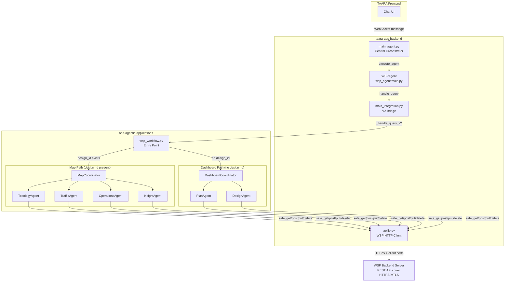
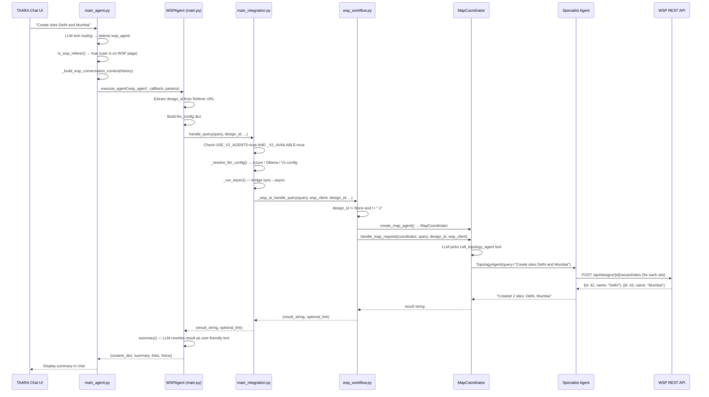
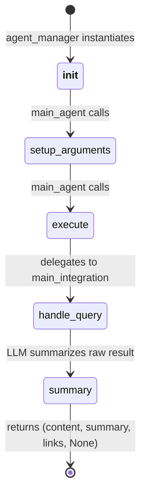
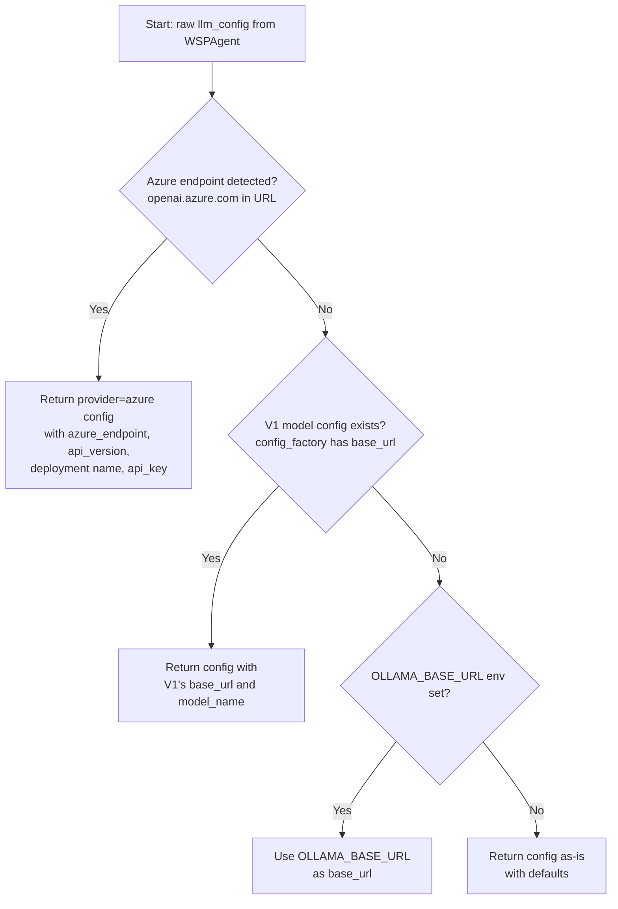
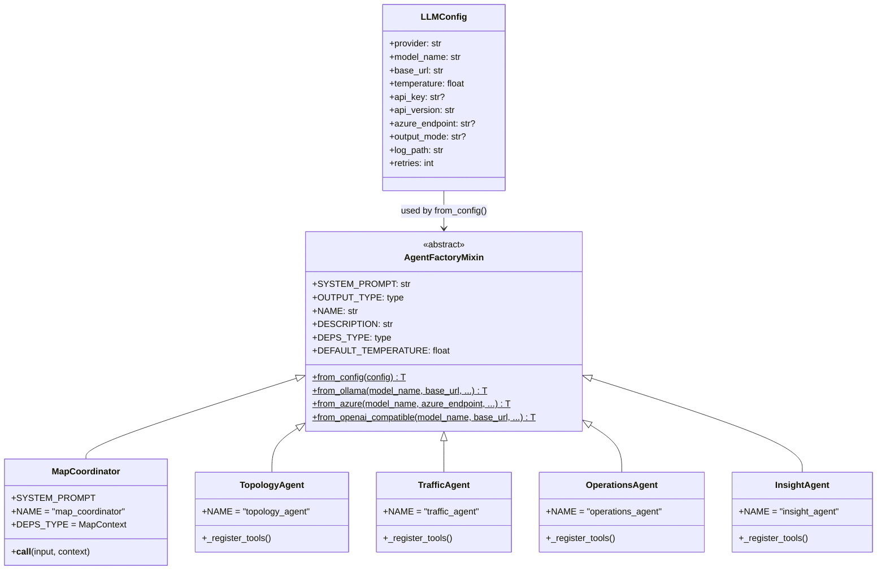

# WSP Agent — Complete Knowledge Transfer (V2)

> **Audience:** Engineers who will own, maintain, and extend the WSP Agent subsystem.
> **Scope:** V2 implementation only (ona-agentic-applications / coordinator-based). V1 (LangGraph) is intentionally excluded.

---

## Table of Contents

1. [What Is WSP?](#1-what-is-wsp)
2. [High-Level Architecture](#2-high-level-architecture)
3. [End-to-End Request Flow](#3-end-to-end-request-flow)
4. [Repository Map & Key Files](#4-repository-map--key-files)
5. [Component Deep-Dives](#5-component-deep-dives)
   - 5.1 [main_agent.py — Central Orchestrator](#51-main_agentpy--central-orchestrator)
   - 5.2 [WSPAgent Class (wsp_agent/main.py)](#52-wspagent-class-wsp_agentmainpy)
   - 5.3 [main_integration.py — V2 Bridge](#53-main_integrationpy--v2-bridge)
   - 5.4 [wsp_workflow.py — Workflow Entry Point](#54-wsp_workflowpy--workflow-entry-point)
   - 5.5 [MapCoordinator](#55-mapcoordinator)
   - 5.6 [DashboardCoordinator](#56-dashboardcoordinator)
   - 5.7 [Specialist Agents](#57-specialist-agents)
   - 5.8 [WSP API Client (apilib.py)](#58-wsp-api-client-apilibpy)
   - 5.9 [Shared Utilities](#59-shared-utilities)
6. [LLM Configuration & Provider Resolution](#6-llm-configuration--provider-resolution)
7. [Agent Base Classes & Factory Pattern](#7-agent-base-classes--factory-pattern)
8. [How-To Guides](#8-how-to-guides)
   - 8.1 [Add a New Tool to an Existing Agent](#81-add-a-new-tool-to-an-existing-agent)
   - 8.2 [Add a New Specialist Agent](#82-add-a-new-specialist-agent)
9. [Configuration Reference](#9-configuration-reference)
10. [Common Gotchas & Troubleshooting](#10-common-gotchas--troubleshooting)
11. [Glossary](#11-glossary)

---

## 1. What Is WSP?

**WSP (WaveSuite Planner)** is Nokia's optical network planning tool. The **WSP Agent** enables natural language interaction with WSP through the TAARA chat interface. Users can ask the agent to:

| Category | Examples |
|----------|----------|
| **Plans & Designs** | Create plans, create/open designs |
| **Topology** | Create/update/delete sites and segments, mesh segments |
| **Traffic** | Create/update/delete trails and services (optical demands) |
| **Operations** | Run design computations, generate BOM/BOQ reports, manage templates |
| **Insight (read-only)** | Query traffic, capacity, feasibility, list sites/segments/failure scenarios |

The user never calls WSP REST APIs directly. They type natural language into TAARA and the agent figures out what to do.

---

## 2. High-Level Architecture



### Two-Coordinator Architecture

The V2 system uses a **coordinator-delegate** pattern. A single request never creates both a MapCoordinator and a DashboardCoordinator — the routing is determined once at the top of `wsp_workflow.py` based on `design_id`.

| Condition | Coordinator | Delegates |
|-----------|------------|-----------|
| `design_id` is `None` or `"-1"` | **DashboardCoordinator** | PlanAgent, DesignAgent |
| Any other `design_id` value | **MapCoordinator** | TopologyAgent, TrafficAgent, OperationsAgent, InsightAgent |

---

## 3. End-to-End Request Flow



### What Happens When the User Is NOT on a WSP Page

If `main_agent.py` selects `wsp_agent` but `is_wsp_referer()` returns `false` (the user is not viewing a WSP dashboard or map page), the system short-circuits — it returns a redirect link telling the user to open WaveSuite Planner first. The agent is never called.

---

## 4. Repository Map & Key Files

```
taara/
├── taara-app-backend/src/storage/agent/
│   ├── main_agent.py                          # Central orchestrator — routes to all agents
│   ├── agent_manager.py                       # execute_agent() — instantiates & runs any agent
│   └── agentslib/wsp_agent/
│       ├── main.py                            # WSPAgent class — entry point from backend
│       ├── main_integration.py                # V1/V2 router, async bridge, LLM config resolver
│       ├── apilib.py                          # WSP HTTP client (singleton, mTLS)
│       ├── config.ini                         # WSP server IP + port
│       └── map_page/                          # V1 LangGraph code (not covered here)
│
├── ona-agentic-applications/ona_agentic_applications/
│   ├── agents/
│   │   └── base.py                            # AgentFactoryMixin, LLMConfig
│   └── workflows/wsp/
│       ├── wsp_workflow.py                    # V2 entry point: handle_query, create_map/dashboard_agent
│       ├── utils.py                           # MapContext, safe_get/post/put/delete, entity ID lookups
│       ├── dashboard_utils.py                 # DashboardContext, dashboard-specific helpers
│       ├── map_coordinator/
│       │   ├── __init__.py
│       │   └── map_coordinator.py             # MapCoordinator — delegates to 4 specialists
│       ├── dashboard_coordinator/
│       │   ├── __init__.py
│       │   └── dashboard_coordinator.py       # DashboardCoordinator — delegates to Plan/Design
│       ├── topology_agent/
│       │   ├── __init__.py
│       │   ├── topology_agent.py
│       │   └── tools.py                       # create/update/delete sites & segments, mesh
│       ├── traffic_agent/
│       │   ├── __init__.py
│       │   ├── traffic_agent.py
│       │   └── tools.py                       # create/update/delete trails & services
│       ├── operations_agent/
│       │   ├── __init__.py
│       │   ├── operations_agent.py
│       │   └── tools.py                       # run_design, get_bom, get_boq, templates
│       ├── insight_agent/
│       │   ├── __init__.py
│       │   ├── insight_agent.py
│       │   └── tools.py                       # read-only: traffic, capacity, feasibility, lists
│       ├── plan_agent/
│       │   ├── __init__.py
│       │   ├── plan_agent.py
│       │   └── tools.py                       # create plans
│       └── design_agent/
│           ├── __init__.py
│           ├── design_agent.py
│           └── tools.py                       # create/open designs
│
└── ona-agentic-tools/ona_agentic_tool/
    └── core/                                  # AgentBase, OllamaOpenAIAgent, AzureOpenAIAgent, etc.
```

---

## 5. Component Deep-Dives

### 5.1 main_agent.py — Central Orchestrator

`main_agent.py` is the backend's universal agent router. It is NOT specific to WSP — it handles all TAARA agents (troubleshooting, documentation, equipment compatibility, NHI, WSP, etc.). For WSP, the relevant pieces are:

**Tool Registration (lines ~314-329):**

The WSP agent is registered as a function tool for the LLM to select:

```python
tools.append({
    "type": "function",
    "function": {
        "name": 'wsp_agent',
        "description": agent_information['wsp_agent'],
        "parameters": {
            "type": "object",
            "properties": {
                "concise_question": {
                    "type": "string",
                    "description": "A concise instruction or question from the user related to WSP network planning..."
                }
            }
        }
    }
})
```

The `description` comes from `WSPAgent.routingDescription()` — the LLM reads this to decide whether WSP is the right tool.

**WSP-Specific Handling (lines ~813-913):**

Once the LLM selects `wsp_agent`, the code:

1. Checks `is_wsp_referer()` using regex `.*/wsp/web/pages/(dashboard|map).*` against the `Referer` header
2. If NOT on a WSP page → returns redirect link "Open WaveSuite Planner" (short-circuits)
3. If on WSP page → sets `max_turns=1`, builds conversation context from recent chat history, calls `execute_agent()`

**Conversation Context Injection:**

```python
def _build_wsp_conversation_context(self, history, max_turns=2):
    """Extract last N user-assistant exchanges from history for WSP context."""
    exchanges = []
    for msg in history:
        role = msg.get('role')
        content = msg.get('content', '')
        if role == 'user' and content:
            exchanges.append(f"User: {content[:300]}")
        elif role == 'assistant' and content:
            exchanges.append(f"Assistant: {content[:300]}")
    if len(exchanges) <= 2:
        return ""
    recent = exchanges[-(max_turns * 2):]
    return "\n".join(recent)
```

This gives the WSP agent awareness of the last 2 conversational turns, so multi-step workflows like "create sites... now add trails between them" carry context.

---

### 5.2 WSPAgent Class (wsp_agent/main.py)

This is the bridge between TAARA's agent framework and the V2 agentic stack.

**Lifecycle:**



**Key code:**

```python
@dataclass
class WSPAgentConfig:
    llm_model: str = "gpt-oss"

class WSPAgent(Configurable[WSPAgentConfig], FeatureInterface):

    def __init__(self):
        obj = self.from_config_factory('wsp_agent', WSPAgentConfig)
        super().__init__(obj)
        # Read config.ini for WSP server address
        config = configparser.ConfigParser()
        config.read(os.path.join(script_dir, 'config.ini'))
        ip_address = config.get('DEFAULT', 'IP_ADDRESS', fallback=None)
        port = config.get('DEFAULT', 'PORT', fallback=None)
        self.wsp = WSP(ip_address, port)  # Singleton HTTP client
```

**design_id Extraction:**

```python
def execute(self):
    if self.referer:
        parsed = urlparse(self.referer)
        if parsed.path.endswith("/web/pages/map"):
            query_params = parse_qs(parsed.query)
            self.design_id = query_params.get("designId", [None])[0]
```

If the Referer URL path ends in `/web/pages/map` and has a `designId` query parameter, the agent extracts it. Otherwise `design_id` stays `None`, which routes to the Dashboard path.

**Summary Generation:**

After getting the raw result from the V2 workflow, `WSPAgent` uses `SUMMARY_PROMPT` to ask the LLM to rewrite the result as a single user-friendly sentence — no developer jargon, no internal IDs.

---

### 5.3 main_integration.py — V2 Bridge

This module has three jobs:

1. **Route V1 vs V2** — Checks `USE_V2_AGENTS` (env `WSP_AGENT_V2`, default `"true"`) and `_V2_AVAILABLE` (import succeeded)
2. **Resolve LLM config** — Translates TAARA's config_factory settings into the agentic stack's config format
3. **Bridge sync→async** — TAARA backend is synchronous; V2 workflow is async

**V2 Availability Check:**

```python
_V2_AVAILABLE = False
try:
    from ona_agentic_applications.workflows.wsp.wsp_workflow import (
        handle_query as _wsp_ai_handle_query,
    )
    _V2_AVAILABLE = True
except ImportError as _import_err:
    _wsp_v2_import_error = str(_import_err)
```

Both `ona-agentic-tools` and `ona-agentic-applications` must be pip-installed in the same Python environment that runs the TAARA backend. In production with gunicorn, that means installing into `/opt/venv/bin/pip`.

**LLM Config Resolution (`_resolve_llm_config`):**



This resolution ensures the V2 agents hit the same LLM endpoint as the rest of the TAARA system, regardless of whether it's Azure, an on-prem Ollama server, or something else.

**Async-to-Sync Bridge (`_run_async`):**

The TAARA backend calls `handle_query()` synchronously, but the V2 workflow is `async`. The bridge handles three scenarios:

| Scenario | Strategy |
|----------|----------|
| No running event loop | `asyncio.run(coro)` |
| Running loop + `nest_asyncio` installed | Patch loop and `asyncio.run(coro)` |
| Running loop, no `nest_asyncio` | Spin up a background thread with its own loop |

---

### 5.4 wsp_workflow.py — Workflow Entry Point

This is the entry point from `ona-agentic-applications`. It is an `async` module with a clean public API:

```python
async def handle_query(
    query: str,
    wsp_client: Any,
    design_id: Optional[str] = None,
    session_id: Optional[str] = None,
    llm_config: Optional[dict] = None,
) -> tuple[str, Optional[str]]:
```

**Routing logic:**

```python
if design_id is None or str(design_id) == "-1":
    coordinator = await create_dashboard_agent(llm_config)
    return await handle_dashboard_request(coordinator, query, wsp_client, session_id)

coordinator = await create_map_agent(llm_config)
result = await handle_map_request(coordinator, query, design_id, wsp_client, session_id)
link = extract_link_from_result(result)
return result, link
```

**Factory Functions:**

`create_map_agent(llm_config)` builds a `MapCoordinator` with 4 specialist agents, all sharing the same LLM config:

```python
async def create_map_agent(llm_config):
    config = llm_config or DEFAULT_LLM_CONFIG
    topology_agent  = TopologyAgent.from_config(TopologyAgentConfig(**config))
    traffic_agent   = TrafficAgent.from_config(TrafficAgentConfig(**config))
    operations_agent = OperationsAgent.from_config(OperationsAgentConfig(**config))
    insight_agent   = InsightAgent.from_config(InsightAgentConfig(**config))
    return MapCoordinator.create_with_agents(
        config=MapCoordinatorConfig(**config),
        topology_agent=topology_agent,
        traffic_agent=traffic_agent,
        operations_agent=operations_agent,
        insight_agent=insight_agent,
    )
```

`create_dashboard_agent(llm_config)` does the same for `DashboardCoordinator` with PlanAgent + DesignAgent.

**WSPMapAgentV2 (performance wrapper):**

For cases where you want to keep a `MapCoordinator` alive across multiple calls (avoiding re-creation), use:

```python
class WSPMapAgentV2:
    def __init__(self, coordinator):
        self.coordinator = coordinator

    @classmethod
    async def create(cls, llm_config=None):
        coordinator = await create_map_agent(llm_config)
        return cls(coordinator)

    async def execute(self, query, design_id, wsp_client, conversation_id=None):
        return await handle_map_request(self.coordinator, query, design_id, wsp_client, conversation_id)
```

---

### 5.5 MapCoordinator

The MapCoordinator is the brain of the Map-page agent. It receives the user query, uses an LLM to decide which specialist(s) to call, calls them in order, and synthesizes the result.

**Class Attributes:**

| Attribute | Value |
|-----------|-------|
| `SYSTEM_PROMPT` | Detailed routing rules (see below) |
| `OUTPUT_TYPE` | `str` |
| `NAME` | `"map_coordinator"` |
| `DEPS_TYPE` | `MapContext` |
| `DEFAULT_TEMPERATURE` | `0.0` |

**Delegation Tools (registered in `_register_delegation_tools`):**

| Tool | Delegates To | Domain |
|------|-------------|--------|
| `call_topology_agent(ctx, query)` | TopologyAgent | Sites, segments, mesh |
| `call_traffic_agent(ctx, query)` | TrafficAgent | Trails, services |
| `call_operations_agent(ctx, query)` | OperationsAgent | Run design, BOM/BOQ, templates |
| `call_insight_agent(ctx, query)` | InsightAgent | Read-only traffic/capacity/feasibility queries |

**Ordering Rules (from system prompt):**

For multi-step requests, the coordinator is instructed to call agents in this order:
1. **Topology first** — sites and segments must exist before you can create trails
2. **Traffic second** — trails and services require existing sites
3. **Operations last** — design computations run on the complete network

**Example multi-step delegation:**

User: *"Create sites A and B, add 5 trails between them, then run design"*

1. `call_topology_agent("Create sites A and B")` → "Created 2 sites"
2. `call_traffic_agent("Create 5 trails between A and B")` → "Created 5 trails"
3. `call_operations_agent("Run design")` → "Design computation complete"
4. Coordinator synthesizes: "Created sites A and B, added 5 trails between them, and triggered design computation."

**How `__call__` works:**

```python
async def __call__(self, input, context, conversation_id=None):
    result = await self.agent.run(
        input.query,
        context=context,         # MapContext with wsp_client + design_id
        session_id=conversation_id,
    )
    return result.output
```

The LLM behind `self.agent` reads the system prompt, sees the available tools, decides which to call, and may call multiple tools in sequence.

---

### 5.6 DashboardCoordinator

Structurally identical to MapCoordinator but scoped to dashboard operations (no `design_id` yet).

| Tool | Delegates To | Domain |
|------|-------------|--------|
| `call_plan_agent(query)` | PlanAgent | Create plans |
| `call_design_agent(query)` | DesignAgent | Create designs, open designs |

**Context:** `DashboardContext(wsp_client)` — no `design_id` since the user hasn't opened a design yet.

When a design is created or opened, the DesignAgent returns a URL. The TAARA UI can then navigate the user to the Map page with the new `design_id`.

---

### 5.7 Specialist Agents

All specialist agents follow the same structural pattern. They inherit from `AgentFactoryMixin`, define class-level constants, register tools in `_register_tools()`, and implement `__call__` to run the agent.

#### Agent Pattern (applicable to all specialists)

```python
class SomeAgent(AgentFactoryMixin):
    SYSTEM_PROMPT = "..."       # Describes the agent's role and tool usage
    OUTPUT_TYPE = str            # All WSP agents output plain strings
    NAME = "some_agent"          # Used in logging and metadata
    DESCRIPTION = "..."          # Human-readable description
    DEPS_TYPE = MapContext        # Tools receive RunContext[MapContext]
    DEFAULT_TEMPERATURE = 0.0    # Deterministic output

    def __init__(self, agent: AgentBase):
        self.agent = agent
        self._register_tools()

    def _register_tools(self):
        from .tools import tool_a, tool_b
        self.agent.add_tool(tool_a)
        self.agent.add_tool(tool_b)

    async def __call__(self, input, context=None, conversation_id=None):
        result = await self.agent.run(input.query, context=context, session_id=conversation_id)
        return result.output
```

#### TopologyAgent

**Domain:** Physical network structure — sites (network locations) and segments (fiber connections between sites).

| Tool | Signature | What It Does |
|------|-----------|-------------|
| `create_sites` | `(ctx, sites: list[SiteSpec])` | Create one or more sites by name/location |
| `update_sites` | `(ctx, sites: list[SiteUpdateSpec])` | Rename or update site properties |
| `delete_sites` | `(ctx, site_names: list[str])` | Delete sites by name |
| `create_segments` | `(ctx, segments: list[SegmentSpec])` | Create fiber connections between site pairs |
| `update_segments` | `(ctx, segments: list[SegmentUpdateSpec])` | Rename or update segment properties |
| `delete_segments` | `(ctx, segment_names: list[str])` | Delete segments by name |
| `mesh_segments` | `(ctx, ...)` | Create a full/partial mesh between sites |

#### TrafficAgent

**Domain:** Network demands — trails (optical transport paths/wavelengths) and services (client-facing demands).

| Tool | Signature | What It Does |
|------|-----------|-------------|
| `create_trails` | `(ctx, trails: list[TrailSpec])` | Create optical trails with rate, protection |
| `update_trails` | `(ctx, trails: list[TrailUpdateSpec])` | Rename or update trail properties |
| `delete_trails` | `(ctx, trail_names: list[str])` | Delete trails by name |
| `create_services` | `(ctx, services: list[ServiceSpec])` | Create client-facing services |
| `update_services` | `(ctx, services: list[ServiceUpdateSpec])` | Rename or update service properties |
| `delete_services` | `(ctx, service_names: list[str])` | Delete services by name |

**Key domain concepts:**

- **Line rates:** 100G, 200G, 400G — the bandwidth of a trail
- **Protection types:** Unprotected, 1+1 protection, shared protection, etc.
- **Demand:** Conceptually a trail AND a service together. When users say "add a demand between A and B," they usually mean both.

#### OperationsAgent

**Domain:** Design execution, reporting, and template management.

| Tool | Signature | What It Does |
|------|-----------|-------------|
| `run_design` | `(ctx, ...)` | Trigger WSP's design computation engine |
| `get_bom` | `(ctx)` | Generate a Bill of Materials report |
| `get_boq` | `(ctx)` | Generate a Bill of Quantities report |
| `get_template_id` | `(ctx, template_name)` | Look up a template's internal ID |
| `set_default_template` | `(ctx, template_name)` | Set a template as the design default |

#### InsightAgent

**Domain:** Read-only queries. This agent never creates, updates, or deletes anything.

| Tool | Parameters | What It Does |
|------|-----------|-------------|
| `get_traffic_between_sites` | `src_site, dest_site` | List all trails/services between two sites |
| `get_trail_and_service_count_between_sites` | `src_site, dest_site` | Count of demands between two sites |
| `get_capacity_used_between_sites` | `src_site, dest_site` | Total bandwidth consumed |
| `check_capacity_available_between_sites` | `src_site, dest_site` | Is there room for more traffic? |
| `can_create_protected_service_between_sites` | `src_site, dest_site` | Feasibility check for protected demand |
| `check_spare_client_ports_between_sites` | `src_site, dest_site, client_rate?, required_ports?` | Free 100GE ports on existing trails |
| `list_all_sites` | *(none)* | Table of all sites in the design |
| `list_sites_and_nodes_with_node_types` | *(none)* | Table: Site, Node, Node Type |
| `list_all_segments` | *(none)* | Table of all segments with endpoints |
| `list_failure_scenarios_with_segments` | *(none)* | Failure scopes and contained segments |

---

### 5.8 WSP API Client (apilib.py)

The `WSP` class is a **singleton** HTTP client that talks to the WSP backend server over HTTPS with mutual TLS (client certificates).

```python
class WSP(SingletonBase):
    def __init__(self, target_server, target_port):
        WSP.target_server = target_server
        WSP.target_port = target_port

    def setUsername(self, userName):
        self.userName = userName  # Sent as "Cert-Auth-User" header

    def api_get(self, path):    # GET  https://{server}:{port}/wsp{path}
    def api_post(self, path, payload):  # POST
    def api_put(self, path, payload):   # PUT
    def api_delete(self, path, payload=None):  # DELETE
```

**Key details:**

| Aspect | Detail |
|--------|--------|
| **Base URL** | `https://{IP_ADDRESS}:{PORT}/wsp` (from `config.ini`) |
| **Auth** | Client certificates from `config_factory`: `certificate_pem`, `certificate_key_pem`, `ca_certificate_pem` |
| **User identity** | `Cert-Auth-User` header set via `setUsername()` |
| **Retries** | Each method retries up to 3 times on non-success status codes |
| **Placeholder expansion** | POST/PUT/DELETE replace `{key}` in paths with values from the payload |
| **Payload sanitization** | POST converts string "null"/"none"/"true"/"false" to Python equivalents |

---

### 5.9 Shared Utilities

#### Map Utilities (`workflows/wsp/utils.py`)

| Function | Purpose |
|----------|---------|
| `MapContext(wsp_client, design_id)` | Dataclass passed as `RunContext.deps` to all Map tools |
| `safe_get(wsp, path)` → `(result, error)` | GET with exception handling |
| `safe_post(wsp, path, payload)` → `(result, error)` | POST with exception handling |
| `safe_put(wsp, path, payload)` → `(result, error)` | PUT with exception handling |
| `safe_delete(wsp, path)` → `(result, error)` | DELETE with exception handling |
| `get_site_id(wsp, design_id, site_name)` | Resolve site name → internal WSP ID |
| `get_segment_id(wsp, design_id, segment_name)` | Resolve segment name → internal WSP ID |
| `get_demand_id(wsp, design_id, demand_name)` | Resolve trail/service name → internal WSP ID |
| `is_success(result)` | Check if API response indicates success |
| `delete_succeeded(result, err)` | Check if DELETE succeeded (handles 204 No Content) |
| `fail_message(base, result, exc_cause)` | Build user-friendly failure message with root cause |
| `extract_error_from_result(result)` | Extract error text from API response dict |
| `format_exception_cause(exc)` | Extract root cause from HTTP exception |
| `sanitize_payload(payload)` | Convert "null"/"true"/"false" strings to Python types |
| `generate_report_link(design_id, report_type)` | Build clickable BOM/BOQ report URL |

#### Dashboard Utilities (`workflows/wsp/dashboard_utils.py`)

| Function | Purpose |
|----------|---------|
| `DashboardContext(wsp_client)` | Context for Dashboard tools (no design_id) |
| `safe_get_dashboard(wsp, path)` | GET with exception handling |
| `safe_post_dashboard(wsp, path, payload)` | POST with exception handling |
| `get_plan_id(wsp, plan_name)` | Resolve plan name → internal ID |
| `get_design_id(wsp, plan_name, design_name)` | Resolve design name → internal ID |
| `generate_design_url(design_id, design_name)` | Build URL to open a design in the WSP web UI |

---

## 6. LLM Configuration & Provider Resolution

The system supports three LLM providers. Resolution happens in `main_integration.py._resolve_llm_config()`:

| Priority | Condition | Provider | Config Source |
|----------|-----------|----------|---------------|
| 1 | Azure endpoint detected (`openai.azure.com` in URL) | `azure` | Parses deployment name, api_version, api_key from endpoint URL |
| 2 | V1 model config has base_url + model_name | `ollama` | From `config_factory.get_model_configurations()` |
| 3 | `OLLAMA_BASE_URL` env var is set | `ollama` | Environment variable |
| 4 | None of the above | `ollama` | Defaults: `http://localhost:11434/v1`, model `gpt-oss` |

**Default LLM config (in wsp_workflow.py):**

```python
DEFAULT_LLM_CONFIG = {
    "provider": "ollama",
    "model_name": "gpt-oss:120b",
    "base_url": "http://localhost:11434/v1",
    "temperature": 0.0,
}
```

**Environment Variables:**

| Variable | Default | Purpose |
|----------|---------|---------|
| `WSP_AGENT_V2` | `"true"` | Enable/disable V2. Set to `"false"` to fall back to V1 LangGraph |
| `OLLAMA_BASE_URL` | `"http://localhost:11434/v1"` | Ollama server URL (fallback) |
| `WSP_AGENT_LOG_DIR` | `"/tmp/wsp_agent_logs"` | Directory for agent log files |
| `AZURE_OPENAI_API_KEY` | *(none)* | Azure API key fallback if not in config_factory |

---

## 7. Agent Base Classes & Factory Pattern

All V2 WSP agents inherit from `AgentFactoryMixin` (defined in `ona_agentic_applications/agents/base.py`). This mixin provides factory methods that create agents for any LLM provider.



**How `from_config` works:**

1. Reads `config.provider` to determine the backend
2. Creates the appropriate `AgentBase` subclass (`OllamaOpenAIAgent`, `AzureOpenAIAgent`, `OpenAICompatibleAgent`)
3. Passes in the agent's class-level `SYSTEM_PROMPT`, `OUTPUT_TYPE`, `NAME`, `DESCRIPTION`, `DEPS_TYPE`
4. Returns `cls(agent=agent, **kwargs)` — invoking the concrete agent's `__init__`

---

## 8. How-To Guides

### 8.1 Add a New Tool to an Existing Agent

**Example:** Add a `get_segment_details` tool to the InsightAgent.

**Step 1 — Write the tool function in `insight_agent/tools.py`:**

```python
async def get_segment_details(
    ctx: RunContext[MapContext],
    segment_name: str,
) -> str:
    """
    Get detailed information about a specific segment.

    Args:
        segment_name: The name of the segment to query.

    Returns:
        A formatted string with segment details (length, fiber type, endpoints).
    """
    wsp = ctx.deps.wsp_client
    design_id = ctx.deps.design_id
    path = f"/api/designs/{design_id}/segments/{quote(segment_name)}"
    result, err = safe_get(wsp, path)
    if err:
        return fail_message(f"Failed to get details for segment '{segment_name}'", result, err)
    return json.dumps(result, indent=2)
```

**Rules for tool functions:**

- Must be `async`
- First parameter must be `ctx: RunContext[MapContext]` (or `RunContext[DashboardContext]` for dashboard agents)
- The **docstring** becomes the tool description that the LLM sees — write it clearly
- Return type must be `str`
- Use `safe_get`/`safe_post`/etc. from `utils.py` for all API calls

**Step 2 — Register the tool in the agent's `_register_tools()`:**

```python
def _register_tools(self):
    from .tools import (
        get_traffic_between_sites,
        # ... existing imports ...
        get_segment_details,  # NEW
    )
    # ... existing registrations ...
    self.agent.add_tool(get_segment_details)  # NEW
```

**Step 3 — Update the agent's system prompt:**

Add the new tool to the system prompt so the LLM knows when to use it:

```
### get_segment_details
- "Get details for segment X"
- "Tell me about segment between A and B"
→ Call with segment_name.
```

**Step 4 — Test it.** No changes needed in the coordinator or workflow — the coordinator already delegates to InsightAgent, and the LLM will discover the new tool through its description.

---

### 8.2 Add a New Specialist Agent

**Example:** Add a `ReportAgent` that handles all reporting (currently split across OperationsAgent).

**Step 1 — Create the directory structure:**

```
workflows/wsp/report_agent/
├── __init__.py
├── report_agent.py
└── tools.py
```

**Step 2 — Define the agent class (`report_agent.py`):**

```python
from ona_agentic_applications.agents.base import LLMConfig, AgentFactoryMixin
from ..utils import MapContext

class ReportAgentConfig(LLMConfig):
    model_config = SettingsConfigDict(extra="ignore")

class ReportAgentInput(BaseModel):
    query: str = Field(description="The user's request about reports.")

REPORT_SYSTEM_PROMPT = """You are the Report specialist for WSP.
Your tools generate BOM, BOQ, and other reports.
..."""

class ReportAgent(AgentFactoryMixin):
    SYSTEM_PROMPT = REPORT_SYSTEM_PROMPT
    OUTPUT_TYPE = str
    NAME = "report_agent"
    DESCRIPTION = "Generates reports (BOM, BOQ, etc.)"
    DEPS_TYPE = MapContext
    DEFAULT_TEMPERATURE = 0.0

    def __init__(self, agent: AgentBase):
        self.agent = agent
        self._register_tools()

    def _register_tools(self):
        from .tools import get_bom, get_boq
        self.agent.add_tool(get_bom)
        self.agent.add_tool(get_boq)

    async def __call__(self, input, context=None, conversation_id=None):
        result = await self.agent.run(input.query, context=context, session_id=conversation_id)
        return result.output
```

**Step 3 — Add to MapCoordinator:**

In `map_coordinator.py`:

1. Add to `MapCoordinatorParams`:
   ```python
   report_agent: ReportAgent
   ```

2. Add delegation tool in `_register_delegation_tools()`:
   ```python
   async def call_report_agent(ctx: RunContext[MapContext], query: str) -> str:
       """Delegate to the Report Agent for BOM/BOQ reports."""
       result = await report_agent(ReportAgentInput(query=query), context=ctx.deps)
       return result
   self.agent.add_tool(call_report_agent)
   ```

3. Add to `create_with_agents()` parameters

4. Update `MAP_COORDINATOR_SYSTEM_PROMPT` to include the new tool and routing rules

**Step 4 — Update `wsp_workflow.py`:**

In `create_map_agent()`:

```python
from .report_agent import ReportAgent, ReportAgentConfig

report_config = ReportAgentConfig(**config)
report_agent = ReportAgent.from_config(report_config)

coordinator = MapCoordinator.create_with_agents(
    config=coordinator_config,
    topology_agent=topology_agent,
    traffic_agent=traffic_agent,
    operations_agent=operations_agent,
    insight_agent=insight_agent,
    report_agent=report_agent,  # NEW
)
```

**Step 5 — Export in `__init__.py` files.**

---

## 9. Configuration Reference

### config.ini (wsp_agent/)

```ini
[DEFAULT]
IP_ADDRESS = ws-ingress
PORT = 58443
```

### Config Factory (wsp_agent section)

| Key | Default | Description |
|-----|---------|-------------|
| `llm_model` | `"gpt-oss"` | Model name passed to LLMFactory and used in LLM config |

### Environment Variables

| Variable | Default | Description |
|----------|---------|-------------|
| `WSP_AGENT_V2` | `"true"` | Set to `"false"` to disable V2 and use V1 LangGraph |
| `OLLAMA_BASE_URL` | `"http://localhost:11434/v1"` | Ollama server URL |
| `WSP_AGENT_LOG_DIR` | `"/tmp/wsp_agent_logs"` | Log directory for V2 agent logs |
| `AZURE_OPENAI_API_KEY` | *(none)* | Fallback Azure API key |
| `EXEC_ENVIRONMENT` | *(none)* | Config environment selector (e.g., `.env.development`) |
| `otntomcat_oms1350web_Ext_Addr` | `""` | Server IP for generating WSP web URLs (dashboard) |
| `otntomcat_oms1350web_Ext_Port` | `""` | Server port for generating WSP web URLs (dashboard) |

### SSL Certificates (from config_factory global config)

| Config Key | Purpose |
|------------|---------|
| `certificate_pem` | Client certificate for mTLS |
| `certificate_key_pem` | Client certificate private key |
| `ca_certificate_pem` | CA certificate for server verification |

---

## 10. Common Gotchas & Troubleshooting

### SSL Certificate Errors

**Symptom:** `SSLError` or `CERTIFICATE_VERIFY_FAILED` when calling WSP APIs.

**Cause:** The WSP client uses mTLS. Cert paths come from `config_factory`'s global config.

**Fix:** Verify that `certificate_pem`, `certificate_key_pem`, and `ca_certificate_pem` are valid and accessible from the running Python process. In Docker, make sure the cert files are mounted into the container.

### V2 Not Available / Falls Back to V1

**Symptom:** Logs show `[WSP V2] Could not import WSP workflow package`.

**Cause:** `ona-agentic-tools` and/or `ona-agentic-applications` are not installed in the Python environment that runs the backend.

**Fix:** Install both packages into the correct venv:
```bash
/opt/venv/bin/pip install -e /path/to/ona-agentic-tools
/opt/venv/bin/pip install -e /path/to/ona-agentic-applications
```

### design_id Is Always None (Dashboard Mode When Map Expected)

**Symptom:** User is on the Map page but requests are routed to the DashboardCoordinator.

**Cause:** The `Referer` header doesn't contain `designId`, or the path doesn't end in `/web/pages/map`.

**Fix:** Check the frontend is sending the correct `Referer` header. The extraction logic in `WSPAgent.execute()` requires:
1. Path ends with `/web/pages/map`
2. Query string contains `designId=<value>`

### Entity Name Lookups Fail

**Symptom:** "Site not found" or "Segment not found" errors despite the entity existing.

**Cause:** Entity name lookups are **case-sensitive and exact-match**. The API path uses URL-encoded names.

**Fix:** Ensure the name matches exactly (including capitalization and spaces) what was used when creating the entity.

### Async Bridge Errors

**Symptom:** `RuntimeError: This event loop is already running` or similar.

**Cause:** `_run_async()` failed to bridge sync→async. This happens when there's a running loop and `nest_asyncio` is not installed.

**Fix:** Install `nest_asyncio` (`pip install nest_asyncio`). Without it, the code falls back to a background thread, which generally works but can occasionally cause issues with thread-local state.

### Multi-Step Operations Fail Partway

**Symptom:** User says "Create sites A, B and add trails between them" but trails fail because sites aren't ready.

**Cause:** The MapCoordinator calls specialists in sequence, but the LLM must be smart enough to order them correctly. The system prompt instructs: topology → traffic → operations.

**Fix:** If the LLM mis-orders, improve the system prompt with more explicit ordering examples or add validation logic in the coordinator.

### LLM Hits Wrong Endpoint (404 Errors)

**Symptom:** Model API calls return 404.

**Cause:** The LLM config resolution in `_resolve_llm_config()` may produce a base_url/model_name combination that doesn't exist on the server.

**Fix:** Check the resolution chain: Azure overrides → V1 config_factory → OLLAMA_BASE_URL env. Log output at `DEBUG` level shows exactly which config was chosen.

---

## 11. Glossary

| Term | Meaning |
|------|---------|
| **WSP** | WaveSuite Planner — Nokia's optical network planning tool |
| **TAARA** | The chat-based assistant application that hosts all agents |
| **Plan** | A top-level WSP container that holds one or more designs |
| **Design** | A network design within a plan — contains sites, segments, trails, services |
| **Site** | A physical network location (e.g., a city, a data center) |
| **Segment** | A fiber connection between two sites |
| **Trail** | An optical transport path / wavelength between sites |
| **Service** | A client-facing demand carried by a trail |
| **Demand** | Collective term for a trail + service pair |
| **Line Rate** | Bandwidth of a trail — 100G, 200G, 400G |
| **Mesh** | A set of segments connecting every site to every other site |
| **BOM** | Bill of Materials — list of equipment needed for the design |
| **BOQ** | Bill of Quantities — quantities of each equipment type |
| **MapCoordinator** | V2 coordinator that delegates to specialist agents for map-page operations |
| **DashboardCoordinator** | V2 coordinator for plan/design operations (no design open yet) |
| **AgentFactoryMixin** | Base class providing factory methods to create agents for Ollama/Azure/OpenAI |
| **MapContext** | Dataclass carrying `wsp_client` + `design_id` through the tool chain |
| **DashboardContext** | Dataclass carrying `wsp_client` for dashboard operations |
| **RunContext** | Pydantic AI's context object — tools access it via `ctx.deps` |
| **config_factory** | TAARA's centralized configuration system |
| **mTLS** | Mutual TLS — both client and server present certificates |
| **nest_asyncio** | Python library that allows nested `asyncio.run()` calls |
| **gpt-oss** | Nokia's internal LLM model identifier |

---

*Document generated as a knowledge transfer reference. For questions, check the codebase at the paths listed in Section 4, or reach out to the original development team.*
