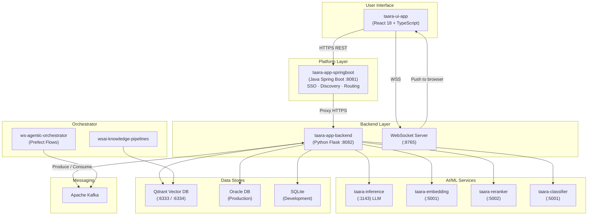
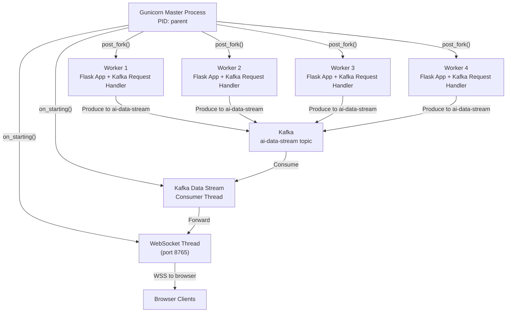
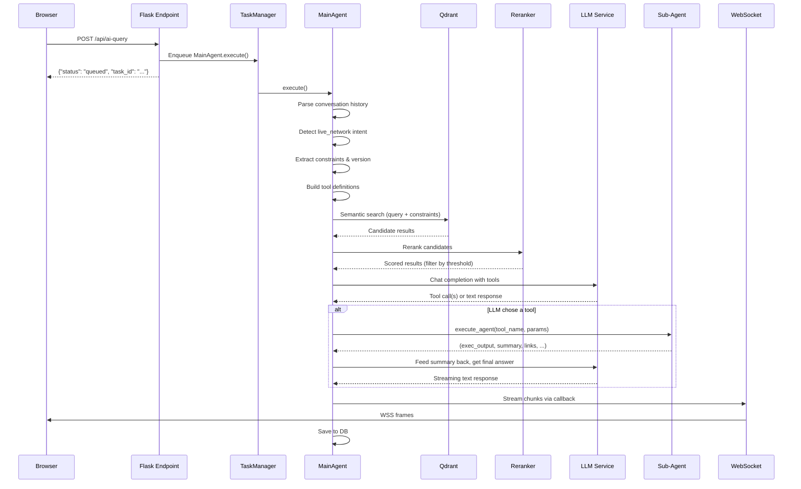
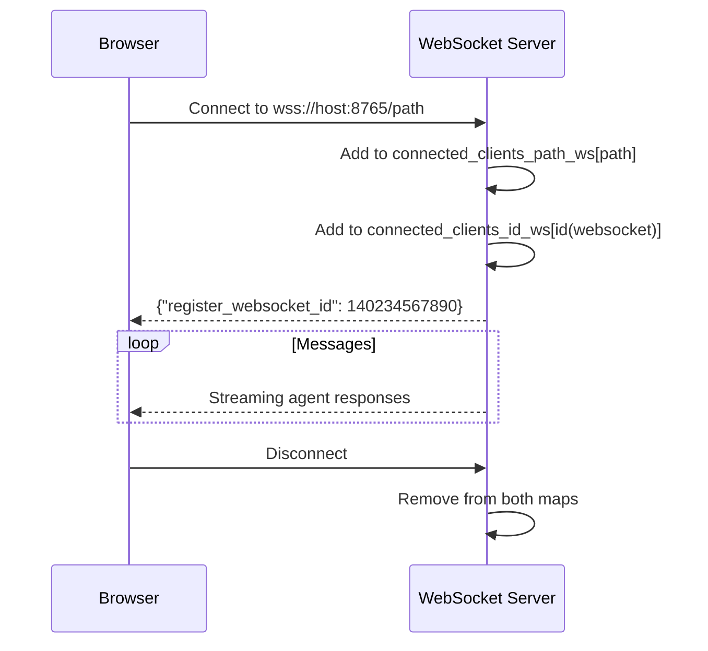
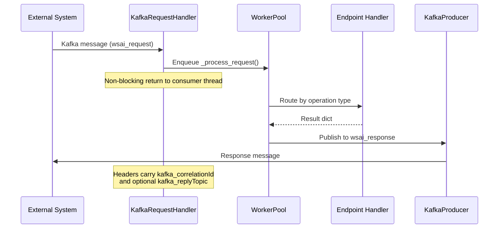
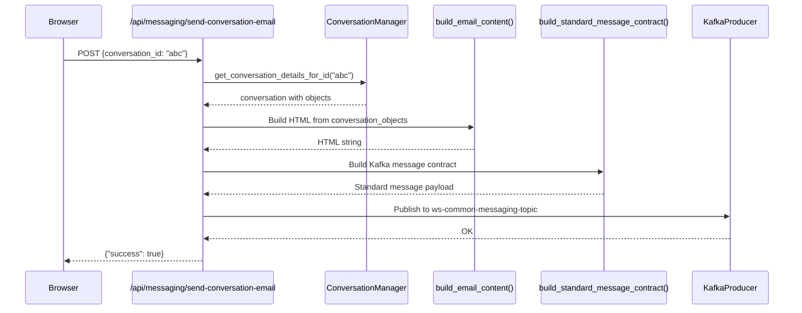
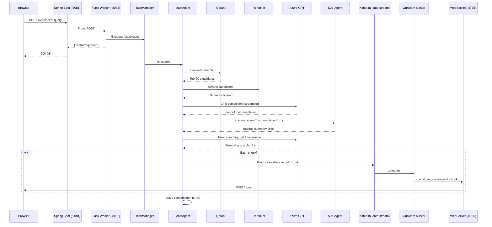
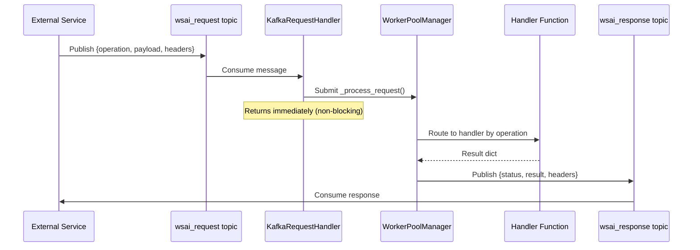
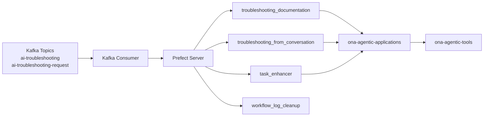
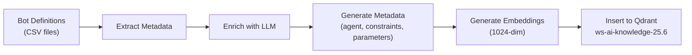

# Taara App Backend — Complete System Reference Guide

> **Audience:** Incoming engineers, on-call rotations, and anyone who needs to understand the full Taara platform from end to end.
>
> **Last updated:** March 2026

---

## Table of Contents

1. [What Is TAARA?](#1-what-is-taara)
2. [System Architecture Overview](#2-system-architecture-overview)
3. [Component Map](#3-component-map)
4. [Startup and Process Model](#4-startup-and-process-model)
5. [API Layer — Every Endpoint](#5-api-layer--every-endpoint)
6. [The Agent System — Brain of the Backend](#6-the-agent-system--brain-of-the-backend)
7. [WebSocket Server](#7-websocket-server)
8. [Kafka Integration](#8-kafka-integration)
9. [Database Layer](#9-database-layer)
10. [Vector Database (Qdrant)](#10-vector-database-qdrant)
11. [Configuration System](#11-configuration-system)
12. [Inference Layer (LLMs, Reranker, Classifier, Embeddings)](#12-inference-layer)
13. [Email and Messaging](#13-email-and-messaging)
14. [End-to-End Data Flows](#14-end-to-end-data-flows)
15. [Spring Boot Platform Layer](#15-spring-boot-platform-layer)
16. [Agentic Orchestrator (ws-agentic-orchestrator)](#16-agentic-orchestrator)
17. [Knowledge Pipelines (wsai-knowledge-pipelines)](#17-knowledge-pipelines)
18. [Docker Packaging](#18-docker-packaging)
19. [Key Code Patterns and Conventions](#19-key-code-patterns-and-conventions)
20. [Troubleshooting Playbook](#20-troubleshooting-playbook)
21. [Glossary](#21-glossary)

---

## 1. What Is TAARA?

TAARA stands for **Team Assisted AI for Research and Automation**. It is the AI assistant built into Nokia's **WaveSuite** optical network management platform. Think of it as a ChatGPT-like assistant that knows everything about optical networking — documentation, live network state, equipment compatibility, performance data, and planning tools.

Users interact through a chat interface in the WaveSuite web UI. Behind the scenes, TAARA orchestrates multiple specialized AI agents, a vector knowledge base, large language models, and live network APIs to answer questions and perform actions.

---

## 2. System Architecture Overview



### How a request flows (the 10-second version)

1. User types a question in the React UI.
2. The browser sends an HTTP POST to the Spring Boot layer (`:8081`).
3. Spring Boot proxies it to the Flask backend (`:8082`).
4. The Flask backend creates a `MainAgent`, which searches Qdrant, reranks results, calls the LLM, and dispatches to sub-agents.
5. Responses are streamed back to the browser in real time over WebSocket (`:8765`).

---

## 3. Component Map

| Component | Language | Port | Purpose |
|-----------|----------|------|---------|
| **taara-ui-app** | React 18 / TypeScript | Served at `/wsai/` | Chat UI. Uses `@optics/framework`, `ag-grid`, `cometd` for real-time, `react-router-dom` |
| **taara-app-springboot** | Java (Spring Boot) | 8081 | SSO, WaveSuite discovery, REST proxy. Controllers: `RedirectController`, `NorthBoundPassthroughController`, `ConversationManagerController`, `ReactStaticController` |
| **taara-app-backend** | Python (Flask) | 8082 | AI agents, RAG pipeline, LLM orchestration, conversation management |
| **WebSocket Server** | Python (`websockets`) | 8765 | Real-time streaming from agents to browser |
| **taara-inference** | Python | 1143 | LLM serving (gpt-oss, mistral-nemo) |
| **taara-embedding** | Python | 5001 | Embedding model (1024-dim) |
| **taara-reranker** | Python | 5002 | Cross-encoder reranking |
| **taara-classifier** | Python | 5001 | Relevance classification |
| **Qdrant** | Rust | 6333 (HTTP), 6334 (gRPC) | Vector database for knowledge search |
| **Oracle** | — | — | Production relational database (wallet auth) |
| **ws-agentic-orchestrator** | Python (Prefect) | — | Kafka consumer → Prefect workflow orchestration |
| **wsai-knowledge-pipelines** | Python | — | Bot metadata extraction → Qdrant ingestion |
| **taara-app-docker** | Docker | — | Multi-stage build packaging all of the above |

---

## 4. Startup and Process Model

Understanding how the application starts is critical for debugging. There are two modes: **standalone** (development) and **Gunicorn** (production).

### 4.1 Entry Points

| File | Role |
|------|------|
| `wsgi.py` | Imports `app` from `main.py`, runs Flask with mutual TLS (mTLS) when started directly |
| `gunicorn_config.py` | Gunicorn configuration: `wsgi_app = 'wsgi:app'`, binds `0.0.0.0:8082`, 4 workers × 4 threads, 600s timeout |
| `main.py` | Creates the Flask `app`, registers all blueprints, conditionally starts WebSocket and Kafka |

### 4.2 Gunicorn Process Model



**Key points:**

- The **master process** starts two daemon threads: the WebSocket server and the Kafka data stream consumer. The master never serves HTTP requests.
- Each **worker process** runs a full Flask app with its own Kafka request handler. Workers handle all REST traffic.
- Workers **cannot** talk directly to the WebSocket server (it lives in the master). Instead, workers write to the `ai-data-stream` Kafka topic, the master's consumer picks it up, and forwards it to the correct WebSocket client.
- The `post_fork()` hook sets `GUNICORN_PARENT_PID` and `GUNICORN_WORKER_ID` environment variables. `main.py` checks `GUNICORN_PARENT_PID` to decide whether to start WebSocket itself (standalone) or skip it (Gunicorn).

### 4.3 What `main.py` Does at Import Time

```python
# 1. Create Flask app
app = Flask(__name__, ...)

# 2. Register all blueprints under config.base_url (default: /wsai)
app.register_blueprint(doc_search_bp, url_prefix=config.base_url)
app.register_blueprint(session_data_bp, url_prefix=config.base_url)
app.register_blueprint(utility_bp, url_prefix=config.base_url)
app.register_blueprint(visualization_bp, url_prefix=config.base_url)
app.register_blueprint(agent_bp, url_prefix=config.base_url)
app.register_blueprint(messaging_bp, url_prefix=config.base_url)

# 3. Start WebSocket only if NOT under Gunicorn
if os.environ.get('GUNICORN_PARENT_PID') is None:
    start_websocket_server()   # standalone mode

# 4. Start Kafka request handler (singleton, safe to call multiple times)
start_kafka_request_handler()
```

### 4.4 Standalone Mode (Development)

Run `python wsgi.py` directly. This starts Flask with SSL on port 8082, starts the WebSocket server in a thread, and initializes the Kafka request handler — all in a single process.

---

## 5. API Layer — Every Endpoint

All paths are prefixed with the configured `base_url` (default: `/wsai`). So `/api/conversations` becomes `/wsai/api/conversations`.

### 5.1 Session Endpoints (`session_data_bp`)

These manage conversations, groups, favourites, and feedback.

| Method | Path | Purpose |
|--------|------|---------|
| `GET` | `/api/conversations` | List conversations (paginated, query params: `offset`, `limit`) |
| `GET` | `/api/conversations/user` | List conversations for the current user |
| `POST` | `/api/create_conversation` | Create a new conversation |
| `POST` | `/api/update_conversation` | Update conversation metadata |
| `GET` | `/api/conversation/{id}` | Get full conversation details |
| `GET` | `/api/conversation/{id}/{group_id}` | Get a specific group within a conversation |
| `POST` | `/api/post_favourite` | Toggle favourite status on a conversation |
| `DELETE` | `/api/delete_conversation/{id}` | Soft-delete a conversation |
| `POST` | `/api/post_feedback` | Submit user feedback on a response |

### 5.2 Doc Search / AI Query Endpoints (`doc_search_bp`)

These are the core AI chat endpoints.

| Method | Path | Purpose |
|--------|------|---------|
| `POST` | `/api/docsearch` or `/api/ai-query` | **Primary chat endpoint.** Streaming via WebSocket. Takes `conversation_id`, `user_message`, `websocket_id`. Returns immediately with `{"status": "queued", "task_id": "..."}`. Responses stream over WebSocket. |
| `POST` | `/api/docsearch-email` or `/api/ai-query-email` | Non-streaming variant. Returns full response in HTTP body (used for email/Kafka flows). |
| `POST` | `/api/enhance-query` (also legacy `/api/enchance-query`) | Query enhancement — rewrites user query for better search results. Synchronous response. |

**How streaming works internally:**

```python
# In docsearch() handler:
callback = lambda message: asyncio.run(safe_send_to_websocket(
    websocket_id=websocket_id,
    message_json=message
))

main_agent = MainAgent()
main_agent.setup_arguments(None, callback=callback, **data)
task_id = _enqueue_agent_execution(main_agent, description="docsearch")
```

The `TaskManager` (a thread pool with configurable `max_workers` and `max_queue_size`) runs the agent in a background thread. Agent outputs are streamed via the `callback` function, which writes to the WebSocket (or Kafka `ai-data-stream` in Gunicorn mode).

### 5.3 Agent Endpoints (`agent_bp`)

| Method | Path | Purpose |
|--------|------|---------|
| `GET` | `/api/agents/details` | Returns all loaded agents and their routing descriptions |
| `GET` | `/api/agents/tasks/{task_id}` | Get status of a running task |
| `POST` | `/api/agents/exec_{agent_name}` | Execute a specific agent by name (dynamically generated routes) |

### 5.4 Messaging Endpoints (`messaging_bp`)

| Method | Path | Purpose |
|--------|------|---------|
| `POST` | `/api/messaging/send-conversation-email` | Load conversation from DB, convert to HTML, publish to Kafka for email delivery |

### 5.5 Utility Endpoints (`utility_bp`)

| Method | Path | Purpose |
|--------|------|---------|
| `GET` | `/api/utility/generateuid` | Generate a unique ID |

### 5.6 Direct App Routes (on `main.py`)

| Method | Path | Purpose |
|--------|------|---------|
| `POST` | `/sendwebsocketmessage` | Broadcast a message to all clients on a given channel |
| `POST` | `/sendwebsocketmessageuc` | Send a message to a specific WebSocket client by ID (unicast) |

---

## 6. The Agent System — Brain of the Backend

This is the most complex part of the system. Take your time with this section.

### 6.1 Agent Discovery

At startup, `agent_manager.py` scans the `agentslib/` directory for sub-agents:

```python
def load_agents(directory):
    for folder in os.listdir(directory):
        folder_path = os.path.join(directory, folder)
        if os.path.isdir(folder_path) and '__init__.py' in os.listdir(folder_path):
            if folder.startswith("_"):
                continue  # skip disabled agents
            module_name = f"agent.agentslib.{folder}.main"
            module = importlib.import_module(module_name)
            # Find class that implements FeatureInterface
            for attribute_name in dir(module):
                attribute = getattr(module, attribute_name)
                if isinstance(attribute, type) and issubclass(attribute, FeatureInterface) and attribute is not FeatureInterface:
                    modules[folder] = attribute  # Store the CLASS, not an instance
```

**What this means:** Drop a new folder in `agentslib/` with a `main.py` and a class that extends `FeatureInterface`, and the system picks it up automatically. Prefix the folder name with `_` to disable it.

### 6.2 The FeatureInterface Contract

Every agent must implement this interface (defined in `features/BaseFeature.py`):

```python
class FeatureInterface(ABC):
    def __init__(self):
        self.LLM = LLM()                    # LLM inference client
        self.ConversationManager = ConversationManager()  # DB access
        self.MT = MessageTemplate()          # WebSocket message formatting
        self.logger = getLogger(self.__class__.__name__)
        self.reranker = Reranker()           # Reranking model
        self.classifier = Classifier()       # Classification model

    def setup_arguments(self, *args, callback=None, **kwargs):
        """Store arguments and callback for later execution."""
        self.args = args
        self.kwargs = kwargs
        self.callback_fn = callback

    @abstractmethod
    def execute(self) -> Any:
        """Do the actual work. Return (exec_output, summary, links, executed_summary)."""
        pass

    @abstractmethod
    def routingDescription():
        """Return a short string the LLM uses to decide which agent to call."""
        pass
```

**The return contract for `execute()`:** A tuple of `(exec_output, summary, links, executed_summary)` where:
- `exec_output`: Rich UI payload (cards, grids, etc.) — or `None`
- `summary`: Text summary for the LLM to consume
- `links`: List of reference links
- `executed_summary`: Abbreviated summary

### 6.3 The Sub-Agents

| Agent Folder | Purpose | Key Details |
|-------------|---------|-------------|
| `live_network` | Calls live REST APIs on network elements | Queries are entity-stripped before RAG lookup |
| `documentation` | RAG-based documentation search | Also consumes `api_info` and `how_to` results |
| `db_agent` | Queries databases (Oracle, Pinot, Prometheus, PostgreSQL) | Falls through: if `live_network` fails, tries `db_agent` and vice versa |
| `wsp_agent` | WaveSuite Planner operations | V2 uses `ona-agentic-applications`; requires WSP referer header |
| `equipment_compatibility` | Equipment compatibility checks | Keyword validation before execution |
| `chart_display` | Generates charts/visualizations | Only offered when query mentions "chart" or "plot" |
| `api_info` | API documentation lookup | Results merged with `documentation` in Qdrant search |
| `how_to` | How-to guide search | Results merged with `documentation` in Qdrant search |
| `nhi_agent` | Network Health Index analysis | Always available in tool list |

### 6.4 MainAgent Orchestrator — Step by Step

`MainAgent` is both a `Configurable[MainAgentConfig]` and a `FeatureInterface`. It is the orchestrator that ties everything together.



**The detailed flow inside `MainAgent.execute()`:**

1. **Parse conversation history** — `parse_conv()` converts stored conversation objects into OpenAI-format message array with system prompt, tool calls, and tool results.

2. **Detect intent** — Check if query starts with `$`, contains `[brackets]`, or mentions "live network" → route to live_network agent.

3. **Extract constraints** — `extractConstraints()` scans for acronyms (e.g., "PSS", "1830") against `constraintshard.json` and expands synonyms. These become hard Qdrant filters.

4. **Detect version** — Regex scan for version strings (e.g., "24.6", "23.12"). Default: "Latest".

5. **Build tool list** — Constructs OpenAI function-calling tool definitions. If live_network intent, only offer `live_network`. Otherwise, offer `documentation`, `equipment_compatibility`, `wsp_agent`, `nhi_agent`, and conditionally `chart_display`.

6. **Query Qdrant** — Semantic search across the main collection, supplementary knowledge, and optionally WSP knowledge.

7. **Rerank** — Cross-encoder reranker scores each candidate. Results below `agent_reranker_threshold` (default: -2.25) are dropped.

8. **LLM routing call** — `invokeLLM()` streams the LLM response. Handles:
   - Content moderation false positives (synonym rotation)
   - Retry logic (up to `num_tries_routing` attempts)
   - Streaming text to UI via callback

9. **Execute tool calls** — For each tool the LLM selects, `handle_tool_call()` runs the corresponding sub-agent with the Qdrant results as context.

10. **Multi-turn loop** — The agent supports up to 10 turns of LLM ↔ tool interaction in a single request.

11. **Save to DB** — Final response, agent outputs, and links are persisted.

### 6.5 MainAgent Configuration

```python
@dataclass
class MainAgentConfig:
    eager_output_to_ui: bool = True
    agent_token_threshold: int = 2000
    agent_top_x_embeddings: int = 20          # How many Qdrant results to fetch
    agent_reranker_threshold: float = -2.25   # Minimum reranker score
    num_follow_ups: int = 3                   # Follow-up suggestions count
    num_tries_routing: int = 5                # LLM retry limit
    max_request_length: int = 500             # Security: max query chars
    agent_collection_name: str = "taara-knowledge-24.12"
    collection_name_user_knowledge: str = "supplementary-knowledge-collection"
    use_supplementary_knowledge: bool = True
    use_classifier: bool = True
    collection_name_wsp_knowledge: str = "wsp-agent-knowledge-25.6"
    use_wsp_knowledge: bool = False
    max_reference_links: int = 5
    llm_model: str = "azure-gpt4"            # Default LLM
    conversation_history_limit: int = 2       # Past turns to include
```

These values come from `config.yml` (or `config_development.yml`) under the `main_agent:` section.

### 6.6 Live Network / DB Agent Fallback

The `live_network` and `db_agent` have a special relationship. When the LLM picks `live_network`:

1. If the query explicitly mentions the "live system" or contains `[brackets]` → try `live_network` first.
2. If the top Qdrant result is flagged `db_agent` or has a low rerank score → try `db_agent` first.
3. If the first choice fails → fall back to the other one.

This ensures the system tries the most appropriate data source first and gracefully degrades.

---

## 7. WebSocket Server

The WebSocket server (`WebsocketServer.py`) runs on port **8765** and provides real-time push from the backend to the browser.

### 7.1 Client Tracking

Two dictionaries maintain client state:

```python
connected_clients_path_ws = {}  # {"/wsai/conversations/123": {ws1, ws2, ...}}
connected_clients_id_ws = {}    # {client_id_int: websocket_object}
```

### 7.2 Connection Lifecycle



### 7.3 Two Ways to Send Messages

| Function | What it does |
|----------|-------------|
| `broadcast_ws_message(path, message)` | Sends to ALL clients subscribed to a path |
| `send_ws_message(websocket_id, message)` | Sends to ONE specific client by its integer ID |

In production, agent responses use `send_ws_message` (unicast) so only the requesting user gets the streamed response.

### 7.4 SSL/TLS

In production (`is_in_development == False`), the WebSocket server loads TLS certificates and runs as `wss://`. In development, it runs plain `ws://`.

---

## 8. Kafka Integration

Kafka is used for three distinct purposes in TAARA.

### 8.1 Topics

| Topic | Producer | Consumer | Purpose |
|-------|----------|----------|---------|
| `wsai_request` | External systems | taara-app-backend (`KafkaRequestHandler`) | Programmatic API requests (same operations as REST) |
| `wsai_response` | taara-app-backend (`KafkaRequestHandler`) | External systems | Response to Kafka requests |
| `ai-data-stream` | Worker processes (`KafkaDataStreamProducer`) | Master process (`KafkaDataStreamConsumer`) | **IPC:** Workers → Master → WebSocket |
| `ws-common-messaging-topic` | taara-app-backend (messaging endpoint) | Common adapter service | Email delivery |
| `mncsyspref` | OMS (Network Management) | taara-app-backend (syspref consumer) | System preference overrides |

### 8.2 KafkaRequestHandler — REST-over-Kafka

The `KafkaRequestHandler` is a singleton that provides the same operations available via REST, but over Kafka messages. This allows external systems to interact with TAARA without HTTP.

**Supported operations:**

| Operation | Handler |
|-----------|---------|
| `docsearch_email` | `docsearch_email_handler` |
| `enhance_query` | `enhance_query_handler` |
| `create_conversation` | `create_conversation_handler` |
| `update_conversation` | `update_conversation_handler` |
| `get_conversation` | `get_conversation_handler` |
| `list_conversations` | `list_conversations_handler` |
| `delete_conversation` | `delete_conversation_handler` |
| `post_feedback` | `post_feedback_handler` |
| `post_favourite` | `post_favourite_handler` |
| `generate_uid` | `generate_uid_handler` |
| `ai_query_email` | `docsearch_email_handler` |

**Message flow:**



**Singleton initialization:**

```python
# Don't do this:
handler = KafkaRequestHandler()  # Raises RuntimeError!

# Do this:
handler = initialize_kafka_request_handler()  # Singleton, creates topics if needed
```

### 8.3 Data Stream IPC (Worker ↔ Master)

This is the most architecturally interesting Kafka usage. The problem: in Gunicorn, 4 worker processes handle HTTP requests, but only the master process runs the WebSocket server. Workers need to push data to WebSocket clients.

**Solution:** Workers produce messages to the `ai-data-stream` Kafka topic. The master process runs a `KafkaDataStreamConsumer` that reads these messages and routes them to the correct WebSocket client.

**Message format:**
```json
{
    "websocket_id": 140234567890,
    "message": {
        "type": "stream_chunk",
        "data": "..."
    }
}
```

**Safety check:** `KafkaDataStreamConsumer` verifies it is running in the master by checking that `GUNICORN_PARENT_PID` is NOT set. Workers always have this env var set.

### 8.4 System Preferences via Kafka

The `mncsyspref` topic carries system preference updates from OMS. Each worker has its own unique consumer group (`wsai-syspref-consumer-worker-{worker_id}`) so that **all workers receive every preference update** (broadcast pattern, not competing consumers).

`syspref_config_mapper.py` applies `WSAI_*` preferences to override runtime configuration values.

---

## 9. Database Layer

### 9.1 Configuration

| Environment | Database | Authentication |
|-------------|----------|----------------|
| Production | Oracle | Wallet-based (no password in config) |
| Development | SQLite | File-based (`database/session_database_dev.db`) |
| Alternative | PostgreSQL, H2 | Connection string in config |

### 9.2 ORM

The system uses **SQLAlchemy** via `DatabaseConfigManager`. All database operations go through `ConversationManager`.

### 9.3 Tables

| Table | Purpose |
|-------|---------|
| `taara_conversation_details` | Conversation metadata (title, user, timestamps, favourite status) |
| `taara_group_info` | Groups within a conversation (question-answer pairs) |
| `taara_conversation_objects` | Individual objects within groups (text, cards, grids, API results) |
| `taara_feedback_info` | User feedback (thumbs up/down, comments) |
| `taara_troubleshooting_workflow` | Troubleshooting workflow state tracking |
| `taara_conversation_troubleshooting_mapping` | Links conversations to troubleshooting workflows |
| `SYS_PREF_*` | System preference tables |

### 9.4 Migrations

Migrations use **Liquibase** via `liquibase-changelog.xml`. Changesets:
- `taara-changeset-24.12.sql` — Initial schema
- `taara-changeset-26.01.sql` — Latest additions

The same changesets exist in both `taara-app-backend` and `taara-app-springboot` to ensure schema parity.

---

## 10. Vector Database (Qdrant)

Qdrant is the semantic search engine that powers TAARA's knowledge retrieval.

### 10.1 Collections

| Collection | Purpose |
|------------|---------|
| `ws-ai-knowledge-25.6` | Primary production knowledge base (documentation, APIs, how-tos, live network APIs, equipment compatibility) |
| `wsp-agent-knowledge-25.6` | WaveSuite Planner-specific knowledge |
| `supplementary-knowledge-collection` | User-uploaded supplementary documents |

Development collections use `-build` suffix (e.g., `ws-ai-knowledge-25.6-build`).

### 10.2 VectorDB Singleton

```python
from vectorDB import VectorDB

results = VectorDB().query_qdrant(
    query="How to provision a trail",
    constraints=[["PSS"]],           # Hard filters on constraint field
    top_x=20,                        # Number of results
    collection_name="ws-ai-knowledge-25.6",
    agents=["documentation", "api_info", "how_to"],  # Filter by agent type
    versionConstraint=["Latest"],
    conv_str="test"
)
```

### 10.3 Embedding Details

- **Dimension:** 1024
- **Distance metric:** Cosine similarity
- **Embedding model:** Served by `taara-embedding` on port 5001

### 10.4 Qdrant Result Structure

Each point in Qdrant has a `payload` with:

```json
{
    "agent": "documentation",
    "constraints": ["PSS"],
    "parameters": {
        "content": "...",
        "url": "...",
        "headers": ["Section 1", "Subsection A"],
        "rerank_score": 3.45
    },
    "origin": {
        "filename": "...",
        "source": "..."
    }
}
```

The `agent` field determines which sub-agent can use this result. `parameters` contains the payload passed to the agent.

---

## 11. Configuration System

### 11.1 File Structure

| File | Used when |
|------|-----------|
| `config.yml` | Production (default) |
| `config_development.yml` | When `EXEC_ENVIRONMENT=development` |

### 11.2 ConfigFactory

`ConfigFactory` is a **thread-safe singleton** that provides configuration access:

```python
from configuration.config_factory import config_factory

# Get global settings
config = config_factory.get_global_config()
print(config.base_url)       # "/wsai"
print(config.app_port)       # 8082

# Get a specific section
main_agent_config = config_factory.get_section('main_agent')
models_config = config_factory.get_section('models')
```

### 11.3 The Configurable Pattern

Components that need config extend `Configurable[T]`:

```python
@dataclass
class MainAgentConfig:
    llm_model: str = "azure-gpt4"
    agent_top_x_embeddings: int = 20
    # ... more fields

class MainAgent(Configurable[MainAgentConfig], FeatureInterface):
    def __init__(self):
        config_factory = ConfigFactory()
        section_data = config_factory.get_section('main_agent')
        obj = MainAgentConfig(**section_data)
        super().__init__(obj)
        # now self.config is a MainAgentConfig instance
```

### 11.4 Key Configuration Sections

| Section | Purpose |
|---------|---------|
| `global` | App port, base URL, certificate paths, reranker/classifier URLs |
| `main_agent` | Collection names, thresholds, LLM model, follow-up count |
| `vector_db` | Qdrant connection, embedding service URL, default collection |
| `models` | LLM model definitions (endpoint URLs, model names, generation kwargs) |
| `session_db` | Database connection (SQLite path or Oracle wallet) |
| `kafka-request-consumer` | Kafka consumer config for `wsai_request` |
| `kafka-response-producer` | Kafka producer config for `wsai_response` |
| `kafka-data-stream` | IPC Kafka config (topic: `ai-data-stream`) |
| `kafka-common-messaging-producer` | Email messaging Kafka config |
| `api_info`, `chart_display`, `db_agent`, `db_manager` | Per-agent LLM model overrides |
| `llm_config` | Global LLM settings (e.g., request_timeout) |

### 11.5 System Preferences Override

At runtime, system preferences from the `mncsyspref` Kafka topic can override config values. The `syspref_config_mapper.py` module maps `WSAI_*` preference keys to config section fields. This allows operators to change behavior (like switching LLM models) without restarting the application.

The override only applies when `WSAI_Execution_Scope` is `'External'` and `WSAI_LLM_Apply` is `'true'`.

---

## 12. Inference Layer

### 12.1 Model Registry

Models are defined in the `models:` section of the YAML config:

```yaml
models:
  azure-gpt4:
    inference_engine: "azureAI"
    chat_endpoint: "https://...openai.azure.com/.../gpt-4.1/chat/completions?api-version=..."
    model_name: "gpt-4"
    gen_kwargs:
      max_tokens: 1500
      temperature: 0.7
      top_p: 0.95
  azure-gpt5:
    inference_engine: "azureAI"
    chat_endpoint: "https://...openai.azure.com/.../gpt-5.2/chat/completions?api-version=..."
    model_name: "gpt-5.2"
  gpt-oss:
    inference_engine: "ollama"
    chat_endpoint: "http://...:11434/v1/chat/completions"
    model_name: "gpt-oss:20b"
  mistral-nemo:
    inference_engine: "nemo"
    text_endpoint: "http://taara-inference:8000/v1/completions"
    model_name: "Mistral-Nemo-Instruct-2407"
```

### 12.2 LLMFactory

```python
from inference.LLMInference1 import LLMFactory

llm = LLMFactory.get_llm("azure-gpt4")
response = llm.chat_completion(messages=[...], tools=[...])
```

The factory returns the correct client based on `inference_engine`: `azureAI`, `ollama`, `nemo`, etc.

### 12.3 ML Services

| Service | Port | Purpose | Input → Output |
|---------|------|---------|----------------|
| taara-inference | 1143 | LLM (gpt-oss, mistral-nemo) | Chat messages → text |
| taara-embedding | 5001 | Embedding generation | Text → 1024-dim vector |
| taara-reranker | 5002 | Cross-encoder reranking | (query, documents) → scores |
| taara-classifier | 5001 | Relevance classification | (query, document) → relevant/not |

### 12.4 Content Moderation Handling

Azure OpenAI sometimes triggers false-positive content moderation. `MainAgent.invokeLLM()` handles this by:

1. Detecting when the API rejects a request (no `choices` in response).
2. Finding a verb in the user's query (e.g., "fetch", "get", "retrieve").
3. Replacing it with a synonym from a pre-defined list.
4. Retrying up to `num_tries_routing` times.

This is a pragmatic workaround for optical networking terminology that occasionally triggers safety filters.

---

## 13. Email and Messaging

### 13.1 Flow



### 13.2 Key Files

| File | Purpose |
|------|---------|
| `conversation_to_email.py` | `build_email_content()` — converts conversation objects (text, cards, grids) into styled HTML |
| `messaging_contract.py` | `build_standard_message_contract()` — wraps HTML in the standard Kafka message envelope expected by the common messaging adapter |
| `endpoints/messaging_endpoints.py` | REST endpoint and Kafka publishing logic |

---

## 14. End-to-End Data Flows

### 14.1 Chat Query (Streaming) — The Happy Path

This is the most common flow. A user types a question and gets a streamed response.



### 14.2 Kafka Request — Programmatic Access

External systems (other microservices, batch jobs) use Kafka instead of HTTP:



### 14.3 Email Flow

User clicks the "email" icon in the UI:

1. `POST /wsai/api/messaging/send-conversation-email` with `{conversation_id}`
2. Load conversation from Oracle/SQLite
3. `build_email_content()` converts conversation objects to HTML
4. `build_standard_message_contract()` wraps it in the standard Kafka envelope
5. Publish to `ws-common-messaging-topic`
6. Common messaging adapter picks it up and sends the email

---

## 15. Spring Boot Platform Layer

The Spring Boot application (`taara-app-springboot`) runs on **port 8081** and serves as the WaveSuite platform integration layer.

### 15.1 What It Does

| Function | Details |
|----------|---------|
| **SSO** | Integrates with WaveSuite single sign-on |
| **Service Discovery** | Registers with WaveSuite discovery service |
| **REST Proxy** | Proxies all `/wsai/api/*` requests to the Flask backend at `https://taara-app:8082` |
| **Static Assets** | Serves the React UI static files |
| **Liquibase** | Runs database migrations on startup |

### 15.2 Controllers

| Controller | Purpose |
|------------|---------|
| `RedirectController` | Redirects root to the React app |
| `NorthBoundPassthroughController` | Proxies northbound REST API calls to Flask |
| `ConversationManagerController` | Proxies conversation management REST calls |
| `ReactStaticController` | Serves React SPA static files |

### 15.3 Context Path

The application serves at context path `/taara` or `/wsai` depending on deployment configuration.

---

## 16. Agentic Orchestrator

The `ws-agentic-orchestrator` runs separately and handles long-running AI workflows.

### 16.1 Architecture



### 16.2 Flows

| Flow | Purpose |
|------|---------|
| `troubleshooting_documentation` | Extracts troubleshooting docs and builds structured knowledge |
| `troubleshooting_from_conversation` | Takes a chat conversation and runs automated troubleshooting |
| `task_enhancer` | Enriches task descriptions with additional context |
| `workflow_log_cleanup` | Periodic cleanup of old workflow logs |

### 16.3 Configuration

- `deployments.yaml` — Defines which flows to deploy
- `kafka_prefect_config.yaml` — Kafka consumer configuration
- Per-flow YAML configs (e.g., `metrics_troubleshooting_workflow.yaml`, `troubleshooting_documentation_flow.yaml`)

---

## 17. Knowledge Pipelines

`wsai-knowledge-pipelines` populates the Qdrant vector database with structured knowledge.

### 17.1 Pipeline



### 17.2 What Gets Indexed

- Documentation pages (split into chunks with headers)
- API specifications (REST endpoints with descriptions)
- How-to guides
- Equipment compatibility matrices
- Live network API definitions (for routing)
- Troubleshooting bot metadata

Each chunk becomes a Qdrant point with the `agent`, `constraints`, `parameters`, and `origin` metadata that the MainAgent uses for filtering and routing.

---

## 18. Docker Packaging

`taara-app-docker` builds a single Docker image containing the full backend stack.

### 18.1 What's in the Image

| Component | Source |
|-----------|--------|
| Base image | WaveSuite base image |
| Spring Boot JAR | `taara-app-springboot` |
| Flask application | `taara-app-backend` |
| Qdrant binary | Embedded Qdrant instance |
| Oracle client | Oracle Instant Client (for wallet auth) |
| Swagger knowledge | Pre-processed API documentation |

### 18.2 Build

The `Dockerfile` is a multi-stage build. `docker_assembly.xml` (Maven assembly plugin) defines what artifacts are copied into the image. `pom.xml` coordinates the Maven build across modules.

---

## 19. Key Code Patterns and Conventions

### 19.1 Singleton with PostConstructMeta

Several classes use a metaclass-based singleton with deferred initialization:

```python
class PostConstructMeta(type):
    def __call__(cls, *args, **kwargs):
        skip_post_init = kwargs.pop('_skip_post_init', False)
        instance = super().__call__(*args, **kwargs)
        if hasattr(instance, '__post_init__') and not skip_post_init:
            instance.__post_init__()
        return instance
```

This avoids circular imports by deferring Kafka/DB initialization until after the instance is fully constructed.

### 19.2 WorkerPoolManager

A reusable thread pool pattern used by both `TaskManager` (for doc search) and `KafkaRequestHandler`:

```python
class TaskManager:
    def __init__(self, max_workers=None, max_queue_size=None):
        self.queue = queue.Queue(maxsize=max_queue_size)
        self.workers = [Thread(target=self._worker) for _ in range(max_workers)]

    def enqueue(self, func, description=None):
        task_id = str(uuid.uuid4())
        self.queue.put_nowait({'id': task_id, 'func': func, ...})
        return task_id
```

### 19.3 Callback Pattern for Streaming

All streaming in TAARA uses a callback function passed through the agent chain:

```python
# Endpoint creates callback
callback = lambda message: asyncio.run(safe_send_to_websocket(websocket_id, message))

# MainAgent uses callback
agent.setup_arguments(None, callback=callback, **data)

# Deep inside agent execution
self.callback_fn(json.dumps(ws_message))
```

In Gunicorn mode, `safe_send_to_websocket` writes to Kafka instead of directly to the WebSocket.

### 19.4 Blueprint Registration

All Flask endpoints are organized into blueprints registered with the base URL prefix:

```python
app.register_blueprint(doc_search_bp, url_prefix=config.base_url)
```

To add a new endpoint group: create a blueprint, add routes, import in `main.py`, and register.

### 19.5 Agent Discovery Convention

To add a new agent:

1. Create folder: `agent/agentslib/my_new_agent/`
2. Add `__init__.py` (can be empty)
3. Add `main.py` with a class extending `FeatureInterface`
4. Implement `execute()` and `routingDescription()`
5. Restart the application — it will be auto-discovered

To disable an agent, prefix the folder with `_` (e.g., `_my_new_agent`).

---

## 20. Troubleshooting Playbook

### 20.1 WebSocket Messages Not Reaching Browser

**Symptoms:** User sees "queued" but never gets a response.

**Check:**
1. Is this Gunicorn mode? → Check Kafka `ai-data-stream` topic. Are workers producing messages?
2. Is the Kafka data stream consumer running? → Check master process logs.
3. Is the `websocket_id` correct? → The browser receives its ID on connection. Verify it matches.
4. Is the WebSocket connected? → Check `connected_clients_id_ws` in master.

### 20.2 Agent Not Found

**Symptoms:** "Module not loaded" error.

**Check:**
1. Does the folder exist in `agent/agentslib/`?
2. Does it have `__init__.py`?
3. Does the class in `main.py` extend `FeatureInterface`?
4. Is the folder name prefixed with `_`? (disabled)

### 20.3 Qdrant Returns No Results

**Check:**
1. Is the collection name correct? (compare config value with actual Qdrant collections)
2. Are constraints too restrictive? (check `constraintshard.json`)
3. Is the embedding service accessible?
4. Is the reranker threshold too high? (try lowering `agent_reranker_threshold`)

### 20.4 LLM Content Moderation Blocks

**Symptoms:** "Unable to process your request due to content restrictions."

**What happens:** Azure OpenAI rejected the request. The system tries synonym rotation automatically (up to `num_tries_routing` times). If all retries fail, the user sees the error.

**Fix:** Rephrase the query. Or temporarily switch `llm_model` to a self-hosted model (e.g., `gpt-oss`) that has no content filters.

### 20.5 Kafka Request Handler Not Starting

**Check:**
1. Is `kafka-request-consumer.enabled` set to `true` in config?
2. Can the application reach the Kafka broker?
3. Check logs for "Failed to ensure Kafka topics exist" — the handler auto-creates `wsai_request` and `wsai_response` topics on startup.

### 20.6 Workers Not Getting System Preference Updates

**Check:**
1. Each worker must have a unique consumer group ID for `mncsyspref`.
2. Verify `GUNICORN_WORKER_ID` is set in each worker (set by `post_fork()`).
3. The consumer group format should be `wsai-syspref-consumer-worker-{worker_id}`.

---

## 21. Glossary

| Term | Meaning |
|------|---------|
| **TAARA** | Team Assisted AI for Research and Automation |
| **WaveSuite** | Nokia's optical network management platform |
| **MainAgent** | The orchestrator agent that routes queries to sub-agents |
| **FeatureInterface** | The base class all agents implement |
| **RAG** | Retrieval-Augmented Generation — search first, then generate |
| **Qdrant** | Vector database for semantic search |
| **Reranker** | Cross-encoder model that re-scores search results for relevance |
| **Classifier** | Model that classifies query-document relevance |
| **IPC** | Inter-Process Communication (between Gunicorn workers and master) |
| **OMS** | Operations Management System (broader WaveSuite component) |
| **FAD** | Functional Architecture Document |
| **NAD** | Network Architecture Document |
| **NHI** | Network Health Index |
| **WSP** | WaveSuite Planner — network planning module |
| **SSO** | Single Sign-On |
| **mTLS** | Mutual TLS — both client and server present certificates |
| **syspref** | System Preferences — runtime configuration overrides via Kafka |
| **Liquibase** | Database migration tool (XML changelog + SQL changesets) |
| **Blueprint** | Flask concept for grouping related endpoints |
| **ona-agentic-applications** | Shared library for agentic AI workflows (used by orchestrator and WSP agent) |
| **ona-agentic-tools** | Shared library for agentic AI tool primitives |

---

> **A final note for whoever reads this:** The system is complex but well-structured. Start with `main.py` to understand what runs on startup, then trace a chat query through `doc_search_endpoints.py` → `MainAgent.execute()` → `agent_manager.execute_agent()` to understand the full flow. When in doubt, follow the callback chain — it is the thread that connects every piece. Good luck.
