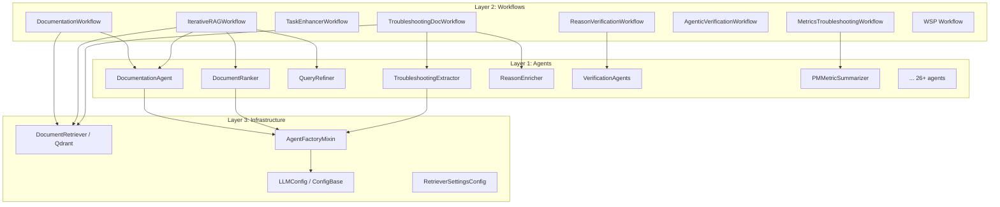
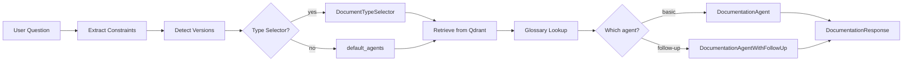
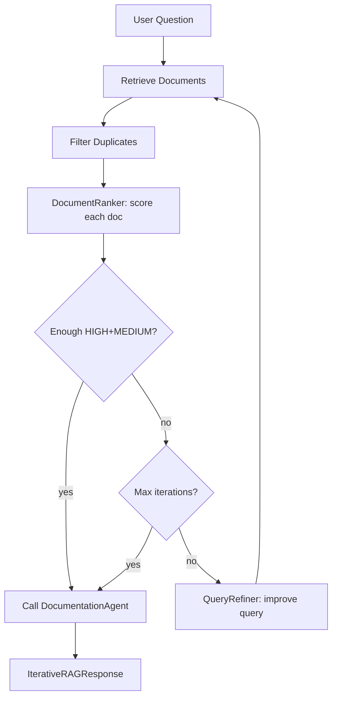
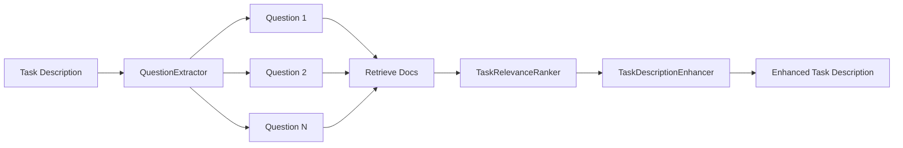
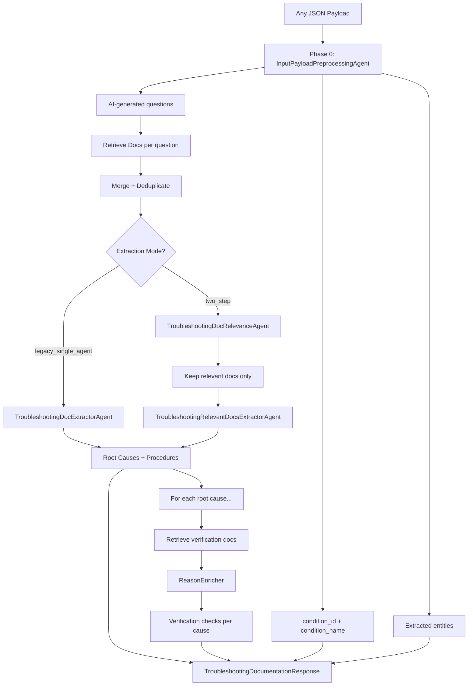
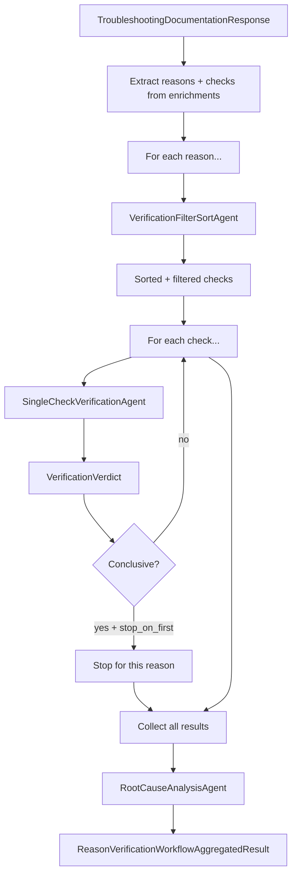
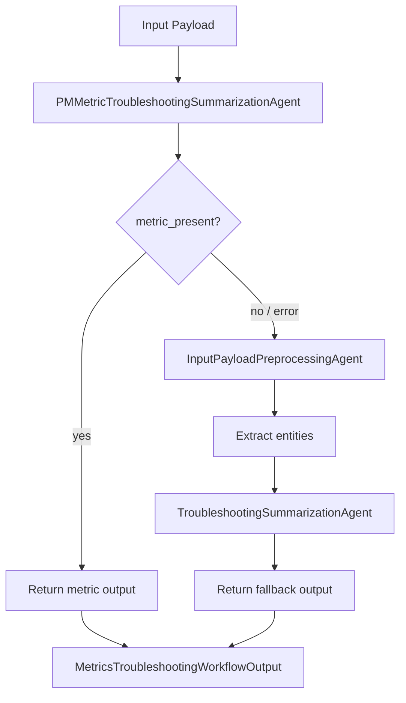
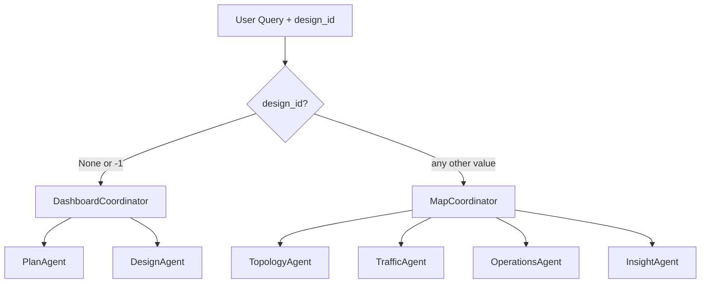

# ONA Agentic Applications — Complete Reference Guide

> **Package**: `ona-agentic-applications` v1.0.0  
> **Python**: >=3.10  
> **Dependencies**: `python-dotenv`, `requests`, `ona-agentic-tools` (sibling package)  
> **Dev extras**: `pytest`, `pytest-asyncio`, `umap-learn`, `scikit-learn`, `dash`, `plotly`, `tqdm`

This document is a full operational reference for the `ona-agentic-applications` library. It covers every agent, every workflow, the configuration system, data models, and the patterns you need to build on top of it.

---

## Table of Contents

1. [Directory Layout](#1-directory-layout)
2. [Architecture Overview](#2-architecture-overview)
3. [Agent Framework — How Every Agent Works](#3-agent-framework--how-every-agent-works)
4. [LLMConfig — The Universal Configuration Object](#4-llmconfig--the-universal-configuration-object)
5. [AgentFactoryMixin — Creating Agents](#5-agentfactorymixin--creating-agents)
6. [Complete Agent Catalog](#6-complete-agent-catalog)
7. [Workflows — Orchestrated Pipelines](#7-workflows--orchestrated-pipelines)
   - 7.1 [DocumentationWorkflow](#71-documentationworkflow)
   - 7.2 [IterativeRAGWorkflow](#72-iterativeragworkflow)
   - 7.3 [TaskEnhancerWorkflow](#73-taskenhancerworkflow)
   - 7.4 [TroubleshootingDocumentationWorkflow](#74-troubleshootingdocumentationworkflow)
   - 7.5 [ReasonVerificationWorkflow](#75-reasonverificationworkflow)
   - 7.6 [AgenticVerificationWorkflow](#76-agenticverificationworkflow)
   - 7.7 [MetricsTroubleshootingWorkflow](#77-metricstroubleshootingworkflow)
8. [WSP Multi-Agent Workflow](#8-wsp-multi-agent-workflow)
9. [RetrieverSettingsConfig — Document Retrieval](#9-retrieversettingsconfig--document-retrieval)
10. [Data Models Reference](#10-data-models-reference)
11. [Configuration Priority and Loading](#11-configuration-priority-and-loading)
12. [Examples and How to Run Them](#12-examples-and-how-to-run-them)
13. [Testing](#13-testing)
14. [Common Patterns and Recipes](#14-common-patterns-and-recipes)
15. [Troubleshooting Common Issues](#15-troubleshooting-common-issues)

---

## 1. Directory Layout

```
ona-agentic-applications/
├── pyproject.toml                    # Package metadata, deps, pyright config
├── requirements.txt                  # Pinned deps for reproducibility
├── docs/                             # Design docs
├── documents/                        # Additional reference material
├── examples/
│   ├── config/                       # YAML configs for all workflows
│   ├── documentation/                # Doc workflow examples + chatbots
│   ├── task_enhancement/             # Task enhancer demos
│   └── troubleshooting/              # Troubleshooting workflow examples
├── ona_agentic_applications/
│   ├── agents/                       # All 26+ agent implementations
│   │   ├── base.py                   # LLMConfig + AgentFactoryMixin
│   │   ├── __init__.py               # Public exports for all agents
│   │   ├── pm_agent/                 # PM metric agents + knowledge base
│   │   └── *.py                      # Individual agent files
│   ├── config/
│   │   └── retriever_config.py       # RetrieverSettingsConfig
│   ├── models/                       # Pydantic I/O models for every agent
│   ├── utils/                        # Utilities (trap_alarm_lookup, etc.)
│   └── workflows/
│       ├── documentation_workflow.py
│       ├── iterative_rag_workflow.py
│       ├── task_enhancer_workflow.py
│       ├── troubleshooting_documentation_workflow.py
│       ├── reason_verification_workflow.py
│       ├── agentic_verification_workflow.py
│       ├── metrics_troubleshooting_workflow.py
│       └── wsp/                      # WSP multi-agent workflow
│           ├── wsp_workflow.py        # Entry point: handle_query()
│           ├── map_coordinator/       # MapCoordinator + config
│           ├── dashboard_coordinator/ # DashboardCoordinator + config
│           ├── topology_agent/        # Site/link topology operations
│           ├── traffic_agent/         # Traffic/demand operations
│           ├── operations_agent/      # Network operations
│           ├── insight_agent/         # Analytics/insight operations
│           ├── plan_agent/            # Plan CRUD
│           └── design_agent/          # Design CRUD
└── tests/
    ├── test_config.py                # Config loading + priority tests
    └── fixtures/                     # YAML and JSON test configs
```

The `pyproject.toml` adds `../ona-agentic-tools` as an extra pyright path, which means this package depends on the sibling `ona-agentic-tools` library at build time and runtime.

---

## 2. Architecture Overview

The library follows a three-layer architecture:



**Key ideas:**
- Every agent inherits from `AgentFactoryMixin`, which gives it `from_config()`, `from_ollama()`, `from_azure()`, and `from_openai_compatible()` factory methods.
- Every workflow has a `*Config` class (inheriting from `ConfigBase`) that can be loaded from YAML files, JSON files, or environment variables.
- Workflows compose agents and infrastructure (retriever, glossary, constraints lookup) together.
- All agents produce Pydantic models as output, making everything type-safe and serializable.

---

## 3. Agent Framework — How Every Agent Works

Every agent in this library follows the same pattern:

1. **Define class attributes** — `SYSTEM_PROMPT`, `OUTPUT_TYPE`, `NAME`, `DESCRIPTION`
2. **Inherit from `AgentFactoryMixin`** — gives you all factory methods for free
3. **Implement `__init__`** — receives an `AgentBase` instance from the factory
4. **Implement `__call__`** — the async method that actually runs the agent

Here is the skeleton:

```python
from ona_agentic_applications.agents.base import AgentFactoryMixin, LLMConfig
from ona_agentic_tool.core import AgentBase
from pydantic import BaseModel

class MyOutput(BaseModel):
    answer: str
    confidence: float

class MyAgent(AgentFactoryMixin):
    SYSTEM_PROMPT = "You are a helpful assistant that..."
    OUTPUT_TYPE = MyOutput
    NAME = "my_agent"
    DESCRIPTION = "Does something useful"

    # Optional overrides
    DEFAULT_TEMPERATURE = 0.0
    DEFAULT_OUTPUT_MODE = None  # or "tool", "native", "prompted"
    DEPS_TYPE = None            # set this if agent has tools needing RunContext
    INPUT_TYPE = str            # input type for delegation framework

    def __init__(self, agent: AgentBase, **kwargs):
        self.agent = agent

    async def __call__(self, input: str) -> MyOutput:
        result = await self.agent.run(input)
        return result.output
```

Once defined, you can create the agent with any LLM backend:

```python
# From a config file
config = LLMConfig.from_yaml("my_config.yaml")
agent = MyAgent.from_config(config)

# Programmatic — Ollama
agent = MyAgent.from_ollama(
    model_name="gpt-oss:120b",
    base_url="http://localhost:11434/v1",
)

# Programmatic — Azure
agent = MyAgent.from_azure(
    model_name="gpt-4",
    azure_endpoint="https://my-resource.openai.azure.com",
    api_version="2024-02-15-preview",
    api_key="your-key",
)

# Programmatic — OpenAI-compatible (vLLM, etc.)
agent = MyAgent.from_openai_compatible(
    model_name="gpt-4",
    base_url="https://api.example.com/v1",
    api_key="your-key",
)
```

---

## 4. LLMConfig — The Universal Configuration Object

`LLMConfig` (in `agents/base.py`) is the Pydantic Settings base class that every agent config inherits from. It holds everything needed to connect to any LLM provider.

| Field | Type | Default | Purpose |
|-------|------|---------|---------|
| `provider` | `"ollama"` / `"azure"` / `"openai"` | **required** | Which LLM backend to use |
| `model_name` | `str` | **required** | Model or Azure deployment name |
| `base_url` | `str` | **required** | Server URL |
| `api_key` | `str` / `None` | `None` | API key (required for azure/openai) |
| `temperature` | `float` | `0.0` | Sampling temperature |
| `seed` | `int` / `None` | `None` | Random seed for reproducibility |
| `max_tokens` | `int` / `None` | `None` | Max tokens to generate |
| `api_version` | `str` | `"2024-02-15-preview"` | Azure API version |
| `azure_endpoint` | `str` / `None` | `None` | Azure endpoint (overrides `base_url` if set) |
| `thinking_level` | `str` / `None` | `None` | Extended reasoning (Ollama: `"true"/"false"`, gpt-oss: `"low"/"medium"/"high"`) |
| `reasoning_effort` | `"low"/"medium"/"high"` / `None` | `None` | OpenAI reasoning effort |
| `reasoning_summary` | `str` / `None` | `None` | OpenAI reasoning summary mode |
| `output_mode` | `"tool"/"native"/"prompted"` / `None` | `None` | Structured output extraction strategy |
| `log_path` | `str` | `"./logs"` | Log directory |
| `log_filename` | `str` / `None` | `None` | Log file name (auto-generated if None) |
| `retries` | `int` | `3` | Agent-level retries |
| `model_http_retries` | `int` | `0` | HTTP-level retries (429, 503) |
| `model_http_retry_delay_seconds` | `float` | `10.0` | Initial backoff delay |
| `disable_ssl_verification` | `bool` | `False` | Disable SSL (OpenAI-compatible only) |
| `extra_headers` | `dict` / `None` | `None` | Extra HTTP headers (OpenAI-compatible only) |

### output_mode explained

- **`None`** (default): Let Pydantic AI and the model decide. This is usually fine.
- **`"tool"`**: Force function/tool calling. The model must support it.
- **`"native"`**: Use the model's native JSON mode (e.g. OpenAI `response_format`).
- **`"prompted"`**: Inject the JSON schema into the system prompt and parse the response. Works with any model.

### Computed property

- `effective_azure_endpoint` — returns `azure_endpoint` if set, otherwise `base_url`. Used internally by `from_config()` when creating Azure agents.

---

## 5. AgentFactoryMixin — Creating Agents

`AgentFactoryMixin` is the abstract base class that every agent inherits from. It provides four factory methods:

### Class attributes (subclasses must define)

| Attribute | Required | Purpose |
|-----------|----------|---------|
| `SYSTEM_PROMPT` | Yes | The system prompt string |
| `OUTPUT_TYPE` | Yes | Pydantic model or type for structured output |
| `NAME` | Yes | Agent name (used in logs, metadata) |
| `DESCRIPTION` | Yes | What the agent does |
| `DEFAULT_TEMPERATURE` | No (0.0) | Default temperature if not overridden |
| `DEFAULT_OUTPUT_MODE` | No (None) | Default output mode |
| `DEPS_TYPE` | No (None) | Context type for tools (e.g., `RunContext[MyContext]`) |
| `INPUT_TYPE` | No (str) | Input type for delegation framework |

### Factory methods

```python
# Create from config object (recommended for production)
agent = MyAgent.from_config(config: LLMConfig, **kwargs)

# Create for Ollama (local or self-hosted)
agent = MyAgent.from_ollama(
    model_name="gpt-oss:120b",
    base_url="http://localhost:11434/v1",
    temperature=0.0,
    thinking_level="high",
    ...
)

# Create for Azure OpenAI
agent = MyAgent.from_azure(
    model_name="gpt-4",
    azure_endpoint="https://...",
    api_version="2024-02-15-preview",
    api_key="...",
    reasoning_effort="medium",
    ...
)

# Create for vLLM or other OpenAI-compatible servers
agent = MyAgent.from_openai_compatible(
    model_name="gpt-4",
    base_url="https://...",
    api_key="...",
    reasoning_effort="low",
    disable_ssl_verification=False,
    extra_headers={"apikey": "...", "model": "gpt-5"},
    ...
)
```

`from_config()` reads `config.provider` and dispatches to the appropriate backend method. Subclasses can override `from_config()` to extract agent-specific kwargs:

```python
class MyAgent(AgentFactoryMixin):
    # ...
    @classmethod
    def from_config(cls, config: MyAgentConfig):
        return super().from_config(config, my_param=config.my_param)
```

---

## 6. Complete Agent Catalog

### Documentation Agents

| Agent | File | Purpose | Key I/O |
|-------|------|---------|---------|
| `DocumentRanker` | `document_ranker.py` | Scores documents as HIGH (3) / MEDIUM (2) / LOW (1) | `DocumentRankerInput(query, document)` → `DocumentRankerOutput(relevance_score, summary, reasoning)` |
| `DocumentSummarizer` | `document_summarizer.py` | Summarizes document content | `DocumentSummarizerInput` → `DocumentSummarizerOutput` |
| `DocumentationAgent` | `documentation_agent.py` | Answers questions from retrieved docs | `DocumentationAgentInput(question, documents, glossary)` → `DocumentationAgentOutput(answer, documents_used_indices)` |
| `DocumentationAgentWithFollowUp` | `documentation_agent_with_follow_up.py` | Answers + can request clarification | `...Input` → `...Output(answer, is_complete, follow_up_question, documents_analysis)` |
| `DocumentTypeSelector` | `document_type_selector.py` | Selects which doc types to query | `DocumentTypeSelectorInput(question)` → `DocumentTypeSelectorOutput(agents)` |

### Query Agents

| Agent | File | Purpose | Key I/O |
|-------|------|---------|---------|
| `QueryRewriterAgent` | `query_rewriter.py` | Rewrites queries using conversation context | `str` → `QueryRewriterOutput` |
| `QueryRefiner` | `query_refiner.py` | Refines query from low-quality doc feedback | `QueryRefinerInput(original_query, previous_queries, document_summaries, feedback_reasons)` → `QueryRefinerOutput(refined_query)` |
| `QuestionExtractor` | `question_extractor.py` | Extracts questions from task descriptions | `QuestionExtractorInput` → `QuestionExtractorOutput` |

### Task Agents

| Agent | File | Purpose |
|-------|------|---------|
| `TaskRelevanceRanker` | `task_relevance_ranker.py` | Ranks docs by task relevance |
| `TaskDescriptionEnhancer` | `task_description_enhancer.py` | Enhances task descriptions with doc context |

### Troubleshooting Agents

| Agent | File | Purpose |
|-------|------|---------|
| `InputPayloadPreprocessingAgent` | `input_payload_preprocessing_agent.py` | Phase 0: extracts condition ID, condition name, questions, and entities from any JSON payload |
| `TroubleshootingDocumentationExtractorAgent` | `troubleshooting_documentation_extractor.py` | Extracts root causes, resolution procedures, related conditions from docs (legacy single-agent mode) |
| `TroubleshootingDocumentRelevanceAgent` | `troubleshooting_document_relevance_agent.py` | Step 1 of two-step mode: determines which docs are relevant |
| `TroubleshootingRelevantDocsExtractorAgent` | `troubleshooting_relevant_docs_extractor_agent.py` | Step 2 of two-step mode: extracts from relevant docs only |
| `ReasonEnricher` | `reason_enricher.py` | Adds verification checks to each root cause |
| `TroubleshootingSummarizationAgent` | `troubleshooting_summarization_agent.py` | Summarizes troubleshooting results (used in fallback path) |

### Verification Agents

| Agent | File | Purpose |
|-------|------|---------|
| `VerificationFilterSortAgent` | `verification_filter_sort_agent.py` | Filters and prioritizes verification checks for a reason |
| `SingleCheckVerificationAgent` | `single_check_verification_agent.py` | Runs one verification check, produces a `VerificationVerdict` |
| `RootCauseAnalysisAgent` | `root_cause_analysis_agent.py` | Aggregates all verification verdicts into root cause analysis |
| `AgenticReasonVerifierAgent` | `agentic_reason_verifier_agent.py` | Agentic verification with tools — can query live systems |

### PM Agents

| Agent | File | Purpose |
|-------|------|---------|
| `PMMetricTroubleshootingSummarizationAgent` | `pm_agent/metric_troubleshooting_summarization_agent.py` | PM metric-first summarization; uses metric knowledge base (`metric_kb.json`) and investigation tools |

---

## 7. Workflows — Orchestrated Pipelines

All workflows follow the same pattern:
1. A `*Config` class (inheriting from `ConfigBase`) for YAML/env loading
2. A `from_config()` class method that builds the workflow from config
3. An async `__call__()` method that runs the pipeline

### 7.1 DocumentationWorkflow

**File**: `workflows/documentation_workflow.py`  
**Config class**: `DocumentationWorkflowConfig` (env prefix: `DOC_WORKFLOW_`)

Straightforward RAG pipeline for answering documentation questions.



**Key config fields:**

| Field | Default | Purpose |
|-------|---------|---------|
| `use_follow_up_agent` | `False` | If True, uses the follow-up capable agent |
| `max_reference_links` | `5` | Max reference links in response |
| `default_version` | `"Latest"` | Version filter when none detected |
| `default_agents` | `["documentation", "api_info", "how_to"]` | Doc types to query |
| `documentation_agent` | required if basic | Basic agent config |
| `documentation_agent_with_follow_up` | required if follow-up | Follow-up agent config |
| `retriever` | required | Qdrant retriever config |
| `constraints_lookup` | required | Constraints file config |
| `glossary_lookup` | optional | Glossary config |

**Usage:**

```python
from ona_agentic_applications.workflows.documentation_workflow import (
    DocumentationWorkflow, DocumentationWorkflowConfig, DocumentationRequest
)

config = DocumentationWorkflowConfig.from_yaml("config/doc_workflow.yaml")
workflow = DocumentationWorkflow.from_config(config)

response = await workflow(DocumentationRequest(
    question="What is WSHA and how does it work?",
    conversation_id="conv-123",
))

if response.needs_follow_up:
    print(f"Need clarification: {response.follow_up_question}")
else:
    print(response.answer)
    for link in response.reference_links:
        print(f"  - {link.link_text}: {link.url}")
```

---

### 7.2 IterativeRAGWorkflow

**File**: `workflows/iterative_rag_workflow.py`  
**Config class**: `IterativeRAGWorkflowConfig` (env prefix: `ITERATIVE_RAG_`)

An advanced RAG workflow that iteratively refines queries when the first retrieval doesn't find good enough documents. It uses a `DocumentRanker` to score each document as HIGH/MEDIUM/LOW, and a `QueryRefiner` to improve the query based on feedback from low-quality results.



**Stopping criteria** (configurable):

| Field | Default | Purpose |
|-------|---------|---------|
| `min_num_of_high_relevant_documents` | `1` | Min HIGH (score=3) docs to stop |
| `min_num_of_medium_relevant_documents` | `0` | Min MEDIUM (score=2) docs to stop |
| `max_iterations` | `3` | Hard stop on iterations |

**How it works:**
1. Retrieve docs for the current query
2. Filter out documents already seen (by content hash) to avoid wasting LLM calls
3. Rank only new documents with `DocumentRanker`
4. Accumulate HIGH + MEDIUM docs across iterations
5. If stopping criteria not met, use LOW + MEDIUM docs as feedback for `QueryRefiner`
6. Refined query goes back to step 1
7. Once done, pass all HIGH + MEDIUM docs (sorted by score) to the `DocumentationAgent`

The response includes iteration metadata (`total_iterations`, per-iteration `IterationResult`) for debugging.

---

### 7.3 TaskEnhancerWorkflow

**File**: `workflows/task_enhancer_workflow.py`

Enhances task/ticket descriptions by pulling in relevant documentation.



**Flow:**
1. `QuestionExtractor` generates questions from the task description
2. For each question, retrieve relevant documents
3. `TaskRelevanceRanker` scores documents for task relevance
4. `TaskDescriptionEnhancer` uses ranked docs to produce an enhanced description

---

### 7.4 TroubleshootingDocumentationWorkflow

**File**: `workflows/troubleshooting_documentation_workflow.py`  
**Config class**: `TroubleshootingDocumentationWorkflowConfig` (env prefix: `TROUBLESHOOTING_DOC_`)

The most complex workflow. Takes any JSON payload (alarm, event, error — any structure), identifies the condition, retrieves docs, extracts root causes, and enriches each cause with verification steps.



**Two extraction modes** (controlled by `extraction_mode` config):

| Mode | Value | Agents Used |
|------|-------|-------------|
| Legacy | `"legacy_single_agent"` | Single `TroubleshootingDocumentationExtractorAgent` does both relevance and extraction |
| Two-step | `"two_step_relevance_then_extraction"` | `TroubleshootingDocumentRelevanceAgent` (step 1: relevance filtering) → `TroubleshootingRelevantDocsExtractorAgent` (step 2: extraction from relevant docs only) |

**Key config fields:**

| Field | Default | Purpose |
|-------|---------|---------|
| `extraction_mode` | `"legacy_single_agent"` | Which extraction strategy to use |
| `top_k_extraction` | `10` | Docs to retrieve for extraction |
| `top_k_enrichment` | `3` | Docs to retrieve per root cause |
| `causes_query_template` | `"Which are the causes of {condition_id} ({condition_name})"` | Template for cause queries |
| `clearing_query_template` | `"how to clear {condition_id} ({condition_name})"` | Template for clearing queries |
| `enrichment_query_template` | `"How do I verify {reason} when troubleshooting {condition_name}"` | Template for verification queries |
| `dedup_similarity_threshold` | `0.95` | Cosine similarity for dedup |
| `max_parallel_enrichments` | `10` | Max parallel enrichment calls |

**Usage:**

```python
from ona_agentic_applications.workflows.troubleshooting_documentation_workflow import (
    TroubleshootingDocumentationWorkflow,
    TroubleshootingDocumentationWorkflowConfig,
)

config = TroubleshootingDocumentationWorkflowConfig.from_yaml("config/troubleshooting.yaml")
workflow = TroubleshootingDocumentationWorkflow.from_config(
    config,
    add_data_for_evaluation=True,  # includes full doc content in response
)

# Works with ANY JSON payload — no predefined schema required
alarm_payload = {
    "message_id": "123",
    "condition_category": "alarm",
    "object": [{"object_additionalinfo": [{"additionaltext": "Module missing"}]}],
}
result = await workflow(alarm_payload)

print(result.condition_id)       # Identified condition
print(result.condition_name)     # Human-readable name
print(result.entities)           # Extracted entities
print(result.extraction)         # Root causes, procedures, related conditions
print(result.enrichments)        # Verification checks per root cause
print(result.all_references)     # All document URLs used
```

**Output structure** (`TroubleshootingDocumentationResponse`):

| Field | Type | Description |
|-------|------|-------------|
| `question_generation` | `dict` | Phase 0 output (raw) |
| `condition_id` | `str` | Identified condition ID |
| `condition_name` | `str` | Identified condition name |
| `entities` | `list[ExtractedEntity]` | Extracted entities |
| `extraction` | `TroubleshootingDocumentationOutput` | Agent 1 output: root causes, procedures, etc. |
| `enrichments` | `list[ReasonEnrichmentResult]` | Agent 2 output per root cause |
| `all_references` | `list[str]` | All document URLs used |
| `processing_time_ms` | `float` | Total workflow time |
| `documents_used_for_extraction` | `list[RetrievedDocumentInfo]` | Only if `add_data_for_evaluation=True` |
| `documents_used_for_enrichment` | `list[list[RetrievedDocumentInfo]]` | Only if `add_data_for_evaluation=True` |

---

### 7.5 ReasonVerificationWorkflow

**File**: `workflows/reason_verification_workflow.py`  
**Config class**: `ReasonVerificationWorkflowConfig` (env prefix: `REASON_VERIFICATION_`)

Takes the output of `TroubleshootingDocumentationWorkflow` and runs actual verification checks against the system.



**Key config fields:**

| Field | Default | Purpose |
|-------|---------|---------|
| `stop_on_first_conclusive` | `True` | Stop checking a reason after first confirms/rules_out verdict |
| `min_confidence_for_conclusive` | `["medium", "high"]` | What confidence levels count as conclusive |

**Flow per reason:**
1. `VerificationFilterSortAgent` removes impractical checks and prioritizes the rest
2. `SingleCheckVerificationAgent` runs each check sequentially, producing a `VerificationVerdict`
3. If `stop_on_first_conclusive` is True and a check comes back as `confirms` or `rules_out` with sufficient confidence, stop early
4. After all reasons are processed, `RootCauseAnalysisAgent` aggregates everything into a final analysis

---

### 7.6 AgenticVerificationWorkflow

**File**: `workflows/agentic_verification_workflow.py`

An alternative to `ReasonVerificationWorkflow` that uses the `AgenticReasonVerifierAgent`, which has tools that can query live systems (network elements, databases, etc.). The agent decides which tools to call to verify each root cause.

---

### 7.7 MetricsTroubleshootingWorkflow

**File**: `workflows/metrics_troubleshooting_workflow.py`  
**Config class**: `MetricsTroubleshootingWorkflowConfig` (env prefix: `METRICS_TROUBLESHOOTING_`)

A metric-first workflow with fallback. Tries PM metrics first; if no metric data is available, falls back to standard troubleshooting.



**Output** (`MetricsTroubleshootingWorkflowOutput`):

| Field | Type | Description |
|-------|------|-------------|
| `selected_path` | `"metric"` / `"fallback"` | Which path was taken |
| `metric_output` | agent output or `None` | PM metric summarization result |
| `preprocessing_output` | agent output or `None` | Only on fallback path |
| `fallback_output` | agent output or `None` | Only on fallback path |
| `processing_time_ms` | `float` | Total time |

**Usage:**

```python
from ona_agentic_applications.workflows.metrics_troubleshooting_workflow import (
    MetricsTroubleshootingWorkflow,
    MetricsTroubleshootingWorkflowConfig,
)
from ona_agentic_applications.models.metrics_troubleshooting_workflow_io import (
    MetricsTroubleshootingWorkflowInput,
)

config = MetricsTroubleshootingWorkflowConfig.from_yaml("config/metrics.yaml")
workflow = MetricsTroubleshootingWorkflow.from_config(config)

result = await workflow(
    MetricsTroubleshootingWorkflowInput(payload=my_payload),
    conversation_id="conv-456",
)

if result.selected_path == "metric":
    print("Used PM metrics:", result.metric_output)
else:
    print("Used fallback:", result.fallback_output)
```

---

## 8. WSP Multi-Agent Workflow

**Files**: `workflows/wsp/` directory  
**Entry point**: `handle_query()` in `wsp_workflow.py`

The WSP (Wavelength Service Planning) workflow is a multi-agent system for network design operations. It routes queries to two different coordinators based on whether a design is selected.



### Usage

```python
from ona_agentic_applications.workflows.wsp import handle_query

# Dashboard operations (no design selected)
result, link = await handle_query(
    query="Create plan MyPlan and design MainDesign",
    wsp_client=wsp_client,
    design_id=None,
    session_id="session-1",
    llm_config={"provider": "ollama", "model_name": "gpt-oss:120b", "base_url": "..."},
)

# Map operations (design selected)
result, link = await handle_query(
    query="Create sites Delhi and Mumbai",
    wsp_client=wsp_client,
    design_id="123",
    session_id="session-1",
)
```

### WSPMapAgentV2 — Reusable wrapper

For performance, `WSPMapAgentV2` keeps a single `MapCoordinator` alive across multiple calls instead of recreating agents every time:

```python
from ona_agentic_applications.workflows.wsp.wsp_workflow import WSPMapAgentV2

agent = await WSPMapAgentV2.create(llm_config={"provider": "ollama", ...})

# Reuse across multiple queries
result1 = await agent.execute("Create site A", design_id="123", wsp_client=wsp)
result2 = await agent.execute("Add link A-B", design_id="123", wsp_client=wsp)
```

### Coordinator details

**MapCoordinator** has four specialist tools that delegate to sub-agents:
- `call_topology_agent` — site/link topology operations
- `call_traffic_agent` — traffic/demand operations
- `call_operations_agent` — network operations
- `call_insight_agent` — analytics and insights

**DashboardCoordinator** has two specialist tools:
- `call_plan_agent` — plan CRUD operations
- `call_design_agent` — design CRUD operations

Each specialist agent has domain-specific tools registered that interact with the WSP API client.

---

## 9. RetrieverSettingsConfig — Document Retrieval

**File**: `config/retriever_config.py`

This is the configuration for the document retrieval pipeline (Qdrant vector search + BM25 sparse prefilter + neural cross-encoder reranking).

### Required fields

| Field | Example |
|-------|---------|
| `qdrant_url` | `"http://localhost:6333"` |
| `collection_name` | `"ws-ai-knowledge-25.6-build"` or `["col-a", "col-b"]` |
| `embedding_endpoint` | `"http://localhost:8083/api/compute_embeddings"` |
| `reranker_endpoint` | `"http://localhost:8083/api/compute_ranking"` |

### Retrieval parameters

| Field | Default | Purpose |
|-------|---------|---------|
| `top_k_retrieval` | `50` | Docs from initial dense search |
| `top_k_output` | `5` | Final docs after reranking |
| `hnsw_ef` | `512` | HNSW beam size (higher = more accurate, slower) |
| `exact_search` | `True` | If True, skips ANN approximation |

### Reranking parameters

| Field | Default | Purpose |
|-------|---------|---------|
| `chunk_size` | `512` | Character chunk size for BM25 + reranker |
| `top_k_chunks` | `3` | Top chunks per document for reranker |
| `aggregation_method` | `"weighted_mean"` | How to aggregate chunk scores: `weighted_mean`, `max`, `harmonic_mean`, `top_k_mean` |
| `reranker_batch_size` | `300` | Max query-chunk pairs per HTTP request |

### Thresholds and flags

| Field | Default | Purpose |
|-------|---------|---------|
| `dense_threshold` | `None` | Min dense score (None = keep all) |
| `rerank_threshold` | `None` | Min rerank score (None = keep all) |
| `enable_sparse_prefilter` | `True` | Use BM25 to select chunks before neural rerank |
| `enable_neural_rerank` | `True` | Use cross-encoder neural reranker |

### Default filters

| Field | Default | Purpose |
|-------|---------|---------|
| `default_agents` | `["documentation", "how_to", "api_info"]` | Document types to query |
| `default_versions` | `["Latest"]` | Version filter |
| `default_filters` | `None` | Per-collection filters (must match `collection_name` list length) |

### Multi-collection with per-collection filters

```yaml
retriever:
  qdrant_url: "http://qdrant:6333"
  collection_name: [col-a, col-b]
  embedding_endpoint: "http://embedding:8083/api/compute_embeddings"
  reranker_endpoint: "http://embedding:8083/api/compute_ranking"
  default_filters:
    - agents: [documentation]
      versions: [Latest]
      exclude_tags: [wsp, ept]
    - agents: [how_to]
      versions: [25.6]
```

### Key methods

```python
# Convert to ona_agentic_tool's RetrieverConfig dataclass
tool_config = retriever_settings.to_tool_config()

# Create a ready-to-use DocumentRetriever instance
retriever = retriever_settings.create_retriever()

# Use the retriever
docs = retriever("What is WSHA?", top_k=10)
```

---

## 10. Data Models Reference

All data models live in `ona_agentic_applications/models/`. Here are the key ones:

### Troubleshooting extraction models

| Model | Purpose |
|-------|---------|
| `IssueSummary` | Condition summary with evidence |
| `RootCause` | Identified root cause with evidence and severity |
| `ResolutionProcedure` | Fix procedure with steps |
| `ResolutionStep` | Single step in a procedure |
| `RelatedCondition` | Related alarms/conditions |
| `AlarmMetadata` | Alarm context metadata |
| `Evidence` | Supporting evidence with `doc_index` reference |
| `DocumentRelevance` | Per-document relevance (doc_index, is_relevant, note) |
| `TroubleshootingDocumentationInput` | Input for extractor (condition_id, condition_name, category, document_chunks) |
| `TroubleshootingDocumentRelevanceOutput` | Output of step 1: document_relevance list |
| `TroubleshootingDocumentContentOutput` | Output of step 2: issue_summary, root_causes, resolution_procedures, etc. |
| `TroubleshootingDocumentationOutput` | Combined output: relevance + content |

### Preprocessing models

| Model | Purpose |
|-------|---------|
| `InputPayloadPreprocessingAgentInput` | Wraps raw payload dict |
| `InputPayloadPreprocessingAgentOutput` | condition_id, condition_name, questions, troubleshooting_questions, root_cause_questions, entities |
| `ExtractedEntity` | Entity extracted from payload |

### Enrichment models

| Model | Purpose |
|-------|---------|
| `ConditionContext` | Context about the condition being troubleshot |
| `ReasonEnricherInput` | condition_context + root_cause + document_chunks |
| `ReasonEnricherOutput` | document_relevance, verification_available, verification |
| `ReasonVerification` | verification_checks list |
| `VerificationCheck` | check_name, check_type, evidence list |
| `ReasonEnrichmentResult` | Workflow-level: reason + enrichment + document_urls |

### Verification models

| Model | Purpose |
|-------|---------|
| `VerificationFilterSortInput` | reason, verification_checks, condition context |
| `VerificationFilterSortOutput` | sorted_indices, dropped_checks |
| `SingleCheckVerificationInput` | reason, check, condition context, entity |
| `VerificationVerdict` | status (confirms/rules_out/inconclusive/failed), confidence, evidence, performed_operations |
| `PerformedVerification` | check + verdict pair |
| `RootCauseAnalysisInput` | condition context + all verification results |
| `RootCauseAnalysisOutput` | root_cause_analysis list with cause_analysis items |

### Agentic verification models

| Model | Purpose |
|-------|---------|
| `AgenticReasonVerifierInput` | candidate_reasons, condition context, entity |
| `AgenticReasonVerifierOutput` | root_cause_analysis (RootCauseAnalysisV1) |
| `CandidateReason` | reason + verification_checks |

### Metrics workflow models

| Model | Purpose |
|-------|---------|
| `MetricsTroubleshootingWorkflowInput` | payload dict |
| `MetricsTroubleshootingWorkflowOutput` | selected_path, metric_output, fallback_output |
| `PMMetricTroubleshootingSummarizationAgentInput` | payload dict |

### Documentation workflow models

| Model | Purpose |
|-------|---------|
| `DocumentationRequest` | question, conversation_id, exclude_urls |
| `DocumentationResponse` | answer, reference_links, is_complete, follow_up_question |
| `IterativeRAGRequest` | question, conversation_id, exclude_urls |
| `IterativeRAGResponse` | answer, reference_links, iterations metadata, follow-up fields |
| `TroubleshootingDocumentationResponse` | Full troubleshooting output (see section 7.4) |

---

## 11. Configuration Priority and Loading

All config classes inherit from `ConfigBase` (from `ona-agentic-tools`), which uses Pydantic Settings v2. The priority order is:

```
Constructor arguments  >  Environment variables  >  Config file (YAML/JSON)  >  Class defaults
```

### Loading from YAML

```python
config = DocumentationWorkflowConfig.from_yaml("path/to/config.yaml")
```

### Loading from environment variables

Each workflow config has an `env_prefix` and uses `__` (double underscore) as the nested delimiter:

| Workflow | Env Prefix | Example |
|----------|-----------|---------|
| DocumentationWorkflow | `DOC_WORKFLOW_` | `DOC_WORKFLOW_RETRIEVER__QDRANT_URL=http://...` |
| IterativeRAGWorkflow | `ITERATIVE_RAG_` | `ITERATIVE_RAG_MAX_ITERATIONS=5` |
| TroubleshootingDocWorkflow | `TROUBLESHOOTING_DOC_` | `TROUBLESHOOTING_DOC_DOC_EXTRACTOR__MODEL_NAME=gpt-4` |
| ReasonVerificationWorkflow | `REASON_VERIFICATION_` | `REASON_VERIFICATION_SINGLE_CHECK_AGENT__MODEL_NAME=gpt-4` |
| MetricsTroubleshootingWorkflow | `METRICS_TROUBLESHOOTING_` | `METRICS_TROUBLESHOOTING_METRIC_SUMMARIZER__PROVIDER=azure` |

### Combining YAML with env overrides

This is the recommended production pattern: define base config in YAML, override secrets and environment-specific values with env vars:

```yaml
# config.yaml — base config (committed to repo)
documentation_agent:
  provider: "azure"
  model_name: "gpt-4"
  temperature: 0.0
retriever:
  collection_name: "ws-ai-knowledge-25.6-build"
  top_k_output: 5
```

```bash
# Environment — secrets and env-specific values
export DOC_WORKFLOW_DOCUMENTATION_AGENT__BASE_URL=https://my-azure.openai.azure.com
export DOC_WORKFLOW_DOCUMENTATION_AGENT__API_KEY=sk-...
export DOC_WORKFLOW_RETRIEVER__QDRANT_URL=http://qdrant-prod:6333
export DOC_WORKFLOW_RETRIEVER__EMBEDDING_ENDPOINT=http://embedding-prod:8083/api/compute_embeddings
export DOC_WORKFLOW_RETRIEVER__RERANKER_ENDPOINT=http://embedding-prod:8083/api/compute_ranking
```

```python
config = DocumentationWorkflowConfig.from_yaml("config.yaml")
# Env vars automatically override YAML values
```

### Test for priority order

The test suite (`test_config.py`) includes `TestConfigPriorityOrder` that verifies:
- Constructor args win over everything
- Environment variables win over file values
- File values win over class defaults

---

## 12. Examples and How to Run Them

| Example | Path | What it does |
|---------|------|-------------|
| Documentation workflow | `examples/documentation/run_documentation_workflow.py` | Runs the basic documentation workflow |
| Documentation chatbot | `examples/documentation/documentation_chatbot.py` | Interactive chatbot using the doc workflow |
| Iterative RAG chatbot | `examples/documentation/iterative_rag_documentation_chatbot.py` | Chatbot with iterative refinement |
| Task enhancement | `examples/task_enhancement/task_enhancement_demo.py` | Enhances task descriptions |
| Troubleshooting docs | `examples/troubleshooting/run_troubleshooting_documentation.py` | Runs troubleshooting doc workflow |
| Metric-first fallback | `examples/troubleshooting/run_metric_first_fallback_workflow.py` | Runs metric-first workflow |
| End-to-end troubleshooting | `examples/troubleshooting/run_end_to_end_troubleshooting.py` | Full troubleshooting pipeline |
| Agentic troubleshooting | `examples/troubleshooting/run_end_to_end_troubleshooting_agentic.py` | With agentic verification |
| Visualize metric fallback | `examples/troubleshooting/visualize_metric_first_fallback.py` | Dash/Plotly visualization |

All examples use YAML config files from `examples/config/`.

### Running an example

```bash
cd ona-agentic-applications
pip install -e .
pip install -e ../ona-agentic-tools

# Set environment variables for secrets
export DOC_WORKFLOW_DOCUMENTATION_AGENT__API_KEY=your-key
# ...

python examples/documentation/run_documentation_workflow.py
```

---

## 13. Testing

### Test structure

- `tests/test_config.py` — The main test file covering configuration loading and priority
- `tests/fixtures/` — YAML and JSON config files used in tests

### Key test classes

| Test Class | What it tests |
|-----------|---------------|
| `TestLLMConfig` | Basic LLMConfig creation and field defaults |
| `TestRetrieverConfig` | RetrieverSettingsConfig creation and validation |
| `TestDocumentationAgentConfig` | Agent-specific config fields |
| `TestDocumentationWorkflowConfig` | Workflow config with nested agents |
| `TestConfigPriorityOrder` | Constructor > env > file > defaults |

### Running tests

```bash
cd ona-agentic-applications
pytest tests/ -v
```

For async tests (workflows), `pytest-asyncio` is used.

---

## 14. Common Patterns and Recipes

### Pattern 1: Create an agent from a YAML config

```python
from ona_agentic_applications.agents import DocumentationAgent, DocumentationAgentConfig

config = DocumentationAgentConfig.from_yaml("my_agent_config.yaml")
agent = DocumentationAgent.from_config(config)
result = await agent(input=my_input, base_url="https://docs.example.com")
```

### Pattern 2: Create a workflow from YAML

```python
from ona_agentic_applications.workflows.troubleshooting_documentation_workflow import (
    TroubleshootingDocumentationWorkflow,
    TroubleshootingDocumentationWorkflowConfig,
)

config = TroubleshootingDocumentationWorkflowConfig.from_yaml("config.yaml")
workflow = TroubleshootingDocumentationWorkflow.from_config(config)
result = await workflow(payload)
```

### Pattern 3: Chain troubleshooting + verification

```python
# Step 1: Documentation workflow
doc_config = TroubleshootingDocumentationWorkflowConfig.from_yaml("doc_config.yaml")
doc_workflow = TroubleshootingDocumentationWorkflow.from_config(doc_config)
doc_result = await doc_workflow(alarm_payload)

# Step 2: Verification workflow
verif_config = ReasonVerificationWorkflowConfig.from_yaml("verif_config.yaml")
verif_workflow = ReasonVerificationWorkflow.from_config(verif_config)
verif_result = await verif_workflow(
    ReasonVerificationFromDocInput(
        documentation_response=doc_result,
        entity_index=0,
    ),
    conversation_id="conv-789",
)

print(verif_result.root_cause_analysis)
```

### Pattern 4: Override config with environment variables

```python
import os

# Set overrides before loading config
os.environ["TROUBLESHOOTING_DOC_DOC_EXTRACTOR__MODEL_NAME"] = "gpt-4.1"
os.environ["TROUBLESHOOTING_DOC_RETRIEVER__QDRANT_URL"] = "http://qdrant-staging:6333"

config = TroubleshootingDocumentationWorkflowConfig.from_yaml("base_config.yaml")
# model_name and qdrant_url are now overridden
```

### Pattern 5: Use evaluation mode for offline quality checks

```python
workflow = TroubleshootingDocumentationWorkflow.from_config(
    config,
    add_data_for_evaluation=True,
)
result = await workflow(payload)

# Now result includes the actual document content used
for doc_info in result.documents_used_for_extraction:
    print(doc_info.content[:200])
    print(doc_info.url)
```

### Pattern 6: Build a new agent

```python
from pydantic import BaseModel
from ona_agentic_applications.agents.base import AgentFactoryMixin, LLMConfig
from ona_agentic_tool.core import AgentBase

class SentimentOutput(BaseModel):
    sentiment: str
    confidence: float
    reasoning: str

class SentimentAgent(AgentFactoryMixin):
    SYSTEM_PROMPT = """Analyze the sentiment of the given text.
    Return a structured response with sentiment (positive/negative/neutral),
    confidence (0-1), and reasoning."""
    OUTPUT_TYPE = SentimentOutput
    NAME = "sentiment_agent"
    DESCRIPTION = "Analyzes text sentiment"
    DEFAULT_OUTPUT_MODE = "tool"

    def __init__(self, agent: AgentBase):
        self.agent = agent

    async def __call__(self, text: str) -> SentimentOutput:
        result = await self.agent.run(text)
        return result.output

# Use it
agent = SentimentAgent.from_ollama(
    model_name="gpt-oss:120b",
    base_url="http://localhost:11434/v1",
)
output = await agent("The system is performing well after the upgrade.")
print(output.sentiment, output.confidence)
```

---

## 15. Troubleshooting Common Issues

### "Unknown provider" error from `from_config()`

The `provider` field must be exactly `"ollama"`, `"azure"`, or `"openai"`. Check your YAML or env var. `"openai"` is used for any OpenAI-compatible endpoint (including vLLM).

### Config validation errors on load

Pydantic Settings v2 is strict. Common issues:
- Missing required fields (`provider`, `model_name`, `base_url`).
- Nested config has wrong delimiter. Use `__` (double underscore) for env vars, not `.`.
- `default_filters` list length doesn't match `collection_name` list length.

### "documentation_extractor is required" error

If `extraction_mode` is `"legacy_single_agent"`, you must provide `doc_extractor` config. If it's `"two_step_relevance_then_extraction"`, you need `doc_relevance_extractor` and `relevant_docs_extractor` (or it will try to derive them from `doc_extractor`).

### Retriever returns empty results

Check:
1. `qdrant_url` is reachable
2. `collection_name` exists in Qdrant
3. `embedding_endpoint` and `reranker_endpoint` are running
4. `default_agents` and `default_versions` match what's actually in your collection
5. `dense_threshold` or `rerank_threshold` aren't too high

### SSL errors with OpenAI-compatible endpoints

Set `disable_ssl_verification: true` in the LLM config. Or set `verify_ssl: false` in the retriever config for embedding/reranker endpoints.

### Enrichment timeouts or failures

Increase `max_parallel_enrichments` in the troubleshooting workflow config, or increase `model_http_retries` and `model_http_retry_delay_seconds` in the agent configs. The enrichment runs in parallel with an `asyncio.Semaphore`.

### WSP workflow recreates agents on every call

Use `WSPMapAgentV2` instead of `handle_query()` when you need to make multiple calls. `handle_query()` creates new coordinator instances each time. `WSPMapAgentV2.create()` builds the coordinator once and reuses it.

---

*This document was written as a knowledge transfer reference. The source of truth is always the code itself — start with `agents/base.py` for the framework, `agents/__init__.py` for the full export list, and the individual workflow files for pipeline logic.*
