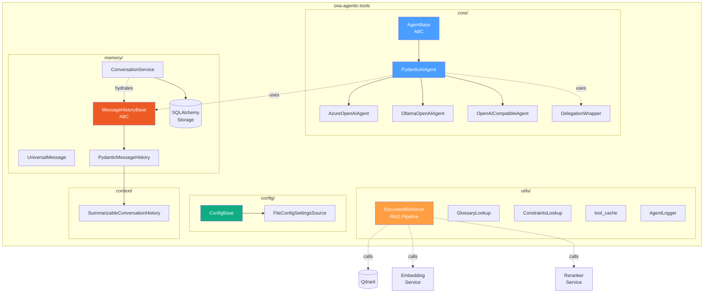
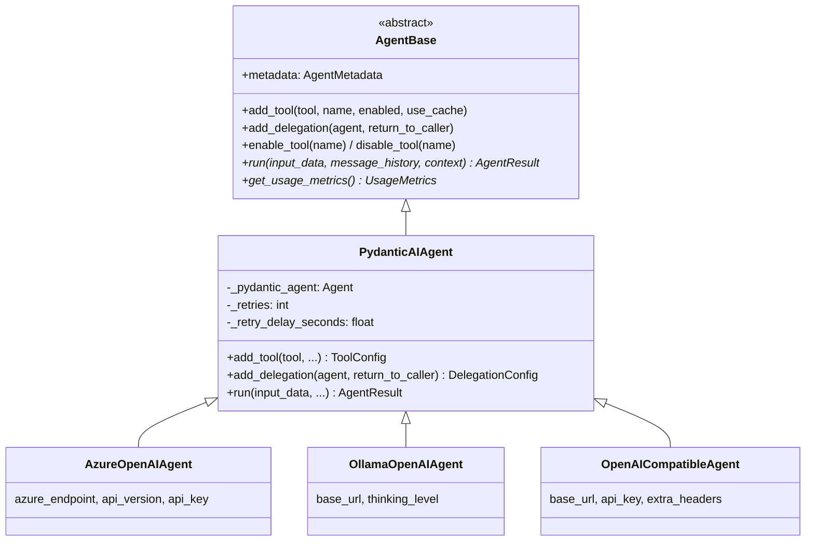
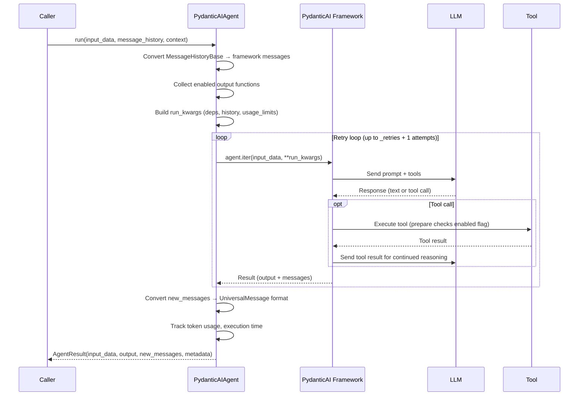
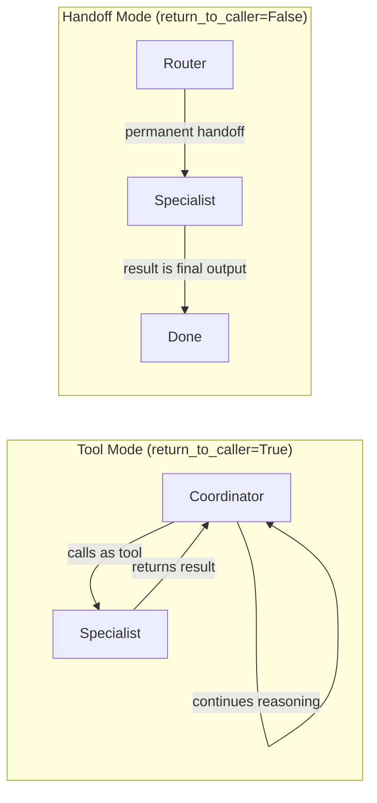
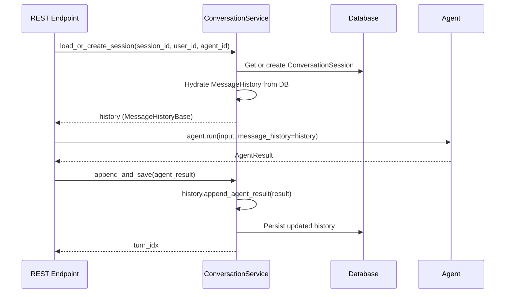
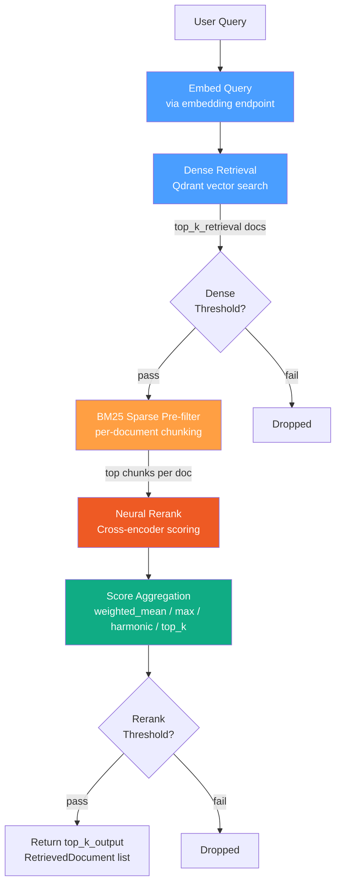
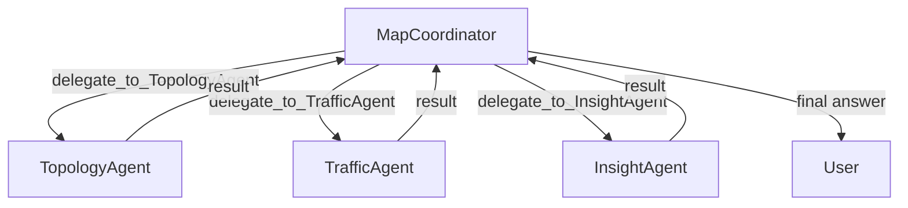

# ONA Agentic Tools — Complete Reference Guide

> **Package:** `ona-agentic-tools`
> **Role:** Foundational framework library that powers every agentic application in the ONA ecosystem.
> **Audience:** Engineers maintaining or extending the agent platform after the original author's departure.

---

## Table of Contents

1. [What This Library Does](#1-what-this-library-does)
2. [Directory Layout](#2-directory-layout)
3. [Architecture Overview](#3-architecture-overview)
4. [Core Module — The Agent Framework](#4-core-module--the-agent-framework)
   - [agent_base.py — Abstract Foundation](#41-agent_basepy--abstract-foundation)
   - [pydantic_ai_agent.py — The Main Workhorse](#42-pydantic_ai_agentpy--the-main-workhorse)
   - [openai_agents.py — Provider-Specific Agents](#43-openai_agentspy--provider-specific-agents)
   - [delegation.py — Multi-Agent Coordination](#44-delegationpy--multi-agent-coordination)
5. [Config Module — Configuration Management](#5-config-module--configuration-management)
6. [Memory Module — Conversation Persistence](#6-memory-module--conversation-persistence)
   - [message_base.py — Universal Message Format](#61-message_basepy--universal-message-format)
   - [pydantic_message_history.py — Framework Bridge](#62-pydantic_message_historypy--framework-bridge)
   - [conversation_service.py — Database Persistence](#63-conversation_servicepy--database-persistence)
   - [database.py, repository.py, models.py — Storage Layer](#64-databasepy-repositorypy-modelspy--storage-layer)
7. [Utils Module — Shared Utilities](#7-utils-module--shared-utilities)
   - [rag_utils.py — The RAG Pipeline](#71-rag_utilspy--the-rag-pipeline)
   - [glossary_lookup.py — Term Resolution](#72-glossary_lookuppy--term-resolution)
   - [constraints_lookup.py — Constraint Extraction](#73-constraints_lookuppy--constraint-extraction)
   - [cache.py — Tool Result Caching](#74-cachepy--tool-result-caching)
   - [logger.py — Structured Logging](#75-loggerpy--structured-logging)
8. [Context Module — Conversation Summarization](#8-context-module--conversation-summarization)
9. [Key Design Patterns](#9-key-design-patterns)
10. [How Other Projects Use This Library](#10-how-other-projects-use-this-library)
11. [Database Migrations (Alembic)](#11-database-migrations-alembic)
12. [Examples](#12-examples)
13. [Quick Reference Tables](#13-quick-reference-tables)

---

## 1. What This Library Does

`ona-agentic-tools` is the shared foundation that every agent in the ONA ecosystem is built on. If you think of `ona-agentic-applications` as the place where specific agents and workflows live, then `ona-agentic-tools` is the toolkit they all import. It provides:

- **An agent abstraction** — a common `AgentBase` class and a PydanticAI implementation (`PydanticAIAgent`) so that every agent in the system follows the same interface.
- **Multi-agent delegation** — a framework for one agent to call another agent as a tool ("agent-as-tool") or hand off control permanently.
- **Configuration management** — a `ConfigBase` class that loads YAML/JSON files and merges them with environment variables following a clear priority order.
- **Conversation memory** — a universal message format, message history adapters, and database-backed persistence so agents can have multi-turn conversations.
- **A RAG pipeline** — the `DocumentRetriever` class that combines Qdrant vector search, BM25 sparse filtering, and neural cross-encoder reranking.
- **Glossary and constraint utilities** — helpers that resolve acronyms and extract product/version constraints from user queries before they hit the RAG pipeline.
- **Structured logging and caching** — JSON-formatted logging and an LRU cache decorator for tool functions.

---

## 2. Directory Layout

```
ona-agentic-tools/
├── ona_agentic_tool/
│   ├── __init__.py
│   ├── config/
│   │   ├── __init__.py
│   │   └── base.py                # ConfigBase, FileConfigSettingsSource
│   ├── context/
│   │   ├── __init__.py
│   │   ├── config.py              # SummarizationConfig
│   │   ├── prompts.py             # Prompt templates for summarization
│   │   ├── summarizable_history.py # SummarizableConversationHistory
│   │   └── summarizable_service.py # Service for summarizable conversations
│   ├── core/
│   │   ├── __init__.py
│   │   ├── agent_base.py          # AgentBase (ABC), AgentMetadata, ToolConfig, AgentResult
│   │   ├── pydantic_ai_agent.py   # PydanticAIAgent — the main implementation
│   │   ├── openai_agents.py       # AzureOpenAIAgent, OllamaOpenAIAgent, OpenAICompatibleAgent
│   │   └── delegation.py          # DelegationConfig, DelegationWrapper, DelegationBasicDeps
│   ├── memory/
│   │   ├── __init__.py
│   │   ├── message_base.py        # UniversalMessage, MessageHistoryBase (ABC)
│   │   ├── pydantic_message_history.py  # PydanticMessageHistory, PydanticConversationalMessageHistory
│   │   ├── conversation_service.py      # ConversationServiceBase, FullHistoryService, ConversationalHistoryService
│   │   ├── database.py            # SQLAlchemy engine setup, session factory
│   │   ├── models.py              # ConversationSession ORM model
│   │   └── repository.py          # CRUD operations for conversations
│   └── utils/
│       ├── __init__.py
│       ├── rag_utils.py           # DocumentRetriever, RetrieverConfig, RetrieverFilter
│       ├── glossary_lookup.py     # GlossaryLookup, GlossaryDefinitions
│       ├── constraints_lookup.py  # ConstraintsLookup
│       ├── cache.py               # tool_cache decorator
│       └── logger.py              # AgentLogger, LogLevel
├── examples/
│   ├── core/                      # Basic agent usage, tool registration
│   ├── integration/               # Integration with external systems
│   └── summarization/             # Conversation summarization examples
├── tests/
├── alembic/                       # DB migrations for conversation storage
├── pyproject.toml
├── requirements.txt
├── ARCHITECTURE.md
└── USE_CASES.md
```

---

## 3. Architecture Overview



### Class Hierarchy at a Glance



---

## 4. Core Module — The Agent Framework

This is the heart of the library. Every agent in `ona-agentic-applications` ultimately inherits from the classes defined here.

### 4.1 agent_base.py — Abstract Foundation

`AgentBase` is the abstract base class (ABC) that defines the contract every agent must follow. It provides the interface for tool management, delegation management, and execution.

#### Key Data Classes

| Class | Purpose | Key Fields |
|-------|---------|------------|
| `AgentMetadata` | Identity of an agent | `name`, `description`, `retries` (default 3) |
| `LoggerSpec` | Where to write logs | `log_path`, `log_filename` |
| `ToolConfig` | Configuration for a registered tool | `tool` (callable), `name`, `enabled`, `use_cache`, `cache_maxsize`, `return_to_caller` |
| `TokenUsage` | Token counter | `input_tokens`, `output_tokens`, `total_tokens`, `.add()` |
| `UsageMetrics` | Combined metrics | `tool_calls` (int), `token_usage` (TokenUsage) |
| `AgentResult` | Unified result from `agent.run()` | `input_data`, `output`, `new_messages`, `session_id`, `metadata` |

#### AgentResult — What You Get Back from Every Agent

Every call to `agent.run()` returns an `AgentResult`. This is the universal currency of the system:

```python
@dataclass
class AgentResult:
    input_data: Any        # The input prompt/data you sent in
    output: Any            # The agent's output (type depends on OUTPUT_TYPE)
    new_messages: List[Any]  # Messages from this execution in UniversalMessage format
    session_id: Optional[str] = None
    metadata: Dict[str, Any] = field(default_factory=dict)
    # metadata contains: execution_time_ms, tool_calls, token_usage
```

#### AgentBase — The Contract

```python
class AgentBase(ABC):
    def __init__(self, metadata, log_spec, output_type, deps_type=None, input_type=str):
        ...

    # Tool management
    def add_tool(self, tool, name=None, enabled=True, use_cache=False, ...) -> ToolConfig
    def enable_tool(self, name: str)
    def disable_tool(self, name: str)
    def get_enabled_tools(self) -> List[str]

    # Delegation management
    def add_delegation(self, agent, return_to_caller, enabled=True) -> DelegationConfig  # abstract
    def enable_delegation(self, name: str)
    def disable_delegation(self, name: str)

    # Execution
    async def run(self, input_data, message_history=None, context=None,
                  session_id=None, output_functions_only=False,
                  usage_limits=None) -> AgentResult  # abstract
```

The `add_tool()` method at the base level handles caching (wraps the tool with `tool_cache` if `use_cache=True`) and stores the `ToolConfig`. Subclasses extend this to also register the tool with their underlying framework.

### 4.2 pydantic_ai_agent.py — The Main Workhorse

`PydanticAIAgent` is the concrete implementation of `AgentBase` built on top of PydanticAI. This is the class that practically every agent in the system uses under the hood.

#### How It Works

1. You create a `PydanticAIAgent` with a pre-configured PydanticAI `Agent` instance, system prompt, output type, and model configuration.
2. Tools are registered via `add_tool(func)`. If the function's first parameter is `RunContext[T]`, it gets registered with `agent.tool()` (which injects dependencies). Otherwise it gets registered with `agent.tool_plain()`.
3. Each tool has a `prepare` function that checks the tool's `enabled` flag at runtime — this is how tools can be dynamically enabled/disabled.
4. When you call `.run()`, it delegates to PydanticAI's `.iter()` method, captures messages, extracts the output, converts messages to `UniversalMessage` format, and returns an `AgentResult`.

#### Tool Registration — Two Modes

Tools can be registered in two modes controlled by `return_to_caller`:

| Mode | `return_to_caller` | Behavior |
|------|-------------------|----------|
| **Normal tool** | `True` (default) | Tool returns result to LLM for continued reasoning |
| **Output function** | `False` | Tool's return value becomes the final agent output — LLM stops |

```python
# Normal tool — LLM calls it, gets result back, continues thinking
agent.add_tool(search_documents, return_to_caller=True)

# Output function — when LLM calls this, agent execution terminates
agent.add_tool(create_final_report, return_to_caller=False)
```

#### The run() Method — Execution Flow



#### Retry Logic

`PydanticAIAgent` has built-in retry logic for transient HTTP errors:

- **Retried status codes:** 429 (rate limit), 503 (service overload)
- **Backoff:** Exponential — `retry_delay_seconds * 2^attempt`
- **Configuration:** `retries=0` means single attempt (no retries), `retries=3` means up to 4 total attempts
- Other exceptions (`UsageLimitExceeded`, `UnexpectedModelBehavior`) are not retried — they propagate immediately

#### Context Injection with RunContext

PydanticAI's `RunContext[T]` mechanism is how dependencies get passed to tools. When you call `agent.run(input, context=my_deps)`, the deps object is available inside any tool that declares `RunContext[MyDepsType]` as its first parameter:

```python
from pydantic_ai import RunContext
from dataclasses import dataclass

@dataclass
class MyDeps:
    database: Database
    api_client: APIClient

async def search_db(ctx: RunContext[MyDeps], query: str) -> str:
    # ctx.deps is the MyDeps instance you passed to agent.run(context=...)
    results = ctx.deps.database.search(query)
    return str(results)

# Register and run
agent.add_tool(search_db)
result = await agent.run("Find user data", context=MyDeps(db, client))
```

### 4.3 openai_agents.py — Provider-Specific Agents

These are convenience classes that create a fully configured `PydanticAIAgent` for specific LLM providers. They handle the boilerplate of setting up the correct PydanticAI model, provider, and settings.

| Class | Provider | Key Parameters |
|-------|----------|----------------|
| `AzureOpenAIAgent` | Azure OpenAI | `azure_endpoint`, `api_version`, `api_key`, `model_name` |
| `OllamaOpenAIAgent` | Ollama (local) | `base_url`, `model_name`, `thinking_level` |
| `OpenAICompatibleAgent` | vLLM, FastChat, etc. | `base_url`, `api_key`, `extra_headers`, `disable_ssl_verification` |

All three accept these common parameters:

- `metadata: AgentMetadata` — name, description, retries
- `log_spec: LoggerSpec` — where to write logs
- `system_prompt: str` — the system prompt
- `temperature: float` — model temperature (default 0.7)
- `max_tokens: Optional[int]` — max output tokens
- `output_type` — Pydantic model, `str`, or list of types
- `output_mode` — `"tool"`, `"native"`, `"prompted"`, or `None`
- `deps_type` — type for RunContext dependencies
- `retries` / `retry_delay_seconds` — HTTP retry configuration

#### Output Modes

The `output_mode` parameter controls how PydanticAI extracts structured output from the LLM:

| Mode | Wrapper | How It Works |
|------|---------|--------------|
| `"tool"` (default) | `ToolOutput(T)` | LLM uses a tool call to produce the structured output |
| `"native"` | `NativeOutput(T)` | Uses model's native structured output (e.g., OpenAI JSON mode) |
| `"prompted"` | `PromptedOutput(T)` | Adds JSON schema to the prompt, parses the response |
| `None` | No wrapping | Passes `output_type` as-is to PydanticAI |

### 4.4 delegation.py — Multi-Agent Coordination

The delegation module enables one agent to use another agent as a tool. This is the backbone of the coordinator-specialist pattern used in the WSP workflow.

#### Two Delegation Modes



**Tool mode** (`return_to_caller=True`): The specialist's output comes back to the coordinator, who continues reasoning with it. The wrapper function is named `delegate_to_{AgentName}`.

**Handoff mode** (`return_to_caller=False`): The specialist's output becomes the final result — the coordinator never continues. The wrapper function is named `handoff_to_{AgentName}`. This is registered as an output function.

#### Key Classes

| Class | Purpose |
|-------|---------|
| `DelegationConfig` | Holds the delegation setup: name, target agent, description, mode, enabled flag |
| `DelegationBasicDeps` | Base dataclass for deps that need message history and session tracking across delegations |
| `DelegationWrapper` | Factory that creates the async tool/output wrappers from a `DelegationConfig` |

#### Dependency Extraction (Composition Pattern)

When agent A delegates to agent B, B may need its own dependencies. The framework uses type-matching composition:

```python
@dataclass
class SpecialistDeps:
    database: Database

@dataclass
class CoordinatorDeps:
    specialist_deps: SpecialistDeps  # Nested field — type-matched by framework
    cache: CacheService

# At runtime, DelegationWrapper automatically extracts specialist_deps
# from the coordinator's RunContext by matching SpecialistDeps type
```

The function `extract_delegatee_deps(owner_deps, delegatee_deps_type)` looks at the type hints of the owner's deps and finds the field whose type matches the delegatee's deps type. If no match is found, it raises a descriptive `ValueError`.

`validate_deps_composition(owner_deps_type, delegatee_deps_type)` can be called at registration time (in `add_delegation()`) to catch composition errors early.

#### How to Wire Up Delegation

```python
# 1. Create the specialist agent
specialist = AzureOpenAIAgent(
    metadata=AgentMetadata(name="Topology Agent", description="Analyzes network topology"),
    ...
)

# 2. Create the coordinator agent
coordinator = AzureOpenAIAgent(
    metadata=AgentMetadata(name="Map Coordinator", description="Coordinates analysis"),
    ...
)

# 3. Register the specialist as a tool on the coordinator
coordinator.add_delegation(
    agent=specialist,
    return_to_caller=True,   # Specialist returns result to coordinator
    enabled=True
)

# 4. Run the coordinator — it can now call the specialist when needed
result = await coordinator.run("Analyze the topology for site X", context=coordinator_deps)
```

---

## 5. Config Module — Configuration Management

The config module provides `ConfigBase`, a Pydantic Settings subclass that supports YAML/JSON file loading with a clear priority chain.

### Priority Order (First Wins)

```
1. Constructor arguments     →  MyConfig(field="override")
2. Environment variables     →  MY_CONFIG_FIELD=override
3. Config file (YAML/JSON)   →  field: value
4. Default values            →  field: str = "default"
```

### ConfigBase Usage

```python
from ona_agentic_tool.config import ConfigBase
from pydantic_settings import SettingsConfigDict

class MyAgentConfig(ConfigBase):
    model_config = SettingsConfigDict(
        env_prefix="MY_AGENT_",
        env_nested_delimiter="__",
    )

    model_name: str = "gpt-4o"
    temperature: float = 0.7
    max_tokens: int = 4096
    qdrant_url: str = "http://localhost:6333"

# Load from defaults + environment variables
config = MyAgentConfig()

# Load from YAML file (env vars still override)
config = MyAgentConfig.from_yaml("config.yaml")

# Load from JSON file
config = MyAgentConfig.from_json("config.json")

# Auto-detect format from extension
config = MyAgentConfig.from_file("config.yaml")

# Constructor overrides beat everything
config = MyAgentConfig.from_yaml("config.yaml", temperature=0.1)
```

### FileConfigSettingsSource

This is the custom PydanticAI settings source that reads YAML or JSON files. It auto-detects format from the file extension (`.yaml`, `.yml`, `.json`). If the config file doesn't exist, it silently falls back to an empty dict — config files are optional.

---

## 6. Memory Module — Conversation Persistence

The memory module handles everything related to conversation history: a universal message format, framework adapters, and database persistence.

### 6.1 message_base.py — Universal Message Format

#### UniversalMessage

Every message in the system, regardless of which AI framework produced it, gets converted to `UniversalMessage`:

```python
@dataclass
class UniversalMessage:
    role: Literal["system", "user", "assistant", "tool"]
    content: Union[str, List[Dict[str, Any]]]  # Text or structured multi-modal
    timestamp: str                                # ISO format
    metadata: Dict[str, Any] = field(default_factory=dict)
    turn_idx: Optional[int] = None               # Groups messages within a conversation turn
```

The `metadata` dict is flexible storage for framework-specific data: `tool_call_id`, `tool_name`, `thinking` (for extended reasoning), `usage` (token metrics), and `framework_data` (original framework objects for lossless round-tripping).

`turn_idx` is important — it correlates all messages that belong to the same user interaction cycle. A single turn includes the user query, any tool calls the agent made, and the final response.

#### MessageHistoryBase (ABC)

This abstract class manages two parallel lists of messages:

| List | Purpose |
|------|---------|
| `messages` | **Full history** — every message including tool calls, retries, internal reasoning |
| `conversational_messages` | **Clean history** — only user/assistant exchanges, no tool calls |

Key methods:

| Method | What It Does |
|--------|-------------|
| `append(messages)` | Add message(s) to full history |
| `append_agent_result(result)` | Extract user/assistant from AgentResult, add to both lists, increment `turn_idx` |
| `append_turn(user_msg, assistant_msg)` | Convenience for manually adding a conversation turn |
| `get_messages(filter_fn, role, limit)` | Query full history with optional filtering |
| `get_conversation_turns(limit)` | Get clean user/assistant exchanges |
| `get_last_n_turns(n)` | Get full messages from last N turns |
| `get_last_n_conversational_turns(n)` | Get clean messages from last N turns |
| `to_framework_messages()` | Convert to PydanticAI format (abstract) |
| `from_framework_messages(messages)` | Convert from PydanticAI format (abstract) |
| `to_db_format()` / `from_db_format()` | Serialize/deserialize for database storage |

### 6.2 pydantic_message_history.py — Framework Bridge

Two concrete implementations of `MessageHistoryBase`:

| Class | `to_framework_messages()` Returns |
|-------|----------------------------------|
| `PydanticMessageHistory` | Full `messages` list — all tool calls, retries, everything |
| `PydanticConversationalMessageHistory` | Only `conversational_messages` — cleaner, fewer tokens |

The choice matters for token efficiency. If your agent has long conversations and doesn't need to see its own tool call history, use `PydanticConversationalMessageHistory`.

### 6.3 conversation_service.py — Database Persistence

`ConversationServiceBase` handles the full persistence lifecycle for stateless REST calls:



Two concrete implementations:

| Class | History Type | Use Case |
|-------|-------------|----------|
| `FullHistoryService` | `PydanticMessageHistory` | Agents that need complete execution history |
| `ConversationalHistoryService` | `PydanticConversationalMessageHistory` | Token-efficient — only user/assistant turns |

#### Usage Pattern

```python
from ona_agentic_tool.memory import ConversationalHistoryService

# Inside a REST endpoint handler
with db_config.session_scope() as db_session:
    service = ConversationalHistoryService(db_session)

    # Step 1: Load or create
    history = service.load_or_create_session(
        session_id="sess-123",
        user_id="user-456",
        agent_id=agent.metadata.name
    )

    # Step 2: Run the agent with the history
    result = await agent.run(user_input, message_history=history)

    # Step 3: Persist
    turn_idx = service.append_and_save(result)
```

### 6.4 database.py, repository.py, models.py — Storage Layer

- **`database.py`** — SQLAlchemy engine creation and session factory setup.
- **`models.py`** — `ConversationSession` ORM model with columns for `session_id`, `user_id`, `agent_id`, `full_history` (JSON), `conversational_history` (JSON), `total_conversational_messages`, timestamps.
- **`repository.py`** — `ConversationRepository` with CRUD methods: `create_session()`, `get_session()`, `update_messages()`, `delete_session()`.

---

## 7. Utils Module — Shared Utilities

### 7.1 rag_utils.py — The RAG Pipeline

This is the most important utility in the library. `DocumentRetriever` is the RAG pipeline that every documentation-related workflow uses.

#### Pipeline Architecture



#### Stage-by-Stage Breakdown

**Stage 1 — Dense Retrieval:**
- Embeds the query using an external embedding service endpoint
- Searches Qdrant with cosine similarity (configurable HNSW beam size or exact search)
- Supports multiple collections (searched in order, results merged)
- Per-collection filters via `RetrieverFilter`
- Returns up to `top_k_retrieval` (default 50) candidates

**Stage 2 — BM25 Sparse Pre-filter (optional, `enable_sparse_prefilter=True`):**
- Each document is chunked into `chunk_size`-character pieces (default 512)
- BM25 ranks chunks within each document
- Top `top_k_chunks` (default 3) chunks per document are selected for neural reranking
- Text is cleaned (HTML entities decoded, unicode normalized, lowercased, stopwords removed)

**Stage 3 — Neural Reranking (optional, `enable_neural_rerank=True`):**
- Selected chunks are sent to a cross-encoder reranker service
- Handles large batches by splitting into `reranker_batch_size` chunks
- Per-document scores are aggregated using the configured method

**Stage 4 — Output:**
- Results sorted by final score, thresholds applied, top `top_k_output` returned

#### RetrieverConfig — All Configuration Options

```python
@dataclass
class RetrieverConfig:
    # Connection
    qdrant_url: str = "http://localhost:6333"
    collection_name: Union[str, List[str]] = "ws-ai-knowledge-25.6-build"
    qdrant_timeout: int = 60

    # External services
    embedding_endpoint: str = "http://localhost:8083/api/compute_embeddings"
    reranker_endpoint: str = "http://localhost:8083/api/compute_ranking"

    # Retrieval sizing
    top_k_retrieval: int = 50    # How many docs to fetch from Qdrant
    top_k_output: int = 5        # How many docs to return to caller

    # Qdrant search params
    hnsw_ef: int = 512           # HNSW beam size (higher = more accurate, slower)
    exact_search: bool = True    # True disables ANN approximation

    # Reranking params
    chunk_size: int = 512        # Character chunk size for BM25 + reranker
    top_k_chunks: int = 3        # Top chunks per document for reranking
    aggregation_method: str = "weighted_mean"  # weighted_mean|max|harmonic_mean|top_k_mean
    reranker_batch_size: int = 300

    # Thresholds (None = no threshold)
    dense_threshold: Optional[float] = None
    rerank_threshold: Optional[float] = None

    # Feature flags
    enable_sparse_prefilter: bool = True
    enable_neural_rerank: bool = True

    # Default filter for all queries
    default_filter: Optional[Union[List[RetrieverFilter], RetrieverFilter]] = None
```

#### RetrieverFilter — Filtering Documents

Filters use OR within the same field and AND across different fields:

```python
filter = RetrieverFilter(
    agents=["documentation", "how_to"],        # (doc OR how_to)
    versions=["Latest", "25.6"],               # AND (Latest OR 25.6)
    constraints=["PSS32"],                     # AND PSS32
    exclude_agents=["live_network"],           # AND NOT live_network
)

# Grouped constraints: (ASC OR PSS) AND OT
filter = RetrieverFilter(
    constraint_groups=[["ASC", "PSS"], ["OT"]]
)
```

#### RetrievedDocument — What You Get Back

```python
class RetrievedDocument(BaseModel):
    parameters: DocumentParameters   # content, url, headers, embed
    metadata: DocumentMetadata       # agent, tags, version, constraints
    qdrant_info: QdrantInfo          # point_id, collection_name
    final_score: float               # Final ranking score
    scores: ScoreBreakdown           # dense_score, sparse_bm25_score, neural_rerank_score, aggregated
    dominant_signal: RetrievalStage  # DENSE | SPARSE_BM25 | NEURAL_RERANK
    rank: int                        # 1-indexed rank position
    passed_threshold: bool
    extra: dict                      # Any additional payload fields
    vector: Optional[list[float]]    # Embedding vector (when with_vectors=True)

    @property
    def content(self) -> str: ...    # Shortcut for parameters.content
```

#### Usage Examples

```python
from ona_agentic_tool.utils.rag_utils import DocumentRetriever, RetrieverConfig, RetrieverFilter

# Configure
config = RetrieverConfig(
    qdrant_url="http://qdrant:6333",
    collection_name="ws-ai-knowledge-25.6-build",
    top_k_output=5,
    default_filter=RetrieverFilter(agents=["documentation"], versions=["Latest"]),
)

# Create retriever
retriever = DocumentRetriever(config)

# Single query (uses default filter)
results = retriever("How to configure span loss thresholds?")
for doc in results:
    print(f"Rank {doc.rank} (score={doc.final_score:.3f}): {doc.content[:100]}...")

# Query with filter override
custom_filter = RetrieverFilter(agents=["how_to"], versions=["25.6"])
results = retriever("Configure OTDR", filter=custom_filter)

# Batch queries (embeddings computed together for efficiency)
all_results = retriever.batch(
    ["query 1", "query 2", "query 3"],
    filter=custom_filter,
    top_k=3
)
```

### 7.2 glossary_lookup.py — Term Resolution

`GlossaryLookup` resolves acronyms and technical terms in user queries using a 3-tier priority system:

```
Priority 1: Application glossary  →  WSHA, WSSE, WSP (product-specific terms)
Priority 2: High-quality glossary  →  Verified technical terms
Priority 3: Regular glossary       →  6,700+ optical networking terms
```

Terms are matched greedily (longest match first). Once a term is matched at a higher priority, it's removed from the query so it won't match at a lower priority.

```python
from ona_agentic_tool.utils.glossary_lookup import GlossaryLookup

lookup = GlossaryLookup(
    glossary_file="glossary.json",
    high_quality_glossary_file="high_quality_glossary.json",
    application_glossary_file="application_glossary.json",
)

definitions = lookup.find_definitions("What is WSHA and how does MIB work?")
print(definitions.application_definitions)  # {'wsha': ['Web Services High Availability...']}
print(definitions.technology_definitions)   # {'MIB': ['Management Information Base...']}

# Convert to strings for prompt injection
app_json, tech_json = definitions.to_prompt_strings()
```

The `GlossaryDefinitions` output has:
- `application_definitions: dict[str, list[str]]` — product terms
- `technology_definitions: dict[str, list[str]]` — technical terms
- `.is_empty` property — check if anything was found
- `.to_prompt_strings()` — returns two JSON strings ready for prompt injection

### 7.3 constraints_lookup.py — Constraint Extraction

`ConstraintsLookup` extracts product and version constraints from user queries. This is used to build `RetrieverFilter` objects for the RAG pipeline.

```python
from ona_agentic_tool.utils.constraints_lookup import ConstraintsLookup

lookup = ConstraintsLookup("constraintshard.json")

# Extract constraints from user text
constraints, categories = lookup.extract_constraints("I'm using WS-NOC with PSS 32")
# constraints = ['WSNOC', 'PSS32']
# categories = ['software', 'ne']

# Useful properties
lookup.synonym_count        # Total synonyms in lookup table
lookup.constraint_to_category  # {'WSNOC': 'software', 'PSS32': 'ne', ...}
```

The constraints JSON file format:
```json
[
    {
        "main_constraint": "WSNOC",
        "category": "software",
        "synonyms": ["WS-NOC", "NOC", "Network Operations Center"]
    }
]
```

Matching is word-boundary aware (won't match "NOCS" when looking for "NOC") and longest-match-first.

### 7.4 cache.py — Tool Result Caching

The `tool_cache` decorator provides LRU caching for tool functions. It's automatically applied when you call `agent.add_tool(func, use_cache=True)`.

```python
from ona_agentic_tool.utils import tool_cache

@tool_cache(maxsize=256)
def expensive_lookup(query: str, version: str) -> str:
    # This result will be cached
    return call_external_api(query, version)

# Cache inspection
expensive_lookup.cache_info()   # {'hits': 5, 'misses': 3, 'maxsize': 256, 'currsize': 3}
expensive_lookup.cache_clear()  # Reset cache
```

Supports:
- Hashable types (`str`, `int`, `float`, `bool`, `None`, `tuple`, `frozenset`)
- Pydantic `BaseModel` instances (uses `model_dump_json()` for key generation)
- Unhashable types fall through (function called without caching)
- LRU eviction when `maxsize` is reached

### 7.5 logger.py — Structured Logging

`AgentLogger` provides structured JSON logging to both file and console:

```python
from ona_agentic_tool.utils import AgentLogger

logger = AgentLogger(
    agent_name="MyAgent",
    log_path="logs",
    log_filename="app.log"
)

# Log with structured context (extra fields become JSON fields)
logger.info("Document retrieved", score=0.95, doc_id="abc-123")
logger.warning("Rate limit approaching", remaining=5, reset_in_seconds=30)
logger.error("Retrieval failed", error=str(e), collection="my-collection")
```

Output format (JSON lines):
```json
{"asctime": "2025-01-15 10:30:45", "logger_name": "agent.MyAgent.a1b2c3", "level": "INFO", "message": "Document retrieved", "score": 0.95, "doc_id": "abc-123"}
```

Logger names are scoped by agent name + file path hash to avoid handler collisions when multiple agents log to different files in the same process.

---

## 8. Context Module — Conversation Summarization

The context module extends the memory module with automatic conversation summarization. When conversations get long, older messages are condensed into a summary to stay within token limits.

### SummarizableConversationHistory

Extends `PydanticConversationalMessageHistory` with:
- An embedded summarization agent
- Summary state tracking
- Automatic context building

The context sent to the LLM looks like:

```
[System Prompt]
[User: "Conversation Summary: ..."]   ← Condensed old history
[Last N Turns Verbatim]                ← Recent detailed context
[New User Message]
```

Configuration via `SummarizationConfig`:
- `threshold` — number of messages before summarization triggers
- `recent_turns_to_keep` — how many recent turns to keep verbatim

Usage:
```python
from ona_agentic_tool.context import SummarizableConversationHistory, SummarizationConfig

history = SummarizableConversationHistory(
    agent=summarizer_agent,
    config=SummarizationConfig(threshold=20, recent_turns_to_keep=5)
)

# Use with your main agent
result = await main_agent.run(input, message_history=history)
turn_idx, summarized = await history.append_agent_result_and_summarize(result)

if summarized:
    print("Conversation summary was updated!")
```

---

## 9. Key Design Patterns

### Pattern 1: AgentFactoryMixin (used in ona-agentic-applications)

Agents in `ona-agentic-applications` follow a factory pattern where you define class-level constants and use factory methods to create instances:

```python
class MySpecialistAgent:
    NAME = "My Specialist"
    DESCRIPTION = "Handles specialist tasks"
    SYSTEM_PROMPT = "You are a specialist agent..."
    OUTPUT_TYPE = MyOutputModel

    @classmethod
    def from_azure(cls, config: LLMConfig) -> AgentBase:
        return AzureOpenAIAgent(
            metadata=AgentMetadata(name=cls.NAME, description=cls.DESCRIPTION),
            log_spec=LoggerSpec(log_path="logs", log_filename="app.log"),
            system_prompt=cls.SYSTEM_PROMPT,
            output_type=cls.OUTPUT_TYPE,
            model_name=config.model_name,
            azure_endpoint=config.azure_endpoint,
            api_version=config.api_version,
            api_key=config.api_key,
        )
```

### Pattern 2: Tool Registration

```python
from pydantic_ai import RunContext

# With RunContext (gets dependency injection)
async def search_docs(ctx: RunContext[MyDeps], query: str) -> str:
    retriever = ctx.deps.retriever
    results = retriever(query)
    return format_results(results)

# Without RunContext (plain function)
def calculate_score(value: float, threshold: float) -> bool:
    return value >= threshold

agent.add_tool(search_docs)           # Registered with agent.tool()
agent.add_tool(calculate_score)       # Registered with agent.tool_plain()
agent.add_tool(search_docs, use_cache=True, cache_maxsize=64)  # With caching
```

### Pattern 3: Coordinator-Specialist Delegation



The coordinator agent has specialist agents registered as tools. The LLM decides which specialist to call based on the user query. Each specialist runs independently and returns its result to the coordinator for synthesis.

### Pattern 4: Config Priority Chain

```
Constructor args  >  Environment variables  >  Config file  >  Defaults
```

This means you can have a `config.yaml` checked into the repo for development defaults, environment variables for deployment-specific overrides, and constructor arguments for programmatic overrides in tests.

### Pattern 5: RAG Pipeline (Embed → Search → BM25 → Rerank → Threshold)

```python
# The standard pattern for using the RAG pipeline:
config = RetrieverConfig(
    collection_name=["collection-v1", "collection-v2"],
    default_filter=[
        RetrieverFilter(agents=["documentation"], versions=["25.6"]),
        RetrieverFilter(agents=["how_to"]),
    ],
)
retriever = DocumentRetriever(config)

# In your agent's tool:
async def search_knowledge_base(ctx: RunContext[MyDeps], query: str) -> str:
    docs = ctx.deps.retriever(query)
    return "\n\n".join(doc.content for doc in docs)
```

---

## 10. How Other Projects Use This Library

### ona-agentic-applications → ona-agentic-tools

| ona-agentic-applications Component | ona-agentic-tools Component |
|-------------------------------------|-------------------------------|
| All agents (AgentFactoryMixin) | `AgentBase`, `PydanticAIAgent`, `AzureOpenAIAgent`, `OllamaOpenAIAgent` |
| Agent configuration (LLMConfig) | `ConfigBase`, `FileConfigSettingsSource` |
| DocumentationWorkflow | `DocumentRetriever`, `RetrieverConfig`, `RetrieverFilter` |
| DocumentationWorkflow | `ConstraintsLookup`, `GlossaryLookup` |
| TroubleshootingDocumentationWorkflow | `DocumentRetriever` |
| MetricsTroubleshootingWorkflow | `DocumentRetriever` |
| WSP MapCoordinator → specialist agents | `DelegationWrapper`, `DelegationConfig`, `DelegationBasicDeps` |
| Chatbot examples | `PydanticConversationalMessageHistory` |
| All structured logging | `AgentLogger` |
| All YAML/JSON config loading | `ConfigBase` |

### taara-app-backend → ona-agentic-tools

The backend uses this library **indirectly** through `ona-agentic-applications`:

```
taara-app-backend
  └── imports ona_agentic_applications.workflows.wsp.wsp_workflow.handle_query
        └── which uses ona-agentic-tools internally
              ├── PydanticAIAgent (for all agents)
              ├── DelegationWrapper (for MapCoordinator → specialists)
              ├── DocumentRetriever (for knowledge base search)
              └── AgentLogger (for structured logging)
```

Both `ona-agentic-tools` and `ona-agentic-applications` must be installed in the same Python environment.

---

## 11. Database Migrations (Alembic)

The `alembic/` directory contains database migration scripts for the conversation storage schema. These are needed when deploying the memory module:

- Migrations manage the `conversation_sessions` table and related indices
- Run with standard Alembic commands: `alembic upgrade head`
- The schema stores `full_history` and `conversational_history` as JSON columns

---

## 12. Examples

| Path | Purpose |
|------|---------|
| `examples/core/` | Basic agent creation, tool registration, running agents |
| `examples/integration/` | Integration patterns with external systems |
| `examples/summarization/` | Conversation summarization with `SummarizableConversationHistory` |

---

## 13. Quick Reference Tables

### All Importable Classes (from ona_agentic_tool)

| Import Path | Class | Purpose |
|-------------|-------|---------|
| `core.agent_base` | `AgentBase` | Abstract base for all agents |
| `core.agent_base` | `AgentMetadata` | Agent identity (name, description, retries) |
| `core.agent_base` | `LoggerSpec` | Log file configuration |
| `core.agent_base` | `ToolConfig` | Tool registration config |
| `core.agent_base` | `AgentResult` | Unified result from agent.run() |
| `core.agent_base` | `UsageMetrics` | Token and tool call tracking |
| `core.agent_base` | `TokenUsage` | Token counter with .add() |
| `core.pydantic_ai_agent` | `PydanticAIAgent` | Main agent implementation |
| `core.openai_agents` | `AzureOpenAIAgent` | Azure OpenAI agent |
| `core.openai_agents` | `OllamaOpenAIAgent` | Ollama agent |
| `core.openai_agents` | `OpenAICompatibleAgent` | vLLM/FastChat/generic agent |
| `core.delegation` | `DelegationConfig` | Delegation configuration |
| `core.delegation` | `DelegationWrapper` | Creates tool/handoff wrappers |
| `core.delegation` | `DelegationBasicDeps` | Base deps with message history |
| `config.base` | `ConfigBase` | Base configuration class |
| `config.base` | `FileConfigSettingsSource` | YAML/JSON settings source |
| `memory.message_base` | `UniversalMessage` | Framework-agnostic message |
| `memory.message_base` | `MessageHistoryBase` | Abstract message history |
| `memory.pydantic_message_history` | `PydanticMessageHistory` | Full history adapter |
| `memory.pydantic_message_history` | `PydanticConversationalMessageHistory` | Conversational-only adapter |
| `memory.conversation_service` | `FullHistoryService` | DB persistence (full) |
| `memory.conversation_service` | `ConversationalHistoryService` | DB persistence (conversational) |
| `utils.rag_utils` | `DocumentRetriever` | RAG pipeline |
| `utils.rag_utils` | `RetrieverConfig` | RAG configuration |
| `utils.rag_utils` | `RetrieverFilter` | Query filter for Qdrant |
| `utils.rag_utils` | `RetrievedDocument` | RAG result document |
| `utils.glossary_lookup` | `GlossaryLookup` | 3-tier glossary resolver |
| `utils.glossary_lookup` | `GlossaryDefinitions` | Glossary results container |
| `utils.constraints_lookup` | `ConstraintsLookup` | Constraint extractor |
| `utils.cache` | `tool_cache` | LRU cache decorator |
| `utils.logger` | `AgentLogger` | Structured JSON logger |
| `utils.logger` | `LogLevel` | Log level enum |
| `context.summarizable_history` | `SummarizableConversationHistory` | Auto-summarizing history |

### Common Operations Cheat Sheet

| Task | Code |
|------|------|
| Create an Azure agent | `AzureOpenAIAgent(metadata, log_spec, system_prompt, model_name, azure_endpoint, api_version, api_key, output_type=MyModel)` |
| Add a tool | `agent.add_tool(my_func)` |
| Add a cached tool | `agent.add_tool(my_func, use_cache=True, cache_maxsize=64)` |
| Add an output function | `agent.add_tool(my_func, return_to_caller=False)` |
| Wire up delegation | `coordinator.add_delegation(specialist, return_to_caller=True)` |
| Run an agent | `result = await agent.run(input, context=deps)` |
| Run with history | `result = await agent.run(input, message_history=history, context=deps)` |
| Load config from YAML | `config = MyConfig.from_yaml("config.yaml")` |
| Search documents | `results = retriever("my query")` |
| Search with filter | `results = retriever("my query", filter=RetrieverFilter(agents=["documentation"]))` |
| Resolve glossary | `defs = glossary_lookup.find_definitions("user query")` |
| Extract constraints | `constraints, categories = constraint_lookup.extract_constraints("user query")` |
| Persist conversation | `service.load_or_create_session(...) → run agent → service.append_and_save(result)` |

---

*This document was written to serve as a standalone reference for the `ona-agentic-tools` library. It reflects the codebase as of March 2026.*
