# Complete System Infrastructure & Configuration Guide

> **Audience:** Anyone operating, debugging, extending, or deploying the Taara platform.
> **Purpose:** This is the single authoritative reference that ties together every service, port, configuration file, Kafka topic, database table, Docker image, and environment variable in the system. Read this first if you are new, or use it as a lookup when something breaks.

---

## Table of Contents

1. [System Overview](#1-system-overview)
2. [System Topology — Services & Ports](#2-system-topology--services--ports)
3. [Configuration Deep Dive](#3-configuration-deep-dive)
   - 3.1 [config.yml (Production)](#31-configyml-production)
   - 3.2 [config_development.yml (Development)](#32-config_developmentyml-development)
   - 3.3 [Production vs Development — Side by Side](#33-production-vs-development--side-by-side)
   - 3.4 [ConfigFactory Singleton](#34-configfactory-singleton)
   - 3.5 [System Preferences via Kafka](#35-system-preferences-via-kafka)
   - 3.6 [System Preferences via Database (SysPref)](#36-system-preferences-via-database-syspref)
4. [Docker & Packaging](#4-docker--packaging)
   - 4.1 [taara-app-docker (Main Application)](#41-taara-app-docker-main-application)
   - 4.2 [ws-agentic-orchestrator Docker](#42-ws-agentic-orchestrator-docker)
   - 4.3 [Prefect Server Docker](#43-prefect-server-docker)
5. [Kafka Ecosystem](#5-kafka-ecosystem)
   - 5.1 [Complete Topic Map](#51-complete-topic-map)
   - 5.2 [Kafka Configuration Details](#52-kafka-configuration-details)
   - 5.3 [Kafka Message Flow Diagrams](#53-kafka-message-flow-diagrams)
6. [Qdrant Vector Database](#6-qdrant-vector-database)
7. [Orchestrator Deep Dive (ws-agentic-orchestrator)](#7-orchestrator-deep-dive-ws-agentic-orchestrator)
   - 7.1 [Kafka Consumer to Prefect Bridge](#71-kafka-consumer-to-prefect-bridge)
   - 7.2 [Deployment Configuration (deployments.yaml)](#72-deployment-configuration-deploymentsyaml)
   - 7.3 [yaml_deploy_manager.py](#73-yaml_deploy_managerpy)
   - 7.4 [Troubleshooting Flows](#74-troubleshooting-flows)
   - 7.5 [Flow Configuration Files](#75-flow-configuration-files)
   - 7.6 [SysPref Overrides in Flows](#76-syspref-overrides-in-flows)
   - 7.7 [Emergency Stop (kill_all_scheduled_deployments.py)](#77-emergency-stop-kill_all_scheduled_deploymentspy)
8. [Knowledge Pipelines (wsai-knowledge-pipelines)](#8-knowledge-pipelines-wsai-knowledge-pipelines)
9. [Spring Boot Platform Layer](#9-spring-boot-platform-layer)
10. [Database Schema](#10-database-schema)
11. [Gunicorn Architecture](#11-gunicorn-architecture)
12. [Environment Variables Master Reference](#12-environment-variables-master-reference)
13. [Health Checks](#13-health-checks)
14. [LLM Model Configuration](#14-llm-model-configuration)
15. [TLS / SSL Certificate Paths](#15-tls--ssl-certificate-paths)
16. [Quick Troubleshooting Checklist](#16-quick-troubleshooting-checklist)
17. [Cross-Reference to Other Guides](#17-cross-reference-to-other-guides)

---

## 1. System Overview

Taara is an AI-powered assistant for Nokia's WaveSuite optical network management platform. The system comprises several interconnected services:

- A **React UI** served by a Spring Boot application
- A **Python Flask backend** that handles REST APIs, WebSocket connections, and agent logic
- A **Qdrant vector database** for knowledge retrieval (RAG)
- Dedicated **ML microservices** for embedding, reranking, classification, and LLM inference
- An **agentic orchestrator** (Prefect-based) for asynchronous troubleshooting workflows
- **Kafka** as the message bus connecting all components
- An **Oracle database** for persistent state (conversations, preferences, troubleshooting results)

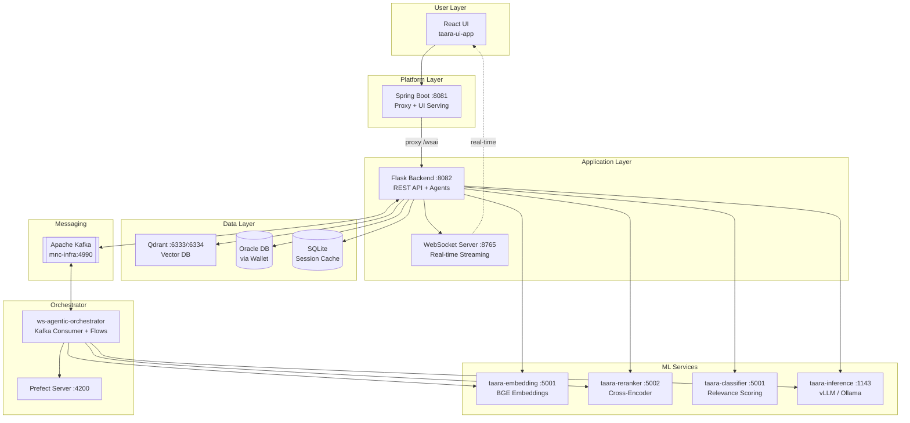

---

## 2. System Topology — Services & Ports

Every service in the system, where it listens, and what technology it runs on.

| Component | Port | Host / Service Name | Technology | Protocol |
|---|---|---|---|---|
| **taara-app-backend** (REST) | 8082 | `taara-app` | Python Flask / Gunicorn | HTTPS |
| **WebSocket Server** | 8765 | `taara-app` (master only) | Python `websockets` | WSS |
| **Spring Boot** | 8081 | `taara-app` | Java Spring Boot | HTTPS |
| **Qdrant HTTP** | 6333 | `taara-app` / `localhost` | Qdrant vector DB | HTTP |
| **Qdrant gRPC** | 6334 | `taara-app` | Qdrant vector DB | gRPC |
| **taara-embedding** | 5001 | `taara-embedding` | Python (BGE model) | HTTP |
| **taara-reranker** | 5002 | `taara-reranker` | Python (Cross-Encoder) | HTTP |
| **taara-classifier** | 5001 | `taara-classifier` | Python | HTTP |
| **taara-inference** | 1143 | `taara-inference` | vLLM / Ollama | HTTP (OpenAI-compatible) |
| **Ollama** (dev only) | 11434 | `135.227.70.154` | Ollama | HTTP |
| **Kafka** (production) | 4990 | `mnc-infra` | Apache Kafka | SSL |
| **Kafka** (development) | 9093 | `localhost` | Apache Kafka (Podman) | PLAINTEXT |
| **Prefect Server** | 4200 | `prefect` container | Prefect 2.x / 3.x | HTTP |
| **ws-ai-db** | default | `ws-ai-db` | PostgreSQL | TCP |
| **Oracle DB** (production) | via wallet | `WDM_ALIAS` / `SNML_ALIAS` | Oracle (Instant Client 19.24) | TNS |
| **Oracle DB** (development) | 6142 | `100.76.60.40` | Oracle | TCP |

### Port Layout Diagram

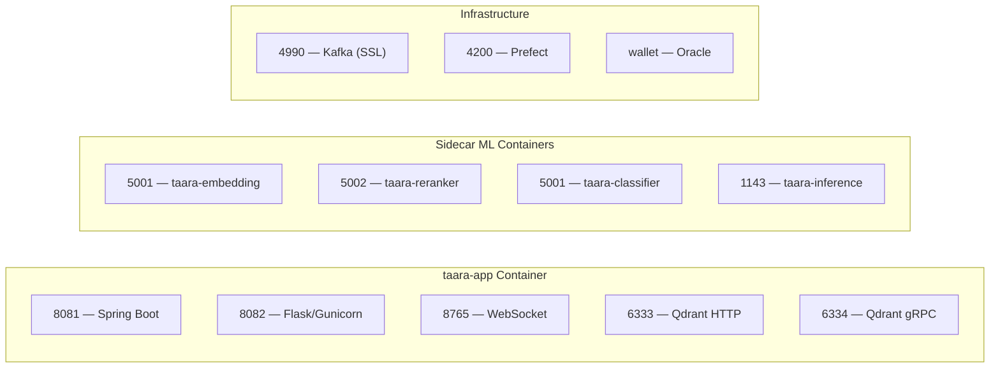

---

## 3. Configuration Deep Dive

### 3.1 config.yml (Production)

Location: `taara-app-backend/src/storage/configuration/config.yml`

This is the master configuration file loaded in production. Every section explained:

#### Global Settings

```yaml
global:
  base_url: "/wsai"                    # URL prefix for all REST endpoints
  base_ws_url: "/wsaiws"              # URL prefix for WebSocket paths
  app_port: 8082                       # Flask listening port
  taara_reranker: "http://taara-reranker:5002/api/compute_ranking"
  taara_classifier: "http://taara-classifier:5001/api/compute_relevance"
```

- `base_url` — Every Flask blueprint is registered under this prefix. Spring Boot proxies requests here.
- `base_ws_url` — Prepended to all WebSocket subscription paths (e.g., `/wsaiws/wsnoc`).

#### Vector Database

```yaml
vector_db:
  qdrant_database_path: "http://localhost:6333"
  embedding_compute_address: "http://taara-embedding:5001/api/compute_embeddings"
  default_collection_name: "ws-ai-knowledge-25.6"
```

- Qdrant runs on `localhost` because it is co-located inside the same container.
- Embedding is a separate container (`taara-embedding`).

#### Session Database

```yaml
session_db:
  sqlite_db_path: "/nfmt/instance/taara-app/backend/storage/database/session_database.db"
```

A lightweight SQLite database for ephemeral session data. Not the main database.

#### Main Agent Settings

```yaml
main_agent:
  agent_collection_name: "ws-ai-knowledge-25.6"
  collection_name_wsp_knowledge: "wsp-agent-knowledge-25.6"
  llm_model: "gpt-oss"
  agent_token_threshold: 8000        # Max context tokens for retrieval
  agent_top_x_embeddings: 100        # Top-K for initial vector search
  agent_reranker_threshold: -5       # Minimum reranker score to keep a result
  num_tries_routing: 3               # Retries for agent routing decisions
  use_classifier: false              # Enable/disable neural classifier
  max_request_length: 500            # Max user message length (chars)
  num_follow_ups: 3                  # Suggested follow-up questions count
  use_wsp_knowledge: false           # Enable WSP-specific collection
  conversation_history_limit: 2      # Turns of history sent to LLM
```

#### LLM Models

```yaml
models:
  gpt-oss:
    inference_engine: "ollama"
    chat_endpoint: "http://taara-inference:1143/v1/chat/completions"
    model_name: "gpt-oss:20b"
  mistral-nemo:
    inference_engine: "nemo"
    text_endpoint: "http://taara-inference:1143/v1/completions"
    model_name: "Mistral-Nemo-Instruct-2407"
    gen_kwargs:
      max_tokens: 1500
      temperature: 0.01
      top_p: 0.99
  azure-gpt4:
    inference_engine: "azureAI"
    chat_endpoint: "https://zscusnkyraiopenai.openai.azure.com/openai/deployments/gpt-4.1/chat/completions?api-version=2025-01-01-preview"
    model_name: "gpt-4"
    auth_key: ""
    gen_kwargs: { max_tokens: 1500, temperature: 0.7, top_p: 0.95 }
  azure-gpt4o:
    inference_engine: "azureAI"
    chat_endpoint: "https://zscusnkyraiopenai.openai.azure.com/openai/deployments/gpt-4o/chat/completions?api-version=2025-01-01-preview"
    model_name: "gpt-4o"
  azure-gpt5:
    inference_engine: "azureAI"
    chat_endpoint: "https://zscusnkyraiopenai.openai.azure.com/openai/deployments/gpt-5.2/chat/completions?api-version=2025-01-01-preview"
    model_name: "gpt-5.2"
    gen_kwargs: { max_completion_tokens: 1500, temperature: 0.7, top_p: 0.95 }
```

Each model key (e.g., `gpt-oss`) can be referenced from any agent section via `llm_model`.

#### Per-Agent LLM Overrides

These sections let you point individual agents at different models:

```yaml
api_info:       { llm_model: "gpt-oss" }
chart_display:  { llm_model: "gpt-oss" }
db_manager:     { llm_model: "gpt-oss" }
db_agent:       { llm_model: "gpt-oss" }
wsp_agent:      { llm_model: "gpt-oss" }
documentation:  { llm_model: "gpt-oss" }
compatibility:  { llm_model: "gpt-oss" }
todo_enhancements: { llm_model: "gpt-oss" }
nhi_agent:      { llm_model: "gpt-oss" }
```

In production, all agents default to `gpt-oss` (the self-hosted model). In development, these all point to `azure-gpt5`.

#### Database Configuration

```yaml
database:
  type: "ORACLE"
  use_wallet: true
  wallet_alias: "WDM_ALIAS"
  snml_wallet_alias: "SNML_ALIAS"
  pool_size: 10
  max_overflow: 20
  pool_timeout: 30
  pool_recycle: 3600
```

- Production uses **Oracle Wallet** authentication (no plain-text passwords).
- `WDM_ALIAS` and `SNML_ALIAS` are TNS aliases resolved from `tnsnames.ora` inside the container.
- Connection pooling is managed by SQLAlchemy.

#### Kafka Configuration (Production)

```yaml
kafka-commons:
  bootstrap_servers: "mnc-infra:4990"
  security_protocol: "SSL"
  ssl_ca_location: "/nfmt/instance/certificates/External/certificate.pem.ca"
  ssl_certificate_location: "/nfmt/instance/certificates/External/certificate.pem"
  ssl_key_location: "/nfmt/instance/certificates/External/key.pem"
  ssl_key_password: "<encrypted>"
```

All Kafka producers and consumers inherit from `kafka-commons`. Individual topic configs:

```yaml
syspref-kafka-consumer:
  enabled: true
  group_id_prefix: "wsai-syspref-consumer"   # Suffixed with -worker-{ID}
  topic: "mncsyspref"

kafka-request-consumer:
  enabled: true
  group_id: "wsai-request-processors"
  topic: "wsai_request"

kafka-response-producer:
  topic: "wsai_response"
  acks: "all"
  compression_type: "gzip"

kafka-data-stream:
  producer: { topic: "ai-data-stream", acks: "all" }
  consumer: { group_id: "taara-ui-broadcaster-master", topic: "ai-data-stream", auto_offset_reset: "latest" }

kafka-common-messaging-producer:
  topic: "ws-common-messaging-topic"
  message_contract:
    source_app_name: "WSAI"
    type: "WSAI_CONVERSATION"
    sub_type: "CONVERSATION_EMAIL"
```

### 3.2 config_development.yml (Development)

Location: `taara-app-backend/src/storage/configuration/config_development.yml`

Loaded when `EXEC_ENVIRONMENT=development`. Only differences from production are listed below. Everything else falls through to the same defaults.

Key differences:
- `is_in_development: true` — enables dev-only code paths
- ML services point to a shared dev server (`135.227.70.159:8083`) instead of Docker service names
- LLM defaults to `azure-gpt5` instead of `gpt-oss`
- `gpt-oss` endpoint points to Ollama on `135.227.70.154:11434`
- Qdrant collections use `-build` suffix
- Database uses direct connection (IP, port, username) instead of wallet
- Kafka uses `localhost:9093` with `PLAINTEXT` (local Podman container)
- System preferences consumer is **disabled**

### 3.3 Production vs Development — Side by Side

| Setting | Production | Development |
|---|---|---|
| `global.is_in_development` | `false` (default) | `true` |
| `global.taara_reranker` | `http://taara-reranker:5002/...` | `http://135.227.70.159:8083/...` |
| `global.taara_classifier` | `http://taara-classifier:5001/...` | `http://135.227.70.159:8083/...` |
| `vector_db.qdrant_database_path` | `http://localhost:6333` | `http://localhost:6333` |
| `vector_db.embedding_compute_address` | `http://taara-embedding:5001/...` | `http://135.227.70.159:8083/...` |
| `vector_db.default_collection_name` | `ws-ai-knowledge-25.6` | `ws-ai-knowledge-25.6-build` |
| `main_agent.llm_model` | `gpt-oss` | `azure-gpt5` |
| `main_agent.collection_name_wsp_knowledge` | `wsp-agent-knowledge-25.6` | `wsp-agent-knowledge-25.6-build` |
| `session_db.sqlite_db_path` | `/nfmt/instance/.../session_database.db` | `database/session_database_dev.db` |
| `models.gpt-oss.chat_endpoint` | `http://taara-inference:1143/...` | `http://135.227.70.154:11434/...` |
| `database.type` | `ORACLE` | `ORACLE` |
| `database.use_wallet` | `true` | `false` |
| `database.host` | *(empty)* | `100.76.60.40` |
| `database.port` | `0` | `6142` |
| `database.service_name` | *(empty)* | `OTNE` |
| `kafka-commons.bootstrap_servers` | `mnc-infra:4990` | `localhost:9093` |
| `kafka-commons.security_protocol` | `SSL` | `PLAINTEXT` |
| `syspref-kafka-consumer.enabled` | `true` | `false` |
| `kafka-request-consumer.group_id` | `wsai-request-processors` | `taara-request-processors-dev` |
| `kafka-data-stream.consumer.group_id` | `taara-ui-broadcaster-master` | `taara-ui-broadcaster-master-dev` |
| All per-agent `llm_model` | `gpt-oss` | `azure-gpt5` |

### 3.4 ConfigFactory Singleton

Location: `taara-app-backend/src/storage/configuration/config_factory.py`

The `ConfigFactory` is a singleton that initializes exactly once at import time:

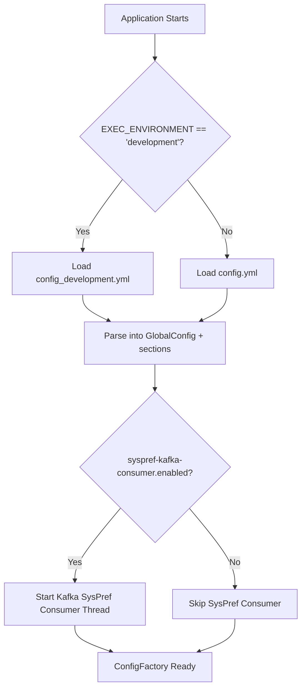

**How to use it in code:**

```python
from configuration.config_factory import config_factory

# Get the global section (base_url, base_ws_url, app_port, etc.)
config = config_factory.get_global_config()

# Get any named section as a dict
kafka_config = config_factory.get_section('kafka-request-consumer')

# Get model configuration
models = config_factory.get_section('models')
```

**Worker ID handling:** When running under Gunicorn, each worker gets a `GUNICORN_WORKER_ID` environment variable. The syspref consumer uses this to create a unique `group_id` per worker (`wsai-syspref-consumer-worker-1`, `wsai-syspref-consumer-worker-2`, etc.) so every worker independently receives the broadcast.

### 3.5 System Preferences via Kafka

The OMS platform broadcasts system preference changes on the `mncsyspref` Kafka topic. Each Gunicorn worker runs its own consumer thread that listens for these messages.

**Processing logic:**

1. Receive message from `mncsyspref` topic
2. Check conditions: `WSAI_Execution_Scope == 'External'` AND `WSAI_LLM_Apply == 'true'`
3. If conditions met, map `WSAI_LLM_*` keys to internal config sections
4. Update the in-memory config singleton

**Engine mapping** (UI label to internal engine name):

| UI Label | Internal Engine |
|---|---|
| Azure Open AI | `azureAI` |
| Ollama | `ollama` |
| vLLM | `vllm` |
| FastChat | `vllm` |

### 3.6 System Preferences via Database (SysPref)

In the orchestrator flows (and anywhere with DB access), LLM settings are read directly from the `SYS_PREF_PROPERTIES` table rather than through Kafka. The function `fetch_llm_system_preferences()` in `flow_utils.py` reads these keys:

| DB Property Key | Purpose |
|---|---|
| `WSAI_LLM_Generate_Endpoint` | Full LLM generate endpoint URL (parsed for base_url, api_version, model_name) |
| `WSAI_LLM_Engine` | Inference engine label (mapped to provider) |
| `WSAI_LLM_Generate_Endpoint_Key` | API key / auth token |
| `WSAI_LLM_Embedding_Endpoint` | Embedding service endpoint |
| `WSAI_LLM_Reranker_Endpoint` | Reranker service endpoint |
| `WSAI_LLM_Model` | Real model name (used for capability toggles like allow_thinking) |

**Engine to provider mapping** (same as Kafka, used in flows):

| WSAI_LLM_Engine Value | Provider |
|---|---|
| Azure Open AI | `azure` |
| Ollama | `ollama` |
| vLLM | `openai` |
| FastChat | `openai` |

**Allow-thinking logic:** The `MODEL_TO_ALLOW_THINKING` map determines whether reasoning/thinking parameters are sent to the model:

| Model Family Prefix | allow_thinking |
|---|---|
| `gpt-5` | `true` |
| `gpt-4` | `false` |

When `allow_thinking` is `false`, `reasoning_effort` and `reasoning_summary` are set to `None` for all agent configs.

---

## 4. Docker & Packaging

### 4.1 taara-app-docker (Main Application)

#### Dockerfile

Location: `taara-app-docker/Docker/Dockerfile`

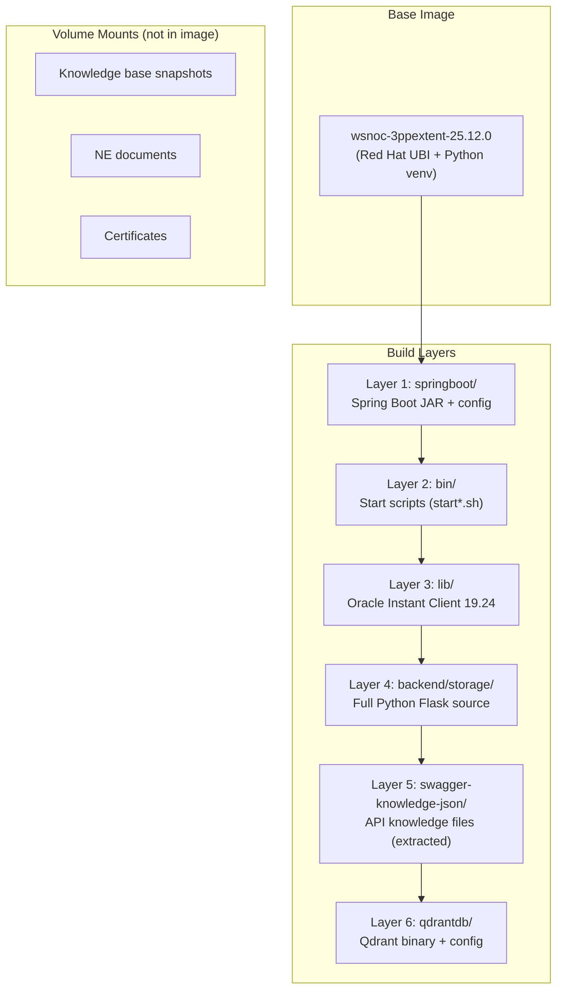

**Root directory:** `/nfmt/instance/taara-app`

**Directory layout inside the container:**

| Path | Contents |
|---|---|
| `/nfmt/instance/taara-app/springboot/` | Spring Boot JAR, config, UI build |
| `/nfmt/instance/taara-app/bin/` | Shell start scripts |
| `/nfmt/instance/taara-app/lib/instantclient_19_24/` | Oracle Instant Client shared objects |
| `/nfmt/instance/taara-app/backend/storage/` | Python Flask backend (full source tree) |
| `/nfmt/instance/taara-app/backend/storage/agent/agentslib/api_info/apilib/` | Extracted Swagger knowledge JSON files |
| `/nfmt/instance/taara-app/qdrantdb/` | Qdrant binary and configuration |

**Oracle client setup:**
- Symlinks `libnsl.so.3` → `libnsl.so.1` for compatibility
- Adds instant client to `ld.so.conf.d` and runs `ldconfig`

**What is NOT in the image (volume-mounted):**
- Knowledge base Qdrant snapshots
- NE (Network Element) documentation PDFs
- TLS certificates

#### pom.xml

Location: `taara-app-docker/pom.xml`

| Property | Value |
|---|---|
| `groupId` | `com.nokia.wavesuite.taara` |
| `artifactId` | `taara-app-docker` |
| `version` | `26.6.0` |
| `kb.version` | `26.6.0-SNAPSHOT` |

**Maven profiles for knowledge base versions:**

| Profile ID | kb.version |
|---|---|
| `kb-26.6` | `26.6.0-SNAPSHOT` |
| `kb-25.12` | `25.12.0-SNAPSHOT` |
| `kb-25.6` | `25.6.0-SNAPSHOT` |

Use `-Pkb-25.12` to build with an older knowledge base version.

**Build phases:**
1. `prepare-package` — Copies backend source, springboot config + JAR + UI build, qdrant, bin, lib, swagger knowledge, Dockerfile
2. `package` — Assembles everything into a tar.gz via `docker_assembly.xml`

#### docker_assembly.xml

Output: `taara-app-{version}-{BUILD_NUMBER}.tar.gz`

Contents of the archive:

```
taara-app-26.6.0-{BUILD_NUMBER}/
├── backend/           # Python Flask backend
├── bin/               # Start scripts
├── lib/               # Oracle Instant Client
├── qdrantdb/          # Qdrant binary + config
├── springboot/        # Spring Boot JAR + config + UI build
├── swagger-knowledge-json/
└── Dockerfile
```

### 4.2 ws-agentic-orchestrator Docker

Location: `ws-agentic-orchestrator/docker/Dockerfile`

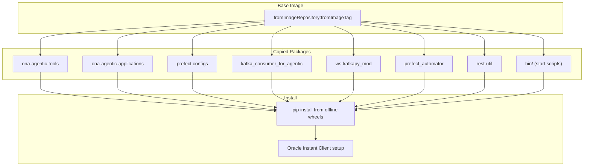

This container runs the Kafka-to-Prefect bridge and all Prefect workflow code.

### 4.3 Prefect Server Docker

- Base image: `registry.access.redhat.com/ubi9/ubi:latest`
- Python 3.12 in a virtualenv at `/opt/venv`
- Exposes port `4200`
- Health check endpoint: `GET /api/health`

---

## 5. Kafka Ecosystem

### 5.1 Complete Topic Map

| Topic | Producer(s) | Consumer(s) | Purpose |
|---|---|---|---|
| `mncsyspref` | OMS platform | taara-app workers (each with unique group) | System preferences broadcast |
| `wsai_request` | External (Spring Boot, other services) | taara-app `KafkaRequestHandler` | Inbound request processing |
| `wsai_response` | taara-app | External consumers | Outbound response delivery |
| `ai-data-stream` | taara-app Gunicorn workers | taara-app Gunicorn master | IPC: worker results → master → WebSocket clients |
| `ws-common-messaging-topic` | taara-app | Common messaging adapter | Conversation email delivery |
| `ai-troubleshooting` | Troubleshooting bots | ws-agentic-orchestrator Kafka consumer | Entity-based troubleshooting trigger |
| `ai-troubleshooting-request` | Chatbot / UI | ws-agentic-orchestrator Kafka consumer | Chat-triggered troubleshooting trigger |
| `ai-troubleshooting-response` | ws-agentic-orchestrator flows | Chatbot / UI | Troubleshooting status updates and results |
| `taskmanager-Notif` | ws-agentic-orchestrator flows | Task manager | Task completion notifications |

### 5.2 Kafka Configuration Details

**Production (SSL):**

| Setting | Value |
|---|---|
| `bootstrap_servers` | `mnc-infra:4990` |
| `security_protocol` | `SSL` |
| `ssl_ca_location` | `/nfmt/instance/certificates/External/certificate.pem.ca` |
| `ssl_certificate_location` | `/nfmt/instance/certificates/External/certificate.pem` |
| `ssl_key_location` | `/nfmt/instance/certificates/External/key.pem` |

**Development (PLAINTEXT, local Podman):**

| Setting | Value |
|---|---|
| `bootstrap_servers` | `localhost:9093` |
| `security_protocol` | `PLAINTEXT` |
| Kafka UI | `http://localhost:8080` |
| Setup scripts | `start-kafka.bat` (Windows) / `start-kafka.sh` (Linux) |

### 5.3 Kafka Message Flow Diagrams

#### Real-time UI Streaming (Worker → Master → WebSocket)

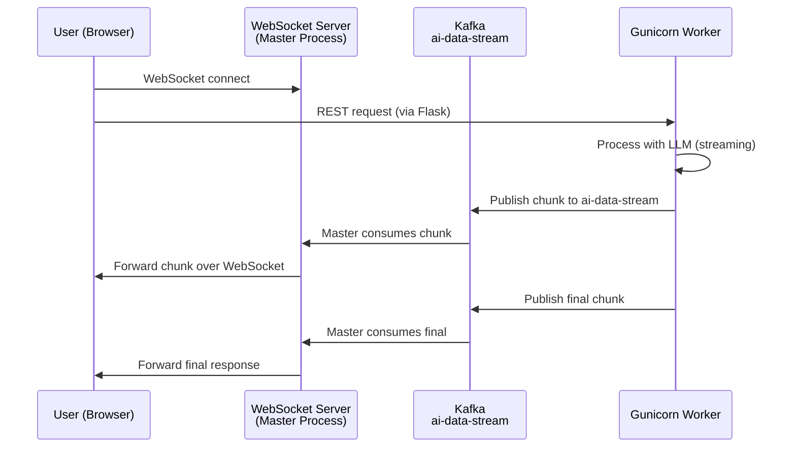

#### Troubleshooting Flow (Bot-triggered)

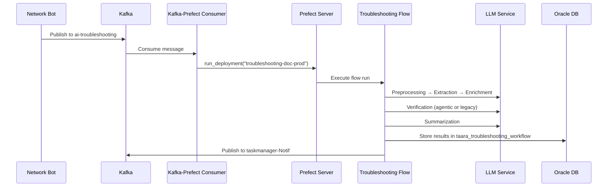

#### Troubleshooting Flow (Chat-triggered)

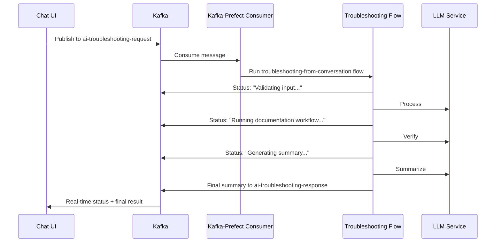

#### System Preferences Broadcast

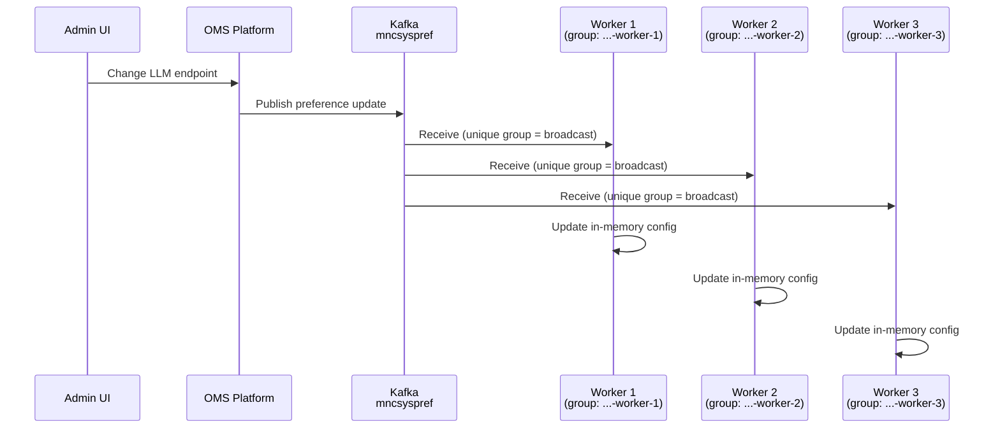

---

## 6. Qdrant Vector Database

### Collections

| Collection | Environment | Usage | Dimension |
|---|---|---|---|
| `ws-ai-knowledge-25.6` | Production | Main knowledge base for all agents | 1024 |
| `ws-ai-knowledge-25.6-build` | Dev / Build | Development knowledge base | 1024 |
| `ws-ai-knowledge-24.12-build` | Legacy | Older troubleshooting knowledge | 1024 |
| `wsp-agent-knowledge-25.6` | Production | WSP agent-specific knowledge | 1024 |
| `wsp-agent-knowledge-25.6-build` | Dev / Build | WSP agent dev knowledge | 1024 |
| `supplementary-knowledge-collection` | Both | User-uploaded / supplementary docs | 1024 |

### Configuration

| Setting | Value |
|---|---|
| Distance metric | Cosine similarity |
| Index type | HNSW |
| Storage path | `./storage` (inside `qdrantdb/`) |
| Snapshots path | `./snapshots` (inside `qdrantdb/`) |
| Cluster mode | Disabled (single node) |
| HTTP port | 6333 |
| gRPC port | 6334 |

### How Data Gets In

Knowledge base data is populated through the **knowledge pipeline** (see Section 8). At deploy time, Qdrant snapshots are volume-mounted into the container. The pipeline can also insert data directly via the Qdrant REST API.

---

## 7. Orchestrator Deep Dive (ws-agentic-orchestrator)

### 7.1 Kafka Consumer to Prefect Bridge

Location: `ws-agentic-orchestrator/docker/kafka_consumer_for_agentic/`

The bridge reads `kafka_prefect_config.yaml` and acts as a simple adapter:

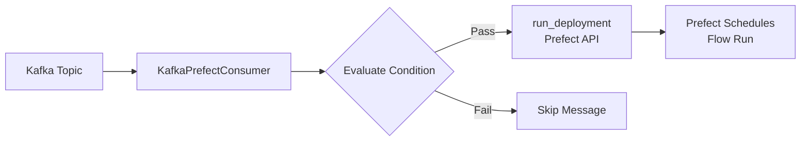

#### kafka_prefect_config.yaml

```yaml
kafka:
  bootstrap_servers: 'mnc-infra:4990'
  group_id: 'wsai-agentic-consumer'
  consumer_settings:
    auto_offset_reset: 'latest'
    enable_auto_commit: true
    max_poll_records: 100

topics:
  - name: 'ai-troubleshooting'
    actions:
      - type: 'run_deployment'
        deployment_name: 'Troubleshooting Documentation/troubleshooting-doc-prod'
        parameters_mapping:
          payload_data: 'message'
          add_data_for_evaluation: False

  - name: 'ai-troubleshooting-request'
    actions:
      - type: 'run_deployment'
        deployment_name: 'Troubleshooting From Conversation/troubleshooting-from-conversation-prod'
        parameters_mapping:
          payload: 'message'
```

For each message consumed, the consumer calls `run_deployment(name=deployment_name, parameters=mapped_params, timeout=0)`. The `timeout=0` means it fires-and-forgets — the flow runs asynchronously.

### 7.2 Deployment Configuration (deployments.yaml)

Location: `ws-agentic-orchestrator/docker/prefect_automator/deployments.yaml`

All deployments use the `local-work-pool` work pool. Key deployments:

| Deployment Name | Flow | Purpose |
|---|---|---|
| `troubleshooting-doc-prod` | `troubleshooting_documentation_flow` | Entity-based troubleshooting pipeline |
| `troubleshooting-from-conversation-prod` | `troubleshooting_from_conversation_flow` | Chat-triggered troubleshooting |
| `task-enhancer-real-prod` | `task_enhancer_flow` | LLM-enhanced task processing |
| `workflow-log-cleanup-prod` | `workflow_log_cleanup_flow` | Daily cleanup at 2 AM UTC |
| Various parallel flows | `parallel_flow_1`, `parallel_flow_2`, etc. | Parallel data processing |
| `data-coordinator-prod` | `coordinator_flow` | Cross-flow coordination |

### 7.3 yaml_deploy_manager.py

Location: `ws-agentic-orchestrator/docker/prefect_automator/yaml_deploy_manager.py`

A CLI tool for managing Prefect deployments:

| Command | What It Does |
|---|---|
| `sync` | Read `deployments.yaml`, dynamically import flow functions, deploy to Prefect |
| `list` | Show all deployments defined in the YAML |
| `validate` | Check YAML syntax and flow function imports without deploying |
| `kafka-sync` | Update `kafka_prefect_config.yaml` from deployment configs |

It uses `flow.from_source().deploy()` for process work pools, enabling code-from-source deployments.

### 7.4 Troubleshooting Flows

#### Entity-based Pipeline (`troubleshooting_documentation_flow.py`)

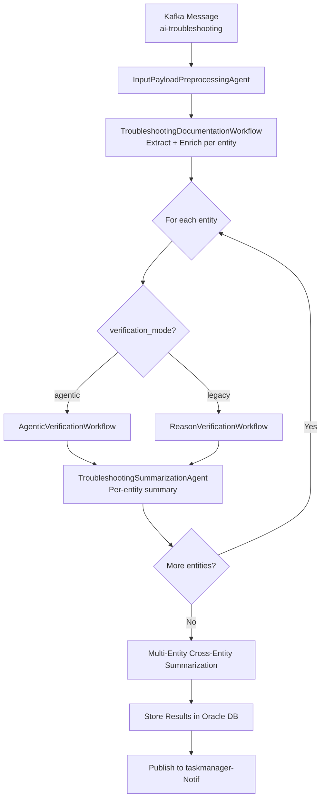

Pipeline steps in detail:

1. **InputPayloadPreprocessingAgent** — Validates and normalizes the incoming payload
2. **TroubleshootingDocumentationWorkflow** — RAG extraction + reason enrichment for each entity
3. **Verification** (per entity) — Either agentic (tool-using agent) or legacy (multi-agent chain)
4. **Summarization** (per entity) — Generates structured troubleshooting summary
5. **Cross-entity summarization** — Combines all entity results into a final report

#### Chat-triggered Pipeline (`troubleshooting_from_conversation_flow.py`)

Same pipeline as above, but:
- Triggered from `ai-troubleshooting-request` topic
- Publishes status updates to `ai-troubleshooting-response` topic throughout execution
- Uses `TroubleshootingFromChatbotRuntimeConfig` for status message templates
- Respects `max_entities_to_process` limit

### 7.5 Flow Configuration Files

All located in `ws-agentic-orchestrator/docker/prefect_automator/deployments/`:

| File | Contents |
|---|---|
| `troubleshooting_documentation_flow.yaml` | Qdrant URL, collection names, embedding/reranker endpoints, agent configs |
| `metrics_troubleshooting_workflow.yaml` | Azure gpt-5.2 for metric summarizer, preprocessing, fallback |
| `troubleshooting_runtime_config.yaml` | `verification_mode: agentic`, `total_time_budget: 30` (minutes) |
| `troubleshooting_from_chatbot_runtime_config.yaml` | Response topic, message type constants, status strings |
| `reason_verification_workflow.yaml` | Legacy verification agent configs |
| `agentic_verification_workflow.yaml` | Agentic verification budget settings |
| `summary_agent.yaml` | Summarization agent model config |

### 7.6 SysPref Overrides in Flows

When flows start, they call `fetch_llm_system_preferences()` to read the latest LLM settings from the database. If values are present and valid (not `NOTSET` or empty), they override the YAML config:

**What gets overridden:**
- `base_url`, `api_version`, `model_name` — parsed from `WSAI_LLM_Generate_Endpoint`
- `provider` — mapped from `WSAI_LLM_Engine`
- `api_key` — from `WSAI_LLM_Generate_Endpoint_Key`
- `embedding_endpoint` — from `WSAI_LLM_Embedding_Endpoint`
- `reranker_endpoint` — from `WSAI_LLM_Reranker_Endpoint`

**Override cascade (highest priority wins):**

```
SysPref DB values > YAML config file values > Pydantic defaults
```

**Allow-thinking rule:** After overrides, the system checks the real model name against `MODEL_TO_ALLOW_THINKING`. If the model does not support thinking (e.g., gpt-4), `reasoning_effort` and `reasoning_summary` are nulled out on all agent configs.

### 7.7 Emergency Stop (kill_all_scheduled_deployments.py)

Location: `ws-agentic-orchestrator/docker/prefect_automator/kill_all_scheduled_deployments.py`

When things go wrong and flows are piling up:

```bash
# Dry run — see what would be affected
python kill_all_scheduled_deployments.py --dry-run

# Actually kill everything
python kill_all_scheduled_deployments.py --yes

# Target a specific work pool
python kill_all_scheduled_deployments.py --work-pool local-work-pool --yes

# Target flows by tag
python kill_all_scheduled_deployments.py --tag production --yes
```

**What it does:**
1. Pauses all active schedules on deployments
2. Cancels all flow runs in `LATE`, `SCHEDULED`, or `RUNNING` state

---

## 8. Knowledge Pipelines (wsai-knowledge-pipelines)

The knowledge pipeline transforms raw bot specifications into searchable vector embeddings.

### Pipeline Steps

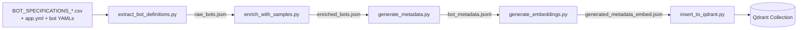

| Step | Script | Input | Output | What It Does |
|---|---|---|---|---|
| 1 | `extract_bot_definitions.py` | CSV + YAML specs | `raw_bots.json` | Parse bot specifications into structured JSON |
| 2 | `enrich_with_samples.py` | `raw_bots.json` | `enriched_bots.json` | Use Azure OpenAI to generate sample questions and capabilities per bot |
| 3 | `generate_metadata.py` | `enriched_bots.json` | `bot_metadata.jsonl` | Build `BotMetadataRecord` per sample question |
| 4 | `generate_embeddings.py` | `bot_metadata.jsonl` | `generated_metadata_embed.json` | BGE embedding (chunk_size=1800, overlap=250) |
| 5 | `insert_to_qdrant.py` | `generated_metadata_embed.json` | Qdrant collection | Ensure collection (1024-dim, cosine), clear agent points, batch insert (100) |

### Pipeline Configuration

| Setting | Value |
|---|---|
| LLM | Azure OpenAI gpt-4.1 |
| Questions per bot | 20 |
| Temperature | 0.7 |
| Embedding service | BGE at `http://135.227.70.159:8083` |
| Embedding dimension | 1024 |
| Chunk size | 1800 characters |
| Chunk overlap | 250 characters |
| Target collection | `ws-ai-knowledge-25.6-build` |
| Batch insert size | 100 |

### Data Schemas

**BotDefinitionRaw:** `bot_id`, `bot_name`, `logical_name`, `bot_specification`, `reasoning`, etc.

**BotDefinitionEnriched:** Everything in Raw + `sample_questions`, `capabilities`

**BotMetadataPayload:** `agent`, `bot_id`, `bot_name`, `content`, `sample_questions`, `parameters`, `reasoning_levels`

**BotParameters:** `trigger_mechanism`, `datasource`, `sql_pattern`, `configurability`

---

## 9. Spring Boot Platform Layer

### Application Properties

Location: `taara-app-springboot/src/main/resources/appconfig.properties`

| Property | Value | Purpose |
|---|---|---|
| `server.port` | `8081` | Spring Boot listening port |
| `server.servlet.context-path` | `/taara` or `/wsai` | URL base path |
| `flask.api.url` | `https://taara-app:8082` | Backend proxy target |
| `spring.datasource.url` | `jdbc:oracle:thin:/@WDM_ALIAS` | Oracle via wallet |
| `KAFKA_BROKER` | `mnc-infra` | Kafka bootstrap host |
| `NFMT_KAFKA_SECURE_PORT` | `4990` | Kafka SSL port |

### Controllers

| Controller | Purpose |
|---|---|
| `RedirectController` | Routes UI navigation requests to React SPA |
| `NorthBoundPassthroughController` | Proxies NBI (Northbound Interface) requests to Flask backend |
| `ConversationManagerController` | CRUD operations for conversations (uses Oracle DB directly) |
| `ReactStaticController` | Serves React static assets (JS, CSS, images) from `build/` directory |

### Request Flow Through Spring Boot

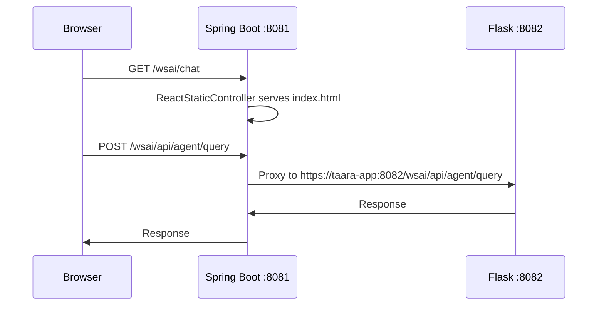

---

## 10. Database Schema

### Backend Tables (taara-changeset-24.12.sql)

| Table | Purpose | Key Columns |
|---|---|---|
| `taara_conversation_details` | Stores conversation metadata | `conversation_id` (PK), `user_id`, `title`, `created_at` |
| `taara_group_info` | Groups of objects within a conversation | `group_id` (PK), `conversation_id` (FK), `group_name` |
| `taara_conversation_objects` | Individual objects with JSON data | `object_id` (PK), `group_id` (FK), `object_data` (JSON) |
| `taara_feedback_info` | User feedback on responses | `feedback_id` (PK), `conversation_id` (FK), `rating`, `comment` |

### Troubleshooting Tables (taara-changeset-26.01.sql)

| Table | Purpose | Key Columns |
|---|---|---|
| `taara_troubleshooting_workflow` | Stores troubleshooting I/O | `troubleshooting_message_id` (PK), `troubleshooting_input` (JSON), `troubleshooting_output` (JSON) |
| `taara_conversation_troubleshooting_mapping` | Links conversations to troubleshooting | `conversation_id` (PK/FK), `troubleshooting_message_id` (FK), `created_timestamp` |

### System Preferences Tables (SYS_PREF_*)

The system preferences schema follows a group → component → property hierarchy:

```mermaid
erDiagram
    SYS_PREF_GROUPS ||--o{ SYS_PREF_COMPONENTS : contains
    SYS_PREF_COMPONENTS ||--o{ SYS_PREF_PROPERTIES_META_DATA : defines
    SYS_PREF_PROPERTIES_META_DATA ||--|| SYS_PREF_PROPERTIES : "stores value"

    SYS_PREF_GROUPS {
        varchar GROUP_ID PK
        varchar GROUP_KEY UK
        varchar GROUP_LABEL
        number GROUP_ORDER
    }
    SYS_PREF_COMPONENTS {
        varchar COMP_ID PK
        varchar COMP_KEY UK
        varchar GROUP_ID FK
    }
    SYS_PREF_PROPERTIES_META_DATA {
        number PROP_ID PK
        varchar PROP_KEY UK
        varchar PROP_TYPE
        varchar PROP_OPTIONS
        varchar DEFAULT_VALUE
        varchar DEPENDS_ON
        varchar COMP_ID FK
    }
    SYS_PREF_PROPERTIES {
        varchar PROP_KEY PK_FK
        varchar PROP_VALUE
    }
```

**WSAI Group hierarchy:**

- **Group:** `WSAI_GROUP` (G2512004)
  - **Component:** `WSAI_LLM` (C2512027)
    - `WSAI_Execution_Scope` — Internal / External (radio)
    - `WSAI_LLM_Apply` — Enable/disable LLM override (boolean)
    - `WSAI_LLM_Model` — Model selection (select: gpt-oss:20b, gpt-4, gpt-5)
    - `WSAI_LLM_Engine` — Engine selection (select: Ollama, vLLM, FastChat, Azure Open AI)
    - `WSAI_LLM_Generate_Endpoint` — LLM endpoint URL (textarea)
    - `WSAI_LLM_Generate_Endpoint_Key` — API key (password)
    - `WSAI_LLM_Chat_Endpoint` — Chat endpoint URL (textarea)
    - `WSAI_LLM_Chat_Endpoint_Key` — Chat API key (password, hidden)
    - `WSAI_LLM_Embedding_Endpoint` — Embedding service URL (textarea)
    - `WSAI_LLM_Reranker_Endpoint` — Reranker service URL (textarea)
    - `WSAI_Enable_Classifier` — Enable/disable classifier (boolean)
    - `WSAI_LLM_Classifier_Endpoint` — Classifier service URL (textarea)
    - `WSAI_LLM_Reranker_Model` — Reranker model ID (text)
    - `WSAI_LLM_Classifier_Model` — Classifier model ID (text)
    - `WSAI_LLM_Embedding_Model` — Embedding model ID (text)
  - **Component:** `WS_AI_reports` (C2606014)
    - `WSAI_TOEMAILIDS` — Email recipients for conversation reports (textarea)

**Dependency chain:** Several properties use `DEPENDS_ON` to control visibility in the UI. For example, `WSAI_LLM_Model` depends on `WSAI_LLM_Apply` being set to `false` — meaning the field is shown only when the toggle is off (using the platform's inverse-logic convention).

---

## 11. Gunicorn Architecture

The Flask backend runs under Gunicorn with a master-worker architecture:

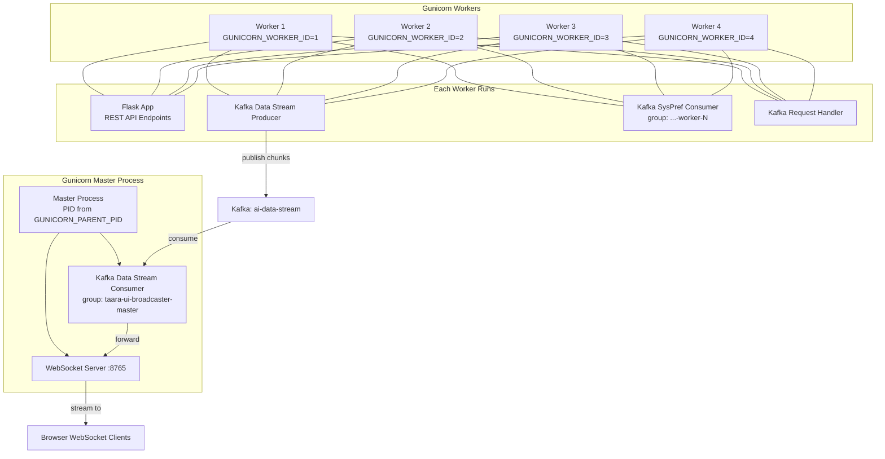

### Configuration

| Setting | Value |
|---|---|
| Bind | `0.0.0.0:8082` |
| Workers | 4 |
| Threads per worker | 4 |
| Timeout | 600 seconds |
| SSL cert | `certificate_pem` |
| SSL key | `certificate_key_pem` |
| CA cert | `ca_certificate_pem` |

### IPC Pattern

Workers cannot directly push messages to WebSocket clients because each worker is a separate process. The solution:

1. Worker produces a message to the `ai-data-stream` Kafka topic
2. The master process consumes from `ai-data-stream` (single consumer, `auto_offset_reset: latest`)
3. The master broadcasts the message to the appropriate WebSocket client(s)

This is why the data stream consumer group (`taara-ui-broadcaster-master`) must have only one consumer — the master process. The `latest` offset reset ensures only real-time messages are forwarded.

### Startup Behavior

```python
# In main.py:
if os.environ.get('GUNICORN_PARENT_PID') is None:
    # Standalone mode — start WebSocket in a thread
    start_websocket_server()
else:
    # Gunicorn mode — WebSocket already running in master process
    pass

# Always start the Kafka request handler (singleton pattern)
start_kafka_request_handler()
```

---

## 12. Environment Variables Master Reference

| Variable | Purpose | Default / Notes |
|---|---|---|
| `EXEC_ENVIRONMENT` | Config file selection | Unset → `config.yml`; `"development"` → `config_development.yml` |
| `GUNICORN_WORKER_ID` | Identifies which Gunicorn worker this is | Set by Gunicorn; used for unique Kafka consumer group IDs |
| `GUNICORN_PARENT_PID` | Indicates this process is a Gunicorn worker (not master) | Set by Gunicorn; controls WebSocket startup |
| `WSP_AGENT_V2` | WSP agent version toggle | `"true"` — use V2 (coordinator-based) agent |
| `WSP_AGENT_LOG_DIR` | WSP agent log directory | `/tmp/wsp_agent_logs` |
| `OLLAMA_BASE_URL` | Ollama endpoint override | `http://localhost:11434/v1` |
| `CERTIFICATE_PEM` | TLS certificate path | Internal default |
| `CERTIFICATE_KEY_PEM` | TLS private key path | Internal default |
| `CA_CERTIFICATE_PEM` | CA certificate path | Internal default |
| `otntomcat_oms1350web_Ext_Addr` | External UI address (for links in emails, etc.) | Not set by default |
| `APP_LOG_FILE_ENABLED` | Enable file-based logging | `"False"` |
| `AZURE_OPENAI_API_KEY` | Azure OpenAI API key | Not set by default |
| `TROUBLESHOOTING_CONFIG` | Override path for troubleshooting documentation flow config | Defaults to `troubleshooting_documentation_flow.yaml` in deployments dir |

---

## 13. Health Checks

Use these endpoints to verify each service is alive:

| Service | Endpoint | Method | Expected Response |
|---|---|---|---|
| Flask backend | `/wsai/api/health` | `GET` | 200 OK |
| Spring Boot | `/actuator/health` | `GET` | 200 OK with `{"status": "UP"}` |
| Qdrant | `/healthz` | `GET` | 200 OK |
| Prefect Server | `/api/health` | `GET` | 200 OK |
| Embedding service | `/api/health` | `GET` | 200 OK |

### Quick Health Check Script

```bash
# From inside the taara-app container:
curl -sk https://localhost:8082/wsai/api/health       # Flask
curl -sk https://localhost:8081/actuator/health        # Spring Boot
curl -s  http://localhost:6333/healthz                 # Qdrant
curl -s  http://taara-embedding:5001/api/health        # Embedding
curl -s  http://prefect:4200/api/health                # Prefect
```

---

## 14. LLM Model Configuration

### Available Models

| Config Key | Engine | Endpoint | Model Name | Use Case |
|---|---|---|---|---|
| `gpt-oss` | `ollama` | `taara-inference:1143` | `gpt-oss:20b` | Production default (self-hosted) |
| `mistral-nemo` | `nemo` | `taara-inference:1143` | `Mistral-Nemo-Instruct-2407` | Alternative text completion |
| `azure-gpt4` | `azureAI` | Azure OpenAI | `gpt-4` (deployment: `gpt-4.1`) | Cloud-based GPT-4 |
| `azure-gpt4o` | `azureAI` | Azure OpenAI | `gpt-4o` | Cloud-based GPT-4o |
| `azure-gpt5` | `azureAI` | Azure OpenAI | `gpt-5.2` | Cloud-based GPT-5 (dev default) |

### Generation Parameters

| Model | max_tokens | temperature | top_p |
|---|---|---|---|
| `gpt-oss` | (default) | (default) | (default) |
| `mistral-nemo` | 1500 | 0.01 | 0.99 |
| `azure-gpt4` | 1500 | 0.7 | 0.95 |
| `azure-gpt4o` | 1500 | 0.7 | 0.95 |
| `azure-gpt5` | 1500 | 0.7 | 0.95 |

### LLM Request Timeout

```yaml
llm_config:
  request_timeout: 120  # seconds
```

All LLM calls have a 120-second timeout. If the model does not respond within this window, the request fails.

### How Model Selection Works

1. Each agent section in `config.yml` has a `llm_model` key (e.g., `llm_model: "gpt-oss"`)
2. The agent looks up the model definition in the `models` section
3. The model definition provides the endpoint URL, engine type, and generation parameters
4. System preferences (via Kafka or DB) can override the endpoint at runtime

---

## 15. TLS / SSL Certificate Paths

### Kafka SSL (Production)

| Certificate | Path |
|---|---|
| CA certificate | `/nfmt/instance/certificates/External/certificate.pem.ca` |
| Client certificate | `/nfmt/instance/certificates/External/certificate.pem` |
| Client key | `/nfmt/instance/certificates/External/key.pem` |

### Gunicorn HTTPS

| Certificate | Environment Variable |
|---|---|
| Server certificate | `CERTIFICATE_PEM` |
| Server private key | `CERTIFICATE_KEY_PEM` |
| CA certificate | `CA_CERTIFICATE_PEM` |

### PostgreSQL SSL (when database.type = POSTGRESQL)

| Certificate | Path |
|---|---|
| Client certificate | `/nfmt/instance/certificates/Internal/certificate.pem` |
| Client key | `/nfmt/instance/certificates/Internal/key.pem` |
| CA certificate | `/nfmt/instance/certificates/Internal/certificate.pem.internal_ca` |

---

## 16. Quick Troubleshooting Checklist

### "The UI won't load"

1. Is Spring Boot running? → Check `:8081/actuator/health`
2. Is the React build present? → Check `/nfmt/instance/taara-app/springboot/dist/build/`
3. Are certificates valid? → Check Spring Boot logs for SSL errors

### "Agent responses are empty or errors"

1. Is Flask running? → Check `:8082/wsai/api/health`
2. Is the LLM reachable? → `curl` the model endpoint from inside the container
3. Is Qdrant running? → Check `:6333/healthz`
4. Is the knowledge base loaded? → Query Qdrant collection count
5. Check `EXEC_ENVIRONMENT` — wrong config file loaded?

### "WebSocket is not streaming"

1. Is the WebSocket server running on `:8765`? → Only runs in the Gunicorn master process
2. Is the Kafka `ai-data-stream` topic healthy? → Check Kafka broker
3. Is the master process consuming? → Check logs for `taara-ui-broadcaster-master` consumer group
4. Is the WebSocket client connected to the right path? (`/wsaiws/...`)

### "Troubleshooting workflow is not triggering"

1. Is the `ai-troubleshooting` topic receiving messages? → Check with Kafka UI or consumer tool
2. Is the `wsai-agentic-consumer` group active? → Check Kafka consumer group lag
3. Is Prefect server healthy? → Check `:4200/api/health`
4. Is the deployment registered? → `python yaml_deploy_manager.py list`
5. Are there stuck flows? → Check Prefect UI or run `kill_all_scheduled_deployments.py --dry-run`

### "System preferences are not being applied"

**In taara-app (Kafka path):**
1. Is `syspref-kafka-consumer.enabled: true`?
2. Is `WSAI_Execution_Scope == External` and `WSAI_LLM_Apply == true`?
3. Check worker logs for "Applied LLM system preferences" messages

**In orchestrator flows (DB path):**
1. Can the flow reach the Oracle DB?
2. Check `SYS_PREF_PROPERTIES` table: are `WSAI_LLM_*` values set (not `NOTSET`)?
3. Check flow logs for "Applied LLM system preferences from DB" messages

### "Kafka consumers are stuck"

1. Check consumer group lag: `kafka-consumer-groups --bootstrap-server mnc-infra:4990 --describe --group <group_id>`
2. Verify SSL certificates are not expired
3. Check if the topic exists and has partitions
4. For development: verify Podman Kafka is running (`localhost:9093`)

---

## 17. Cross-Reference to Other Guides

This document covers the infrastructure and configuration layer. For deeper dives into specific subsystems, refer to these companion documents:

| Guide | File | What It Covers |
|---|---|---|
| WSP Agent KT | `01-WSP-Agent-KT.md` | WSP agent V2 architecture, coordinator pattern, specialist agents, tools |
| Taara App Backend | `02-Taara-App-Backend-Complete-Guide.md` | Flask app structure, REST endpoints, agent routing, session management |
| ONA Agentic Applications | `03-ONA-Agentic-Applications-Guide.md` | Troubleshooting workflows, verification agents, summarization, Pydantic configs |
| ONA Agentic Tools | `04-ONA-Agentic-Tools-Guide.md` | Agent framework (PydanticAI), RAG pipeline, config management, conversation memory |

---

> **Last updated:** March 2026. This document reflects the state of the system at version 26.6.0.
