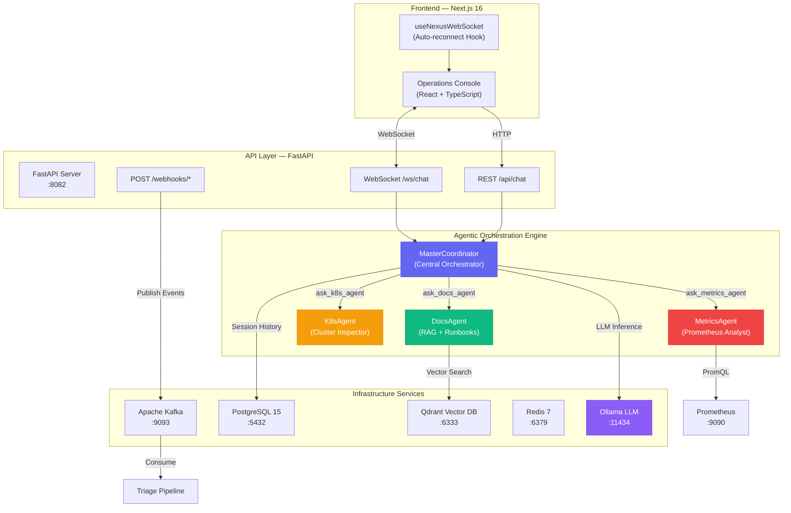
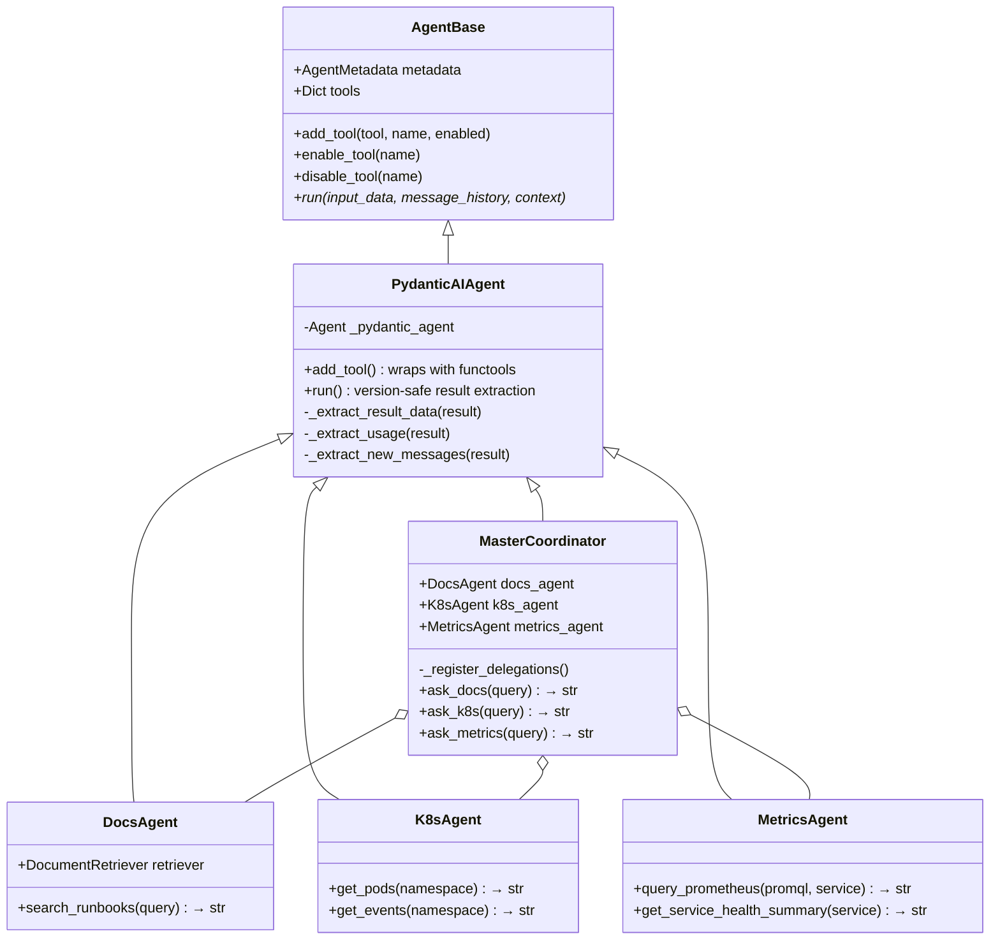
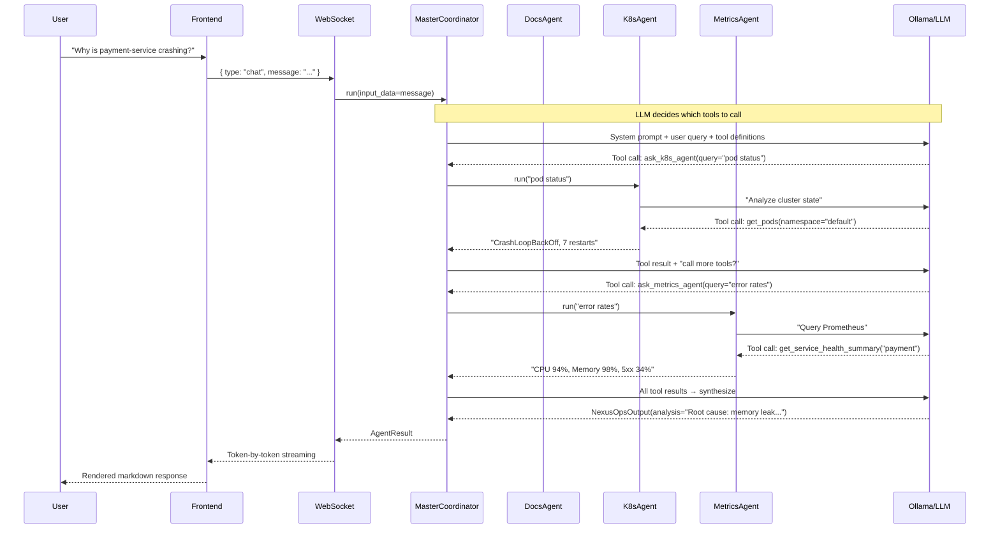
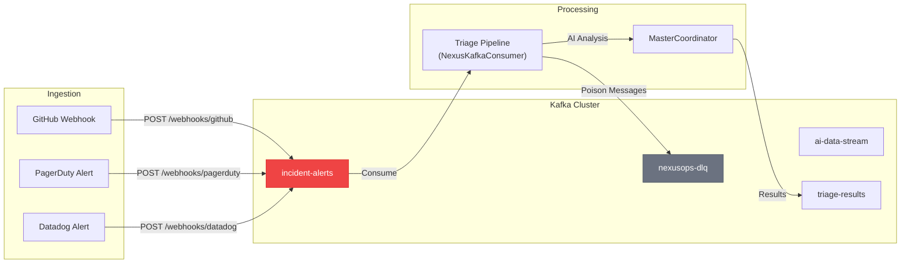
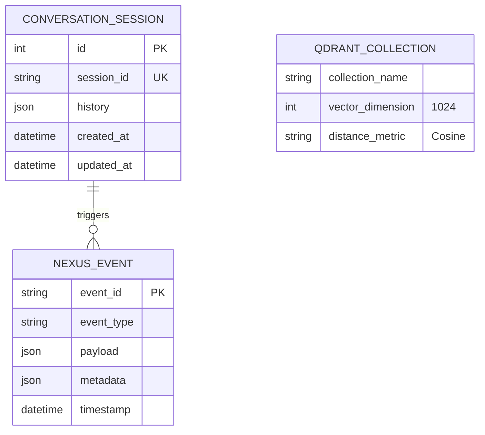

# NexusOps — System Architecture

> AI-Powered DevOps Operations Center — Complete Technical Architecture

---

## High-Level System Overview



---

## Agent Architecture

### Agent Hierarchy



### Agent Data Models

| Agent | Output Model | Fields |
|-------|-------------|--------|
| **MasterCoordinator** | `NexusOpsOutput` | `analysis`, `confidence`, `specialists_consulted` |
| **DocsAgent** | `DocsAgentOutput` | `answer`, `sources` |
| **K8sAgent** | `K8sAgentOutput` | `finding`, `actions_taken` |
| **MetricsAgent** | `MetricsOutput` | `summary`, `metrics_data`, `anomalies_detected` |

---

## Request Flow — Chat Query



---

## Event-Driven Pipeline (Kafka)



### Kafka Topics

| Topic | Purpose | Partitions |
|-------|---------|-----------|
| `incident-alerts` | Incoming webhook events | 3 |
| `ai-data-stream` | Internal agent communication | 3 |
| `triage-results` | Completed analysis results | 3 |
| `nexusops-dlq` | Dead letter queue for failed messages | 3 |

---

## Data Layer



### Storage Services

| Service | Role | Port | Data |
|---------|------|------|------|
| **PostgreSQL 15** | Relational DB | 5432 | Conversation sessions, audit logs |
| **Qdrant** | Vector DB | 6333 | Runbook embeddings, knowledge base |
| **Redis 7** | Cache / Pub-Sub | 6379 | Session cache, rate limiting |
| **Kafka** | Event Streaming | 9093 | Incident alerts, triage pipeline |

---

## WebSocket Protocol

### Client → Server

```json
{ "type": "chat", "session_id": "...", "message": "Why is payment-service down?" }
{ "type": "ping" }
```

### Server → Client (Streamed)

```json
{ "type": "connected",    "session_id": "uuid" }
{ "type": "status",       "content": "Analyzing your query...", "done": false }
{ "type": "tool_call",    "tool": "ask_k8s_agent", "status": "running" }
{ "type": "tool_result",  "tool": "ask_k8s_agent", "result": "complete" }
{ "type": "token",        "content": "Based on ", "done": false }
{ "type": "complete",     "content": "full response...", "done": true }
{ "type": "error",        "message": "..." }
```

---

## Directory Structure

```
NexusOps/
├── backend/
│   ├── api/
│   │   ├── main.py                    # FastAPI app, lifespan, singleton coordinator
│   │   ├── routers/
│   │   │   └── websocket_router.py    # WebSocket streaming, demo/real LLM modes
│   │   └── webhooks/
│   │       └── ingester.py            # GitHub/PagerDuty/Datadog webhook ingestion
│   └── core/
│       ├── agents/
│       │   ├── agent_base.py          # AgentBase, AgentResult, ToolConfig contracts
│       │   ├── pydantic_ai_agent.py   # PydanticAI wrapper (version-safe)
│       │   ├── coordinator.py         # MasterCoordinator orchestrator
│       │   ├── specialists.py         # DocsAgent, K8sAgent
│       │   └── metrics_agent.py       # MetricsAgent (Prometheus)
│       ├── config/
│       │   └── base.py                # ConfigBase, LLMConfig
│       ├── db/
│       │   ├── database.py            # SQLAlchemy engine + session factory
│       │   └── models.py              # ConversationSession model
│       ├── events/
│       │   ├── kafka_infra.py         # Producer, Consumer, topic management
│       │   └── schemas.py             # NexusEvent Pydantic schemas
│       ├── memory/
│       │   ├── message_base.py        # UniversalMessage, MessageHistoryBase
│       │   └── conversation_service.py# Session load/save bridge
│       ├── utils/
│       │   └── rag_utils.py           # DocumentRetriever (Qdrant + embeddings)
│       └── workflows/
│           └── triage_pipeline.py     # Kafka-driven incident triage
├── frontend/
│   └── src/
│       ├── app/                       # Next.js 16 App Router
│       └── hooks/
│           └── useNexusWebSocket.ts   # Auto-reconnect WebSocket hook
├── docs/                              # ← You are here
├── docker-compose.yml                 # Postgres, Redis, Qdrant, Kafka, Zookeeper
├── pyproject.toml                     # Python project config
└── requirements.txt                   # Python dependencies
```

---

## Technology Stack

| Layer | Technology | Version |
|-------|-----------|---------|
| **LLM Runtime** | Ollama (llama3.1 / llama3.2) | Latest |
| **AI Framework** | pydantic-ai | 1.70.0 |
| **API Server** | FastAPI + Uvicorn | 0.104+ |
| **Frontend** | Next.js (Turbopack) | 16.2.0 |
| **Database** | PostgreSQL | 15-alpine |
| **Vector DB** | Qdrant | 1.12.0 |
| **Cache** | Redis | 7-alpine |
| **Streaming** | Apache Kafka (Confluent) | 7.5.0 |
| **ORM** | SQLAlchemy | 2.0+ |
| **Validation** | Pydantic | 2.4+ |
